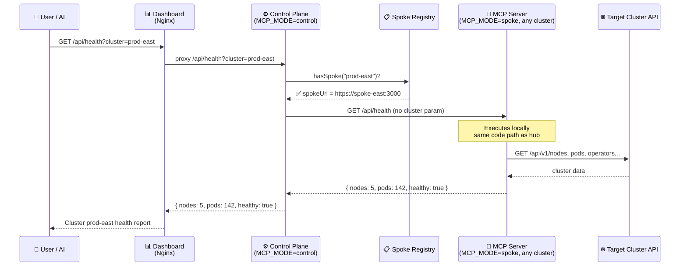
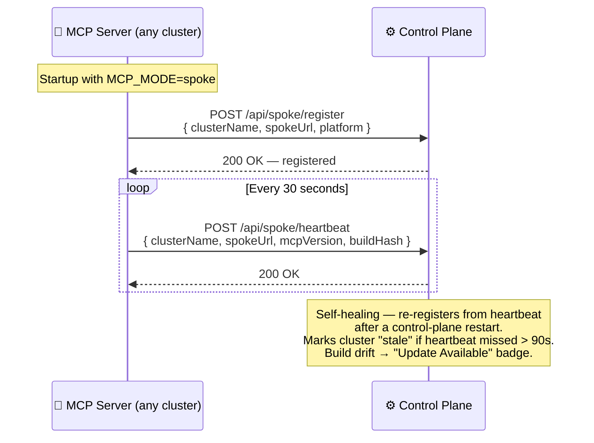
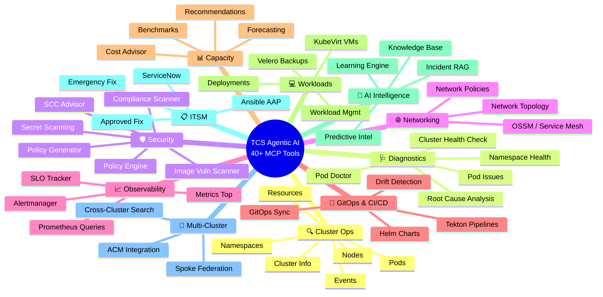
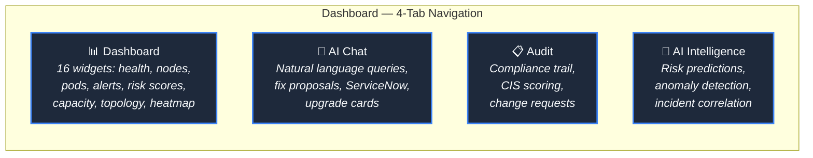
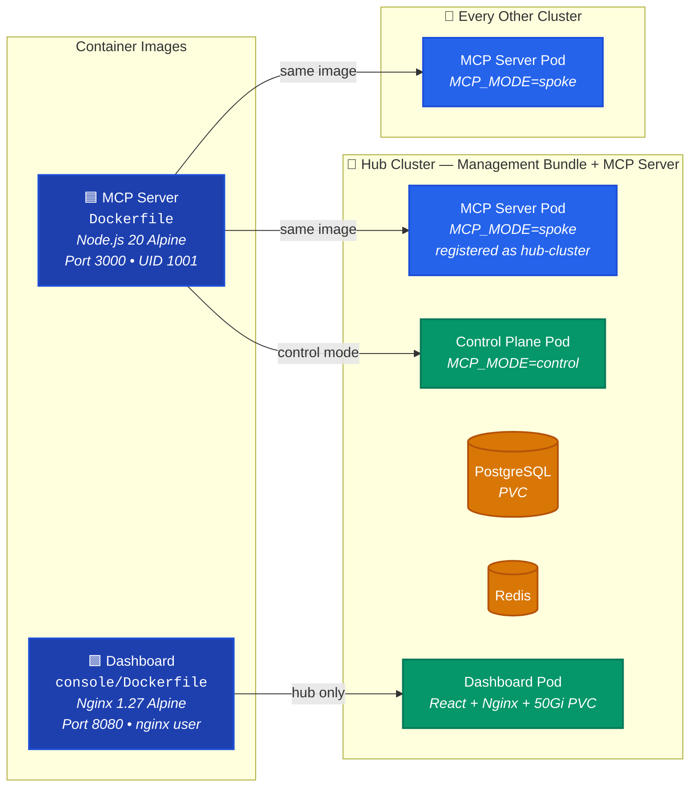
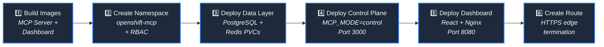
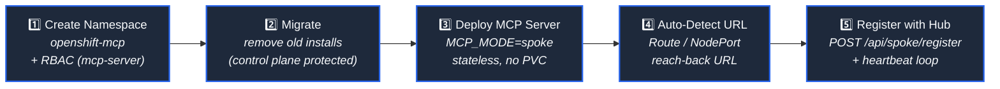

<div align="center">

# TCS Agentic AI

### OpenShift Intelligence Platform

[](https://www.redhat.com/en/technologies/cloud-computing/openshift)
[](https://kubernetes.io)
[](https://nodejs.org)
[](https://modelcontextprotocol.io)
[](LICENSE)

A production-grade **Model Context Protocol (MCP)** server for **Red Hat OpenShift** with multi-cluster federation, AI-powered diagnostics, ACM integration, Ansible remediation, and ServiceNow ITSM workflows.

*One stateful **Management Bundle** (dashboard + PostgreSQL + Redis), one stateless **MCP server** pod on every cluster — including the hub. Same image, same answers, everywhere.*

[](https://www.servicenow.com)
[](https://www.ansible.com)
[](https://www.redhat.com/en/technologies/management/advanced-cluster-management)
[](https://react.dev)
[](https://nginx.org)
[](https://www.postgresql.org)
[](https://redis.io)

</div>

---

## Architecture

TCS Agentic AI uses a **two-plane architecture** — the same pattern as Red Hat ACM, Rancher, and Portainer:

| Plane | Components | Deployed | State |
|---|---|---|---|
| **Management Plane** (Management Bundle) | Dashboard + Control Plane (`MCP_MODE=control`) + PostgreSQL + Redis | **Once**, on one cluster | Stateful — all data on PersistentVolumeClaims |
| **Data Plane** (MCP Server) | Stateless MCP server pod (`MCP_MODE=spoke`) | On **every** cluster, *including the hub* | Stateless — no DB, no PVC, kill/redeploy anytime |

Key principles:

- **The bundle is sacred.** Deployed once; MCP server refreshes never touch it. Every dashboard change (settings, chats, audit, incidents, knowledge base) is stored in PostgreSQL.
- **The MCP server is cattle.** The same image runs on every cluster. It gathers data live from its own cluster and registers with the control plane (heartbeat every 30s, carrying its build version for "Update Available" drift detection).
- **The hub is just another cluster.** The management cluster runs its own MCP server pod too, registered as `hub-cluster` (the ACM *local-cluster* pattern). Every query — including hub-cluster queries — flows through the same spoke pipeline, guaranteeing **identical answers fleet-wide**.
- **LLM config is centralized.** Credentials live only in the management plane; the control plane injects them per-request when proxying chat to any cluster's MCP pod. Configure once, works everywhere.

### System Overview

```mermaid
flowchart TB
    subgraph AI["🤖 AI Assistants"]
        direction LR
        claude["Claude"]
        chatgpt["ChatGPT"]
        copilot["Copilot"]
    end

    subgraph HUB["🏢 Hub Cluster (Management Bundle + its own MCP Server)"]
        direction TB
        subgraph DASH["📊 Dashboard Pod"]
            react["React SPA<br/><i>4-tab UI</i>"]
            nginx["Nginx :8080<br/><i>reverse proxy</i>"]
        end
        subgraph MCP_HUB["⚙️ Control Plane Pod"]
            hub_server["Control Plane :3000<br/><i>MCP_MODE=control</i>"]
            federation["Federation Proxy"]
            spoke_reg["Spoke Registry"]
            audit["Audit Engine"]
            llmcfg["LLM Config<br/><i>single source</i>"]
        end
        subgraph DATA["💾 Data Layer (PVCs)"]
            pg[("PostgreSQL<br/><i>audit, history,<br/>knowledge base</i>")]
            redis[("Redis<br/><i>cache, sessions,<br/>real-time</i>")]
        end
        subgraph MCP_LOCAL["🟣 MCP Server Pod<br/><i>registered as hub-cluster</i>"]
            mcp_h["MCP Server :3000<br/><i>MCP_MODE=spoke</i>"]
            tools_hub["40+ MCP Tools<br/><i>local execution</i>"]
            hb_h["Heartbeat → Control Plane"]
            mcp_h --> tools_hub
            mcp_h --> hb_h
        end

        react --> nginx
        nginx -->|"/api/*"| hub_server
        hub_server --> pg
        hub_server --> redis
        hub_server --> federation
        hub_server --> spoke_reg
        hub_server --> audit
        hub_server --> llmcfg
    end

    subgraph SPOKE_A["🔵 Spoke Cluster A<br/><i>e.g., prod-east</i>"]
        mcp_a["MCP Server :3000<br/><i>MCP_MODE=spoke</i>"]
        tools_a["40+ MCP Tools<br/><i>local execution</i>"]
        hb_a["Heartbeat → Hub"]
        mcp_a --> tools_a
        mcp_a --> hb_a
    end

    subgraph SPOKE_B["🟢 Spoke Cluster B<br/><i>e.g., staging-west</i>"]
        mcp_b["MCP Server :3000<br/><i>MCP_MODE=spoke</i>"]
        tools_b["40+ MCP Tools<br/><i>local execution</i>"]
        hb_b["Heartbeat → Hub"]
        mcp_b --> tools_b
        mcp_b --> hb_b
    end

    subgraph SPOKE_N["🟠 Spoke Cluster N<br/><i>unlimited clusters</i>"]
        mcp_n["MCP Server :3000<br/><i>MCP_MODE=spoke</i>"]
        tools_n["40+ MCP Tools<br/><i>local execution</i>"]
        hb_n["Heartbeat → Hub"]
        mcp_n --> tools_n
        mcp_n --> hb_n
    end

    AI -->|"SSE / stdio / MCP"| hub_server
    AI -->|"HTTPS"| nginx
    federation -->|"proxy /api/*<br/>(hub-cluster)"| mcp_h
    federation -->|"proxy /api/*"| mcp_a
    federation -->|"proxy /api/*"| mcp_b
    federation -->|"proxy /api/*"| mcp_n
    hb_h -->|"POST /api/spoke/heartbeat"| spoke_reg
    hb_a -->|"POST /api/spoke/heartbeat"| spoke_reg
    hb_b -->|"POST /api/spoke/heartbeat"| spoke_reg
    hb_n -->|"POST /api/spoke/heartbeat"| spoke_reg

    mcp_a -->|"OpenShift API"| k8s_a["☸ Cluster A API"]
    mcp_b -->|"OpenShift API"| k8s_b["☸ Cluster B API"]
    mcp_n -->|"OpenShift API"| k8s_n["☸ Cluster N API"]
    mcp_h -->|"OpenShift API"| k8s_hub["☸ Hub API"]

    classDef ai fill:#7C3AED,stroke:#5B21B6,color:#FFFFFF,stroke-width:2px
    classDef hub fill:#1E40AF,stroke:#1E3A8A,color:#FFFFFF,stroke-width:2px
    classDef dash fill:#0891B2,stroke:#0E7490,color:#FFFFFF,stroke-width:2px
    classDef data fill:#D97706,stroke:#B45309,color:#FFFFFF,stroke-width:2px
    classDef spoke_a fill:#2563EB,stroke:#1D4ED8,color:#FFFFFF,stroke-width:2px
    classDef spoke_b fill:#059669,stroke:#047857,color:#FFFFFF,stroke-width:2px
    classDef spoke_n fill:#EA580C,stroke:#C2410C,color:#FFFFFF,stroke-width:2px
    classDef k8s fill:#326CE5,stroke:#1D4ED8,color:#FFFFFF,stroke-width:2px

    class claude,chatgpt,copilot ai
    class hub_server,federation,spoke_reg,audit,llmcfg hub
    class react,nginx dash
    class pg,redis data
    class mcp_h,tools_hub,hb_h spoke_a
    class mcp_a,tools_a,hb_a spoke_a
    class mcp_b,tools_b,hb_b spoke_b
    class mcp_n,tools_n,hb_n spoke_n
    class k8s_a,k8s_b,k8s_n,k8s_hub k8s
```



### Request Proxy Flow

Every cluster query — **including the hub's own** — is transparently proxied to that cluster's MCP server pod. One pipeline, identical results everywhere. (`?cluster=local` is remapped to the `hub-cluster` pod.)



### MCP Server Registration & Heartbeat



> The MCP server registered as **`hub-cluster`** is the management cluster's own data plane — it follows the exact same registration flow but does not appear as a separate cluster card.

### Why This Architecture?

| | ❌ Hub-Special-Path (Old) | ✅ Two-Plane / Local-Cluster Pattern (New) |
|---|---|---|
| **Code Path** | Hub answered its own queries in-process, spokes via proxy | Same MCP server pod + same spoke pipeline on every cluster, hub included |
| **Query Results** | Hub and spokes formatted answers differently | Identical answers fleet-wide |
| **Data Freshness** | Multiple cache layers could serve stale data | Live proxy to the cluster's own pod; only LLM prose cached (build-versioned keys) |
| **State** | MCP server pods carried file state / PVCs | MCP server fully stateless; all state in the bundle's PostgreSQL |
| **Upgrades** | Rerun deploy scripts per cluster | ⋮ → Redeploy from the dashboard; "Update Available" badge on version drift |
| **Industry Pattern** | Custom, non-standard | ACM (`local-cluster`), Rancher, Portainer |

---

## Features

### 🔍 Cluster Insights & Information Gathering

| Tool | Description |
|------|-------------|
| `get_cluster_info` | Cluster version, channel, platform, operator status |
| `get_cluster_events` | Recent events filtered by namespace/type |
| `get_cluster_resource_usage` | CPU, memory, pod capacity across all nodes |
| `list_nodes` | All nodes with status, roles, capacity |
| `get_node_details` | Detailed node info with pods running on it |
| `list_pods` | Pods in namespace or cluster-wide |
| `get_pod_details` | Container statuses, events, resource requests |
| `get_pod_logs` | Container logs (tail, previous container) |
| `list_namespaces` | All namespaces/projects with quotas |
| `get_namespace_details` | Workloads, quotas, services in a namespace |

### 🩺 Diagnostics & Issue Detection

| Tool | Description |
|------|-------------|
| `diagnose_pod_issues` | Detects CrashLoopBackOff, ImagePullBackOff, OOMKilled, scheduling failures with fix suggestions |
| `diagnose_namespace_health` | Health check on all workloads — failing pods, unavailable deployments, quota pressure |
| `cluster_health_check` | Comprehensive cluster assessment — nodes, operators, critical components |

### 📋 ServiceNow ITSM Integration

| Tool | Description |
|------|-------------|
| `create_servicenow_incident` | Create incident for detected issues |
| `create_change_request` | Create normal/standard/emergency change requests |
| `check_approval_status` | Check if a change request has been approved |
| `query_servicenow` | Query incidents, changes, problems |
| `update_servicenow_record` | Update records (close, add notes) |

### 🔧 Ansible Automation Platform

| Tool | Description |
|------|-------------|
| `list_ansible_job_templates` | List available remediation playbooks |
| `launch_ansible_job` | Run a playbook with extra variables |
| `check_ansible_job_status` | Monitor running job status |
| `list_ansible_inventories` | List inventories |
| `list_ansible_workflows` | List workflow templates |
| `launch_ansible_workflow` | Launch multi-step workflows |

### 🚨 Emergency Fixes

| Tool | Description |
|------|-------------|
| `emergency_fix` | Immediate fix with auto-created emergency change request and notification |
| `approved_fix` | Execute fix only after ITSM approval is confirmed |

Supported actions: `restart_pod` `scale_deployment` `cordon_node` `drain_node` `rollback_deployment` `delete_stuck_pod`

### 🌐 Multi-Cluster Management (ACM)

| Tool | Description |
|------|-------------|
| `list_managed_clusters` | All ACM managed clusters with health |
| `get_managed_cluster_details` | Detailed cluster info, claims, capacity |
| `list_acm_policies` | Governance policies and compliance |
| `search_across_clusters` | Search resources across all clusters |

### 🛡️ Advanced Tool Categories



### 📊 Dashboard

The React dashboard (`console/`) — deployed as a separate Nginx pod on the hub cluster:



---

## Prerequisites

| Requirement | Version | Required |
|-------------|---------|----------|
|  | 4.12+ (or K8s 1.24+) | ✅ |
|  | 20+ | ✅ Local dev |
|  | Latest | ✅ Builds |
|  | 2.x | Optional |
|  | 2.x | Optional |
|  | Any | Optional |

---

## Quick Start

### 1. Clone & Install

```bash
git clone https://github.com/cskaruppu/openshift-mcp-server.git
cd openshift-mcp-server
npm install
```

### 2. Configure Environment

```bash
cp .env.example .env
```

Edit `.env`:

```bash
# Required — OpenShift
OPENSHIFT_API_URL=https://api.your-cluster.example.com:6443
OPENSHIFT_TOKEN=$(oc whoami -t)

# Optional — ServiceNow
SERVICENOW_INSTANCE=https://your-instance.service-now.com
SERVICENOW_USERNAME=admin
SERVICENOW_PASSWORD=your-password

# Optional — Ansible
ANSIBLE_CONTROLLER_URL=https://ansible-controller.apps.your-cluster.example.com
ANSIBLE_CONTROLLER_TOKEN=your-token

# Optional — Emergency webhook (Slack/Teams)
EMERGENCY_NOTIFICATION_WEBHOOK=https://hooks.slack.com/services/...

# Optional — PostgreSQL and Redis (hub mode)
POSTGRES_HOST=localhost
POSTGRES_DB=mcp
REDIS_URL=redis://localhost:6379
```

### 3. Run Locally

```bash
# Control mode — the management plane (PostgreSQL/Redis/dashboard bundle)
MCP_MODE=control node src/index.js

# Spoke mode — the per-cluster stateless MCP server (connects to the control plane)
MCP_MODE=spoke HUB_URL=http://hub-host:3000 CLUSTER_NAME=my-cluster node src/index.js

# Dev mode with auto-reload
npm run dev
```

### 4. Connect to Claude Desktop

Add to `claude_desktop_config.json`:

```json
{
  "mcpServers": {
    "openshift": {
      "command": "node",
      "args": ["/path/to/openshift-mcp-server/src/index.js"],
      "env": {
        "OPENSHIFT_API_URL": "https://api.your-cluster.example.com:6443",
        "OPENSHIFT_TOKEN": "sha256~your-token",
        "NODE_TLS_REJECT_UNAUTHORIZED": "0"
      }
    }
  }
}
```

Or via **Claude Code CLI**:

```bash
claude mcp add openshift-mcp -- node /path/to/openshift-mcp-server/src/index.js
```

---

## Deployment

TCS Agentic AI ships as **two container images**:



### Deploy the Management Bundle (once)

Deploys dashboard + control plane + PostgreSQL + Redis with persistent storage. Deployed once — MCP server refreshes never touch it.

```bash
./deploy/dashboard/deploy.sh
```

**What it does:**



After deployment:

```bash
# Get the dashboard URL
oc get route mcp-dashboard -n openshift-mcp -o jsonpath='{.spec.host}'

# Check all pods
oc get pods -n openshift-mcp
# Expected: agentic-ai-server (control plane), mcp-dashboard, mcp-postgres, mcp-redis
```

### Deploy the MCP Server (every cluster, including the hub)

Run on each cluster — deploys only the stateless MCP server (no dashboard, no databases, no PVC). On the management cluster itself, use `--cluster-name hub-cluster` so it registers as that cluster's own data plane (the ACM local-cluster pattern).

```bash
# On the management cluster (registers as its own data plane):
./deploy/mcp/deploy.sh \
  --hub-url https://<dashboard-route> \
  --hub-token <hub-token> \
  --cluster-name hub-cluster \
  --platform openshift --tls-skip

# On each additional cluster:
./deploy/mcp/deploy.sh \
  --hub-url https://<dashboard-route> \
  --hub-token <hub-token> \
  --cluster-name prod-east \
  --platform openshift --tls-skip
```

**What it does:**



**MCP Server ConfigMap variables:**

| Variable | Description |
|----------|-------------|
| `MCP_MODE` | `spoke` |
| `HUB_URL` | Management bundle URL (the dashboard route) |
| `CLUSTER_NAME` | Unique cluster name (`hub-cluster` on the management cluster; e.g. `prod-east` elsewhere) |
| `CLUSTER_PLATFORM` | `openshift`, `rancher`, `eks`, `aks`, `gke`, or `k8s` |
| `DEPLOYMENT_NAME` / `MCP_NAMESPACE` | Used by the dashboard's ⋮ → Redeploy action |

### Verifying Registration

MCP servers register automatically on startup. Verify from the hub:

```bash
# Check registered clusters
curl https://<hub-url>/api/spoke/status

# Check per-cluster build versions (drift detection)
curl https://<hub-url>/api/cluster/version
```

After the image is updated in the registry, **no script reruns are needed** — clusters running an older build show an "Update Available" badge; click ⋮ → Redeploy on the cluster card.

### Helm Chart

```bash
helm install tcs-agentic-ai ./chart/openshift-mcp \
  --set mcpMode=hub \
  --set image.repository=quay.io/your-org/openshift-mcp-server \
  --set image.tag=latest
```

---

## ITSM Workflows

```mermaid
flowchart TB
    subgraph NORMAL["✅ Normal Flow — with Approval"]
        direction LR
        N1["🤖 AI detects<br/>issue"] --> N2["📋 Create Change<br/>Request"]
        N2 --> N3["⏳ Wait for<br/>Approval"]
        N3 --> N4["✅ Execute Fix<br/><code>approved_fix</code>"]
        N4 --> N5["📝 Update<br/>ServiceNow"]
    end

    subgraph EMERGENCY["🚨 Emergency Flow — Immediate"]
        direction LR
        E1["🤖 AI detects<br/>critical issue"] --> E2["🚨 Create Emergency<br/>Change Request"]
        E2 --> E3["⚡ Execute Fix<br/>Immediately"]
        E3 --> E4["📢 Webhook<br/>Notification"]
        E4 --> E5["📝 Post-Approval<br/>Review"]
    end

    subgraph ANSIBLE["🔧 Ansible-Driven Flow"]
        direction LR
        A1["🤖 AI detects<br/>issue"] --> A2["📋 Create<br/>ServiceNow Ticket"]
        A2 --> A3["✅ Approval<br/>Received"]
        A3 --> A4["🔧 Launch Ansible<br/>Playbook"]
        A4 --> A5["📊 Monitor<br/>Job Status"]
        A5 --> A6["📝 Update<br/>ITSM Ticket"]
    end

    classDef normal fill:#059669,stroke:#047857,color:#FFFFFF,stroke-width:2px
    classDef emergency fill:#DC2626,stroke:#B91C1C,color:#FFFFFF,stroke-width:2px
    classDef ansible fill:#D97706,stroke:#B45309,color:#FFFFFF,stroke-width:2px

    class N1,N2,N3,N4,N5 normal
    class E1,E2,E3,E4,E5 emergency
    class A1,A2,A3,A4,A5,A6 ansible
```



---

## Project Structure

```
openshift-mcp-server/
│
├── 📦 src/                              # MCP server source code
│   ├── index.js                         # Server entry point (hub/spoke/standalone)
│   ├── tools/                           # 40+ MCP tool implementations
│   │   ├── cluster.js                   #   Cluster info, events, resources
│   │   ├── nodes.js                     #   Node listing and details
│   │   ├── pods.js                      #   Pod operations and logs
│   │   ├── namespaces.js                #   Namespace management
│   │   ├── diagnostics.js               #   Issue detection, health checks
│   │   ├── servicenow.js                #   ITSM integration
│   │   ├── ansible.js                   #   Ansible Automation Platform
│   │   ├── emergency.js                 #   Emergency fix workflows
│   │   ├── acm.js                       #   Advanced Cluster Management
│   │   ├── security.js                  #   Security scanning, SCC advisor
│   │   ├── network.js                   #   Network topology, policies
│   │   ├── helm.js                      #   Helm chart operations
│   │   ├── tekton.js                    #   Tekton CI/CD pipelines
│   │   ├── velero.js                    #   Backup and restore
│   │   └── ...                          #   And many more
│   ├── services/                        # 50+ core services
│   │   ├── spoke-proxy.js               #   Hub/spoke federation proxy
│   │   ├── agent-bridge.js              #   Legacy agent bridge (fallback)
│   │   ├── chat-api.js                  #   AI chat interface
│   │   ├── nlu.js                       #   Natural language understanding
│   │   ├── llm.js                       #   LLM provider abstraction
│   │   ├── audit-log.js                 #   Action audit trail
│   │   ├── auth.js                      #   Authentication
│   │   └── ...
│   ├── platform/                        # Platform abstraction (OpenShift/K8s)
│   ├── security/                        # Command validation, guardrails
│   ├── agents/                          # MCP router and agent registry
│   └── utils/                           # API clients (OpenShift, ServiceNow, Ansible)
│
├── 🖥️ console/                          # React dashboard (separate pod)
│   ├── Dockerfile                       # Nginx + React multi-stage build
│   ├── nginx.conf                       # Reverse proxy → MCP server
│   ├── src/
│   │   ├── App.jsx                      # Main app (4-tab navigation)
│   │   ├── views/                       # Dashboard, Chat, Audit, AI Intelligence
│   │   ├── components/                  # Reusable UI components
│   │   ├── design/                      # Design system tokens & components
│   │   └── ...
│   ├── package.json
│   └── vite.config.js
│
├── 🚀 deploy/                           # Deployment automation (all deploy scripts here)
│   ├── dashboard/
│   │   ├── deploy.sh                    # Management Bundle: Dashboard + Control Plane
│   │   │                                #   + PostgreSQL + Redis (deployed ONCE, PVCs)
│   │   └── manifests/                   # namespace, RBAC, configmap, postgres,
│   │       │                            #   redis, dashboard-deployment (50Gi PVC)...
│   │       └── dashboard-deployment.yaml
│   └── mcp/
│       └── deploy.sh                    # MCP server: stateless pod, run on EVERY
│                                        #   cluster incl. hub (--cluster-name hub-cluster)
│
├── ⎈  chart/                            # Helm chart
│   └── openshift-mcp/
│       ├── Chart.yaml
│       ├── values.yaml
│       └── templates/
│
├── 🔌 adapters/                         # AI framework adapters
│   ├── anthropic-claude/                # Claude MCP client
│   ├── langchain/                       # LangChain adapter
│   ├── microsoft-agent-framework/       # Microsoft agent orchestrator
│   └── rest-api/                        # OpenAPI spec
│
├── 📚 docs/                             # Documentation + doc generators
├── 💾 db/                               # Database schema (PostgreSQL)
├── 🧪 tests/                            # Test suites + smoke test
├── 📦 backup/                           # Legacy agent & old dashboard
├── 📊 data/                             # Sample data (incident history)
├── 📝 examples/                         # Client config examples
├── 🐳 Dockerfile                        # MCP server image (API-only)
├── 📄 package.json
├── 📄 .env.example
└── 📄 CLAUDE.md                         # Project instructions
```

---

## Container Images

### MCP Server (`Dockerfile`)

API-only Node.js server. No dashboard files.

```
┌────────────────────────────────────────┐
│  node:20-alpine                        │
│  Non-root (UID 1001)                   │
│  Port 3000                             │
│  Entry: node src/index.js              │
│  ENV: MCP_MODE=control|spoke|standalone│
└────────────────────────────────────────┘
```

```bash
podman build -t quay.io/your-org/openshift-mcp-server:latest .
```

### Dashboard (`console/Dockerfile`)

React SPA served by Nginx. Reverse proxies API calls to the MCP server.

```
┌─────────────────────────────────────┐
│  nginx:1.27-alpine                  │
│  Non-root (nginx user)              │
│  Port 8080                          │
│  Proxies /api/* → mcp-server:3000   │
│  Proxies /sse   → mcp-server:3000   │
│  SPA fallback: try_files → index    │
└─────────────────────────────────────┘
```

```bash
podman build -t quay.io/your-org/mcp-dashboard:latest ./console
```

---

## Security

| Area | Implementation |
|------|---------------|
| **RBAC** | Dedicated ServiceAccount with least-privilege roles per cluster |
| **Read Access** | Reader role for information gathering (read-only) |
| **Write Access** | Remediator role for fix actions (pod delete, scale, cordon) |
| **Secrets** | Kubernetes Secrets (External Secrets Operator recommended for production) |
| **Container** | Non-root — UID 1001 (MCP server), nginx user (dashboard) |
| **Network** | Spoke-to-hub over HTTPS (TLS at OpenShift Route edge) |
| **Guardrails** | Command validation prevents destructive ops without approval |
| **Auth** | ServiceNow Basic auth (OAuth extensible), token-based cluster auth |
| **Notifications** | Emergency webhook — Slack, Teams, or any HTTP endpoint |

---

## Example Conversations

> **Cluster Overview:**
> "What's the current state of my OpenShift cluster?"

> **Diagnose Issues:**
> "Are there any pods with issues in the production namespace?"

> **Fix with Approval:**
> "The redis pod keeps getting OOMKilled. Can you increase its memory limit? Create a change request first."

> **Emergency Fix:**
> "The API gateway is down in production! This is an emergency — restart the pod immediately."

> **Multi-Cluster (via spoke):**
> "Show me the health status of the prod-east cluster."

> **ACM:**
> "List all clusters managed by ACM and their compliance status."

> **Ansible Remediation:**
> "Run the node-maintenance playbook on worker-2."

---

<div align="center">

**Built by TCS Agentic AI Team**

[](https://github.com/cskaruppu/openshift-mcp-server)
[](LICENSE)

</div>
