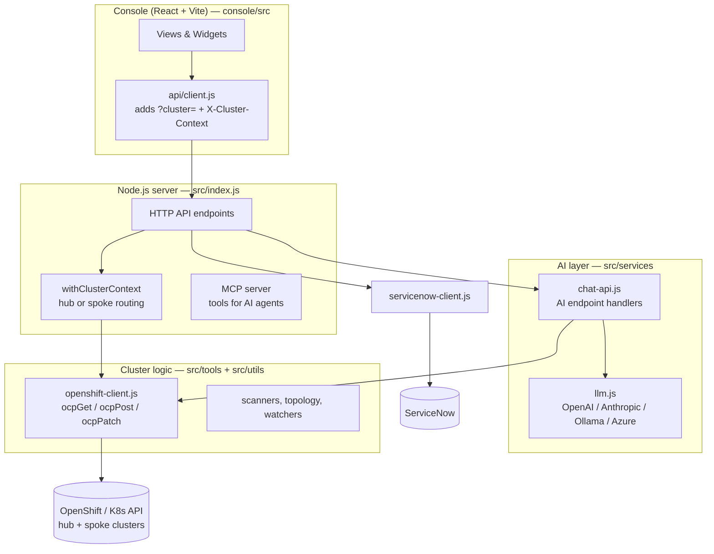

# TCS Agentic AI — Code Reference (File-by-File)

A guided tour of the codebase: what each layer does, what lives in each file,
and end-to-end traces of the main features so you can explain the product to
anyone — engineer or exec.

---

## 1. The Big Picture



**One sentence:** the React console calls HTTP endpoints on the Node server;
the server routes each call to the right cluster (hub or spoke), uses the
`tools/` modules to read/act on Kubernetes, and calls the `services/` AI layer
when reasoning is needed — with ServiceNow as the ITSM side-channel.

## 2. Repository Layout

| Path | Role |
|---|---|
| `src/index.js` | The server: HTTP endpoint router + MCP server + cluster-context switching |
| `src/services/` | AI & platform services (LLM, chat handlers, auth, audit, guardrails…) |
| `src/tools/` | Cluster-facing feature logic (scanners, topology, watchers, RCA…) |
| `src/utils/` | Low-level clients (OpenShift API, ServiceNow, cache, config) |
| `src/agents/` | Agent registry + spoke-agent manifests (hub/spoke federation) |
| `console/src/` | React console (views, widgets, stores, api client) |
| `deploy/` | Kubernetes manifests to deploy the platform itself (incl. RBAC) |
| `docs/` | Engineering and product documentation |
| `usecases/` | Per-use-case customer collateral and its generators |
| `examples/` | Client configs, sample requirements, SOPs, sample applications |

---

## 3. Backend Core

### `src/index.js` (~8,200 lines) — the spine
Everything meets here:
- **HTTP server & routing** — every `/api/...` endpoint is an `if (url.pathname === ...)` block. Serves the built console too.
- **`withClusterContext(url, fn)`** — the multi-cluster heart. Reads `?cluster=` and runs `fn` against the hub (direct) or a spoke (via the agent bridge). Returns `null` when the cluster is unreachable, so every endpoint has a graceful fallback.
- **MCP server** — registers all `src/tools/*` as MCP tools so AI agents can call them.
- Feature endpoints added per pillar; key ones referenced in the traces below (§7).

### `src/utils/` — low-level clients
| File | What it does |
|---|---|
| `openshift-client.js` | `ocpGet/ocpPost/ocpPatch/ocpDelete` against the cluster API using the pod's ServiceAccount token; remote-cluster context switching (`setRemoteCluster`, bridge helpers) |
| `servicenow-client.js` | `snowFetch` (auth, proxy via undici ProxyAgent, timeout/hibernation hints), `createIncident`, `queryRecords`, `updateRecord` (PATCH→PUT fallback), `resolveIncident` (ITIL close with rich work notes + state-transition fallbacks), `resolveCallerSysId` (identifies "platform-raised" incidents) |
| `cluster-credentials.js` | Per-cluster stored credentials for direct (non-bridge) access |
| `cache.js`, `config.js`, `db.js`, `state-store.js` | Response cache, env config, persistence helpers |
| `generate-agent-yaml.js` | Generates the spoke-agent install YAML shown in the Agent Registry |

### `src/services/` — the AI & platform brain (selected)
| File | What it does |
|---|---|
| `llm.js` | Single `callLLM()` façade over OpenAI-compatible / Anthropic / Azure / Ollama; provider chosen by env or per-request `llmOpts` |
| `chat-api.js` (~19,700 lines) | All AI endpoint handlers: chat, fix execution, RCA, plus this session's `handleGenerateManifestAPI` (doc→manifests), `handleIncidentCorrelationAPI` (dedup/correlate incidents), `handleTopologyExplainAPI` (topology root-cause), `handleComplianceImpactAPI` (CIS impact analysis) |
| `doc-parser.js` | Extracts text from uploaded requirement docs (`parseDocx` via mammoth; PDF via pdf-parse; plain text/markdown passthrough) |
| `manifest-scan.js` | **Shift-left security**: `cisCheckManifests` (static CIS/PSS-restricted checks on generated YAML) + `scanManifestImages` (image hygiene, optional live-CVE enrichment from Trivy reports) |
| `agent-bridge.js`, `mcp-hub.js`, `spoke-proxy.js` | Hub↔spoke federation: SSE bridge, connected-agent registry, request proxying |
| `auth.js`, `guardrails.js`, `audit-log.js`, `approval-chains.js` | Login/session, action safety rails, audit trail, approvals |
| `action-workflow.js`, `fix-executor.js`, `pod-doctor.js`, `rca-engine.js`* | Diagnose→propose→dry-run→apply remediation pipeline (*rca in tools/) |
| Others (`prometheus.js`, `alertmanager.js`, `knowledge-base.js`, `predictive-intel.js`, …) | Metrics, alerts, KB, predictions feeding the Dashboard/Intelligence views |

### `src/tools/` — cluster-facing features (selected)
| File | What it does |
|---|---|
| `namespace-topology.js` | `getNamespaceTopology(ns, {expand})` — builds the topology popup's graph: workload health scoring, Route→Service→Workload chains, cross-component issue detection, Grouped (per-kind counts) and Expanded (every resource, Deployment→ReplicaSet→Pod) graphs, plus `relations` for blast-radius tracing |
| `compliance-scanner.js` | `runComplianceScan()` — CIS benchmark checks (pod-security / network / RBAC / image categories), score + grade + control pass counts |
| `image-vulnerability-scanner.js` | `runImageScan(ns)` — hybrid scanning: `detectScanSources()` (Trivy Operator / Quay CSO), live CVE reports where available, static hygiene fallback for full coverage |
| `app-change-watcher.js` | Tracks user-selected namespaces, snapshots workloads, detects/report changes; persists selections in a ConfigMap |
| `network-topology.js` | Endpoint/NetworkPolicy-centric network graph (predates namespace-topology; still serves `/api/network/topology`) |
| `compliance-frameworks.js` | Multi-framework (beyond CIS) evaluation |
| Others (`nodes.js`, `pods.js`, `diagnostics.js`, `emergency.js`, `acm.js`, …) | Per-domain MCP tools + dashboard data providers |

---

## 4. Frontend (console/src)

### Shell
| File | What it does |
|---|---|
| `App.jsx` | App shell: auth gate, cluster-picker vs workspace, the 4 NAV tabs (Dashboard / AI Chat / Audit / AI Intelligence), mounts global modals incl. `AutomationHub` |
| `views/ClusterPickerView.jsx` | Fleet workspace screen: cluster cards + fleet-level actions (Automation Hub icon, Agent Registry, Settings) |
| `api/client.js` | `apiGet`/`clusterUrl` — appends `?cluster=` + `X-Cluster-Context` header; 401 → auth recheck |
| `hooks/useClusterQuery.js` | TanStack-Query wrapper keyed by active cluster (auto-cancel on switch) |
| `store/*.js` | Zustand stores: `clusterStore` (active cluster), `authStore`, `chatStore` (per-cluster chat), `toastStore`, `themeStore`, `viewStore` |

### The two big session-built components
**`components/AutomationHub.jsx` (~890 lines)** — fleet-level popup with two agents:
- `SopAgent` (App Deployment Agent): upload doc → `/api/automation/extract-doc` → generate → editable YAML → pre-deploy checks (`/api/automation/cis-check`, `/api/automation/image-scan`) → cluster dropdown → dry-run/deploy (`/api/automation/deploy`) → **terminal-style pod watch** (`/api/automation/app-status`, 4s poll, kubectl-like rows, auto-stops at all-ready) → post-deploy verify (`/api/compliance/scan-namespace` + image scan). Includes the RBAC-403 fix hint.
- `SnowAgent` (ServiceNow Agent): open-only platform-scoped incidents → `Analyze & Correlate` (`/api/servicenow/incidents/analyze`) → group cards with ROOT/duplicates → dry-run **+ live validation** (`/api/servicenow/incidents/validate`) → consolidated close list → apply fix / close-only (`/api/servicenow/incidents/fix` with `alsoClose`) → auto-reconcile loop (90s toggle + optional auto-close).

**`components/widgets/NamespaceHeatmapWidget.jsx` (~540 lines)** — heatmap + topology popup:
- Heatmap cells → click → `NamespaceTopologyModal`: Grouped/Expanded toggle, clickable filter chips, **AI Copilot bar** (Explain → `/api/topology/explain`; Security overlay → namespace-scoped image-vulns), issues panel.
- `TopologyGraph`: deterministic tree layout (`layoutTree`), SVG elbow edges, pan/zoom/drag canvas, root-cause pulse + symptom dashes + dimming, blast-radius tracing (descendants + services + routes), CVE shield badges, node panel with dry-run→apply restart (`/api/topology/remediate`).

### Other views/widgets (pre-existing, per CLAUDE.md)
`DashboardView` (16 widgets incl. ImageVulns, AppChanges, Heatmap), `ChatView`
(+`ChatTokens`), `AuditView` (CIS autopilot: clickable KPIs, auto-fix/guided
remediation, AI impact), `IntelligenceView` (predictions, anomalies, KB, SOP
Runner).

---

## 5. Deploy & RBAC (`deploy/dashboard/manifests/`)

| File | What it does |
|---|---|
| `serviceaccount.yaml` | The RBAC story in three ClusterRoles: **reader** (broad read-only across ~60 API groups incl. Trivy/Quay reports), **remediator** (targeted mutations: pod delete, deployment patch/scale, cordon, PVC resize…), **deployer** (opt-in: lets the App Deployment Agent create namespaces/workloads/networking/RBAC/monitoring — incl. `bind`+`escalate` for creating app Roles). Bound to both `agentic-ai-server` and `agentic-ai-agent` SAs |
| `deployment.yaml` / `dashboard-deployment.yaml` | The server + console workloads |
| `namespace.yaml`, `service.yaml`, `configmap.yaml`, `secret.yaml`, `networkpolicy.yaml` | Platform namespace plumbing |
| `deploy/trivy-operator/` | Optional Trivy Operator install for live CVE scanning |

---

## 6. Design Patterns Worth Explaining

1. **Cluster context everywhere** — every feature endpoint wraps its work in `withClusterContext`, so the same code serves the hub and any spoke. UI passes `?cluster=`; nothing else changes.
2. **AI with deterministic fallback** — every LLM handler (correlation, topology explain, manifest generation) has a built-in non-AI fallback and validates AI output against reality (e.g. ticket numbers, node ids) so hallucinations can't leak into actions.
3. **Dry-run → validate → confirm → apply → verify** — no mutation happens without a preview; several flows also validate *live state* first (is it still broken?) and verify after (CIS + image scan, pod watch).
4. **Additive feature flags** — risky features (fleet scan, cluster store) default off; new capability lands as new endpoints + opt-in RBAC so existing behavior is byte-identical.
5. **Shift-left + runtime security** — the same standards are enforced twice: statically on generated YAML (manifest-scan) and live on the cluster (compliance-scanner + image scanner).

## 7. End-to-End Feature Traces (use these to demo/explain)

### A. App Deployment Agent — "document → running app"
```
Upload doc      AutomationHub.SopAgent.onUpload
                → POST /api/automation/extract-doc      (index.js → doc-parser.js)
Generate        → POST /api/automation/generate-manifest (index.js → chat-api.handleGenerateManifestAPI → llm.js)
                ← manifests[] + editable YAML + security/monitoring summaries
Pre-checks      → POST /api/automation/cis-check         (manifest-scan.cisCheckManifests)
                → POST /api/automation/image-scan        (manifest-scan.scanManifestImages [+Trivy])
Deploy          → POST /api/automation/deploy?cluster=X  (index.js: YAML→objects, apiVersion normalization,
                                                          dependency-ordered create-or-update, dryRun=All)
Watch           → GET /api/automation/app-status (4s)    (index.js: kubectl-style pod rows → terminal panel)
Verify          → POST /api/compliance/scan-namespace    (compliance-scanner, filtered to the namespace)
                → GET /api/dashboard/image-vulns?namespace= (image-vulnerability-scanner)
```

### B. ServiceNow Agent — "noisy queue → one fix"
```
List            GET /api/servicenow/incidents?scope=platform  (index.js → servicenow-client.queryRecords;
                open-only filter, caller_id=platform user, dedup fingerprints)
Correlate       POST /api/servicenow/incidents/analyze        (chat-api.handleIncidentCorrelationAPI → llm.js;
                duplicate clusters + causal groups + fix order)
Validate        POST /api/servicenow/incidents/validate       (index.js: live pod/sibling health — already fixed?)
Fix             POST /api/servicenow/incidents/fix            (index.js: rolling restart via ownerRefs → 
                resolveIncident + alsoClose correlated tickets; closeOnly mode skips cluster mutation)
Reconcile       SnowAgent 90s loop → validate each → flag/auto-close already-resolved tickets
```

### C. Namespace Topology — "map that reasons and acts"
```
Open            heatmap cell click → GET /api/topology/namespace?namespace=&expand=
                (namespace-topology.getNamespaceTopology: graph + issues + relations)
Explain         POST /api/topology/explain                    (chat-api.handleTopologyExplainAPI → llm.js;
                primaryId + symptomIds → pulse/dim rendering in TopologyGraph)
Blast radius    client-side: descendants(sel) + relations.services/routes → orange IMPACTED set
Security        GET /api/dashboard/image-vulns?namespace=     → CVE shield badges per pod/workload
Fix             POST /api/topology/remediate                  (dry-run shows ready/desired → rolling restart → refetch)
```

## 8. "Where do I change X?" Cheat Sheet

| Want to change… | Go to |
|---|---|
| What the App Deployment Agent generates (standards, images) | `chat-api.js` → `handleGenerateManifestAPI` prompt (rules 1–9) |
| Which kinds can be deployed | `index.js` → `/api/automation/deploy` `kindPath` + `kindApiVersion` + `applyRank` |
| CIS checks (static, pre-deploy) | `manifest-scan.js` → `cisCheckManifests` |
| CIS checks (live cluster) | `compliance-scanner.js` |
| Incident correlation behavior | `chat-api.js` → `handleIncidentCorrelationAPI` prompt |
| Topology node kinds / health rules | `namespace-topology.js` |
| Topology visuals (colors, layout, overlays) | `NamespaceHeatmapWidget.jsx` → `TopologyGraph`, `STATUS`, `KIND_ICON` |
| Automation Hub UI/flows | `AutomationHub.jsx` (`SopAgent` / `SnowAgent`) |
| ServiceNow connection/close behavior | `utils/servicenow-client.js` |
| Platform RBAC | `deploy/dashboard/manifests/serviceaccount.yaml` |
| LLM provider/model | env (`LLM_PROVIDER`, …) or Settings panel → `llm.js` |
