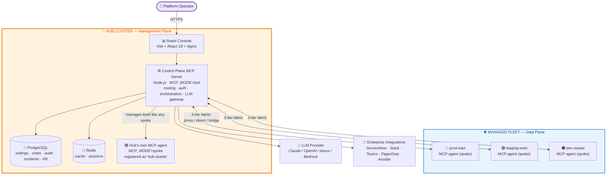
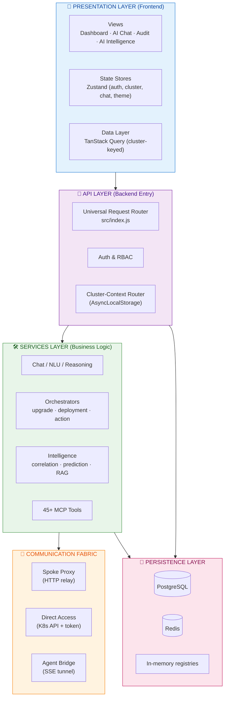
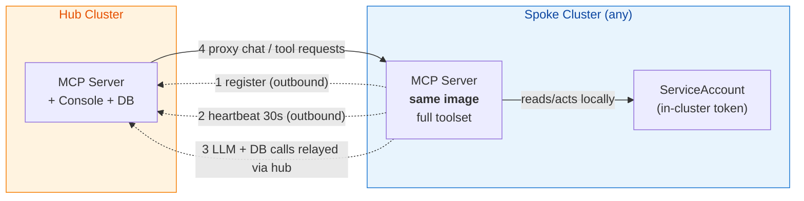
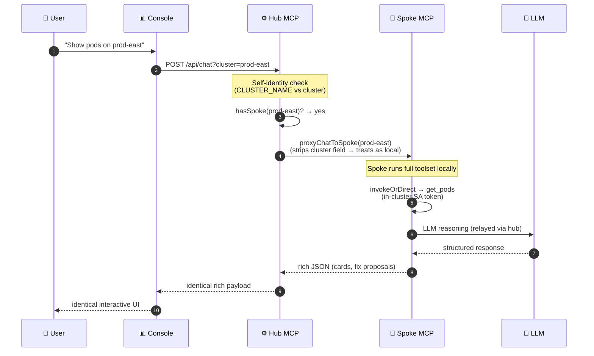
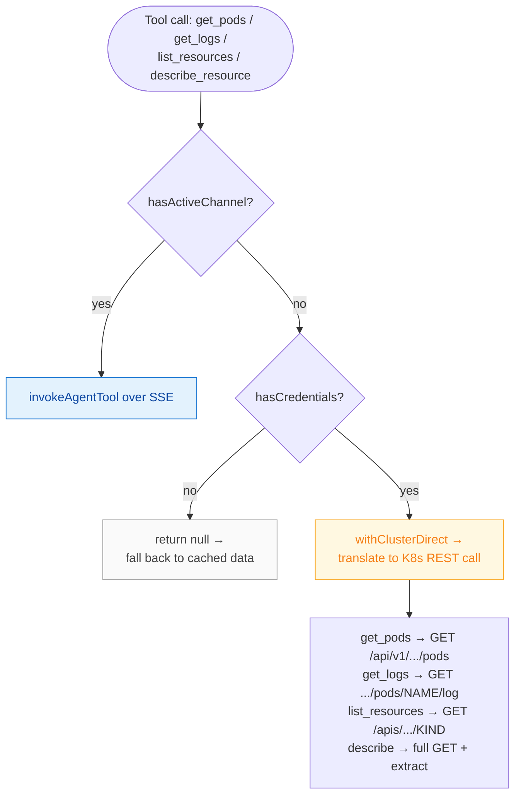
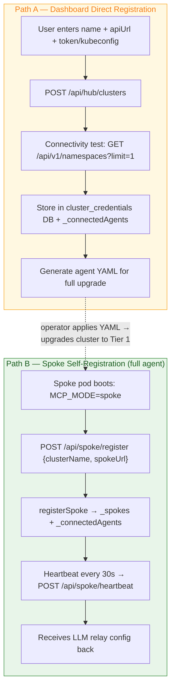
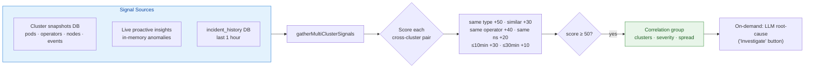
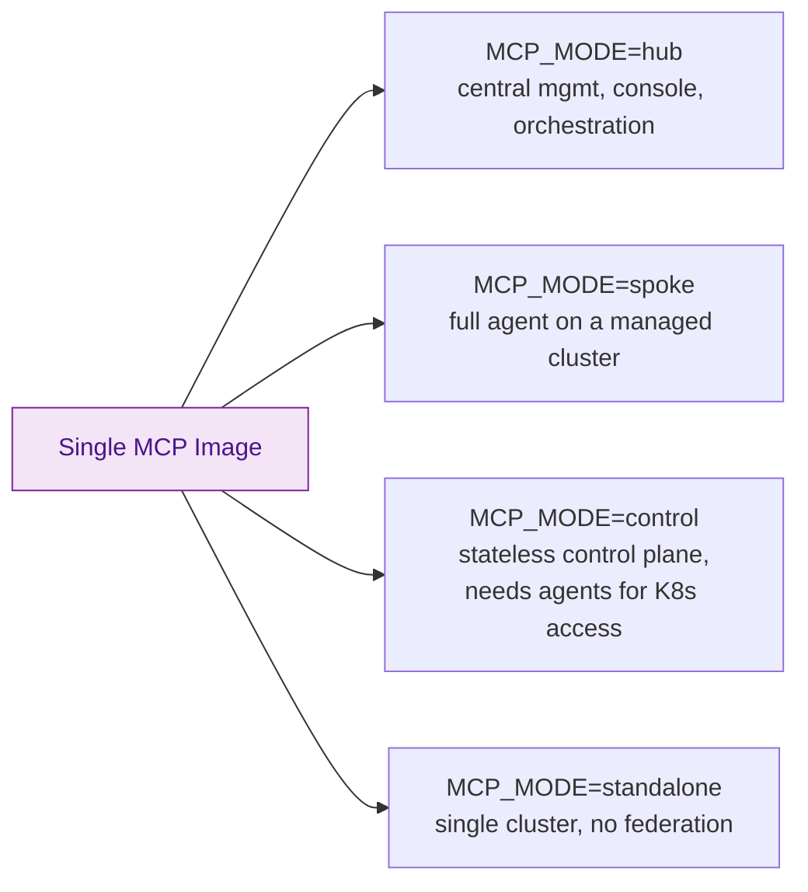

# TCS Agentic AI — High-Level & Low-Level Design

> **TCS Agentic AI** (a.k.a. *TCS KubeNexus AI*) — an AI-native, multi-cluster
> intelligence and operations platform for OpenShift and Kubernetes, built on the
> **Model Context Protocol (MCP)**.
>
> **Architecture pattern:** *Agent on Every Cluster* (Rancher / Red Hat ACM
> local-cluster model) with a three-tier resilient communication fabric.
>
> | | |
> |---|---|
> | **Document version** | 1.0 |
> | **Last updated** | 2026-06-15 |
> | **Status** | Current / as-built |
> | **Audience** | Architects, platform engineers, reviewers |

---

## Table of Contents

1. [System Overview](#1-system-overview)
2. [High-Level Design (HLD)](#2-high-level-design-hld)
3. [Component Inventory](#3-component-inventory)
4. [Technology Stack](#4-technology-stack)
5. [Low-Level Design (LLD)](#5-low-level-design-lld)
6. [Data Model](#6-data-model)
7. [Deployment Topology](#7-deployment-topology)
8. [Security & Isolation Design](#8-security--isolation-design)
9. [Design Decisions & Rationale](#9-design-decisions--rationale)

---

## 1. System Overview

TCS Agentic AI lets a single operator manage a **fleet** of OpenShift/Kubernetes
clusters through one console — running AI-driven chat, dashboards, audit, and
autonomous remediation **identically on every cluster**, hub or spoke.

The platform is split into **two planes** and runs the **same MCP server image
on every cluster** (the only difference is one environment variable, `MCP_MODE`):

| Plane | Where | What runs |
|---|---|---|
| **Management Plane** | Hub cluster, deployed **once** | React console + Control Plane MCP server + PostgreSQL + Redis |
| **Data Plane** | **Every** cluster (including the hub itself) | One stateless MCP server pod (`MCP_MODE=spoke`) with the full toolset, executing live against its own cluster |

**Key property:** because every cluster runs the identical code with the identical
toolset, the AI Chat, upgrade orchestrator, fix proposals, and lifecycle cards
render **identically** whether you are on the hub or any spoke.

---

## 2. High-Level Design (HLD)

### 2.1 System Context



### 2.2 Logical Layers



### 2.3 The "Agent on Every Cluster" Model

Every cluster is a **full peer**: it runs the complete MCP server with all 45+
tools and executes scans, log reads, metrics, and AI reasoning **locally** using
its in-cluster ServiceAccount. The hub is simply the peer that *also* hosts the
console, database, and fleet-wide orchestration.



**Connectivity is outbound-only** — spokes dial the hub, so no inbound firewall
rules are needed on managed clusters (identical to ArgoCD agent / ACM klusterlet).

---

## 3. Component Inventory

### 3.1 Frontend (Console)

**Location:** `console/` — built with Vite, served by Nginx (`console/Dockerfile`).

| Component | Files | Responsibility |
|---|---|---|
| **App shell** | `src/App.jsx`, `src/main.jsx` | Header, 4-tab nav, back pill, brand, routing |
| **Views** | `src/views/*.jsx` | Dashboard, AI Chat, Audit, AI Intelligence, AI Hub, Cluster Picker |
| **Widgets** | `src/components/widgets/*.jsx` | 19 dashboard widgets (health, nodes, pods, operators, alerts, risk, capacity, topology, heatmap, etc.) |
| **Components** | `src/components/*.jsx` | Login overlay, Settings panel, Agent registry, Command palette, Toast stack, User mgmt |
| **State stores** | `src/store/*.js` | Zustand stores: `authStore`, `clusterStore`, `chatStore`, `themeStore`, `toastStore`, `viewStore`, `healthHistoryStore` |
| **Data layer** | `src/hooks/useClusterQuery.js`, `src/api/client.js` | TanStack Query wrapper that keys every query to the active cluster; API client injects `?cluster=<id>` + `X-Cluster-Context` header |
| **Design system** | `src/design/` | Shared tokens + components: `StatusDot`, `SeverityBadge`, `ExpandableSection`, `ConfirmDialog`, `ActionCard`, `ProgressTimeline` |
| **Libs/utils** | `src/lib/platforms.js`, `src/utils/markdown.js`, `src/utils/format.js` | Platform metadata, markdown rendering, formatting |

**The 4 primary tabs (per `CLAUDE.md` design contract):**

| Tab | View | Highlights |
|---|---|---|
| Dashboard | `DashboardView.jsx` | 16+ live widgets |
| AI Chat | `ChatView.jsx` + `ChatTokens.jsx` | Conversation, fix proposals, ServiceNow & upgrade cards |
| Audit | `AuditView.jsx` | Compliance trail, CIS scoring, change requests |
| AI Intelligence | `IntelligenceView.jsx` | Risk predictions, anomaly detection, knowledge base, **cross-cluster correlation** |

### 3.2 Backend (MCP Server)

**Location:** `src/` — Node.js 20 ESM, no web framework (raw `http` server).
**Entry point:** `src/index.js` (~6,500 lines) — the universal request router.

| Module group | Location | Responsibility |
|---|---|---|
| **Entry / router** | `src/index.js` | HTTP server, universal request routing, cluster-context resolution, all REST endpoints |
| **Chat & AI** | `src/services/chat-api.js` (~17k lines), `nlu*.js`, `reasoning.js`, `task-planner.js`, `reflection.js` | Natural-language understanding, tool selection, agentic loop, rich-card responses |
| **Orchestrators** | `src/services/upgrade-orchestrator.js`, `deployment-orchestrator.js`, `action-workflow.js`, `mcp-orchestrator.js` | Multi-step workflows with cluster-context wrapping |
| **Communication fabric** | `src/services/spoke-proxy.js`, `agent-bridge.js`, `src/utils/cluster-credentials.js`, `src/utils/openshift-client.js` | The three tiers (see LLD §5) |
| **Intelligence** | `src/services/cross-cluster-correlation.js`, `predictive-intel.js`, `proactive-agent.js`, `incident-rag.js`, `learning-engine.js`, `episodic-memory.js` | Multi-cluster correlation, predictions, RAG, learning |
| **Tools** | `src/tools/*.js` (45+ files) | Cluster, pods, nodes, security, compliance, GitOps, Velero, KubeVirt, network, upgrade, RCA, ServiceNow, Ansible, etc. |
| **Platform abstraction** | `src/platform/*.js` | Distro detection, K8s client, intent router, provider adapters |
| **Integrations** | `src/services/integrations.js`, `notifications.js`, `chatops.js`, `src/utils/servicenow-client.js`, `ansible-client.js` | ServiceNow, Slack, Teams, PagerDuty, Ansible, webhooks |
| **Persistence utils** | `src/utils/db.js`, `cache.js`, `state-store.js` | PostgreSQL pool, Redis cache, state abstraction |
| **Security** | `src/security/command-validator.js`, `src/services/guardrails.js`, `safety.js`, `redaction.js`, `auth.js` | Command validation, guardrails, secret redaction, auth/RBAC |

### 3.3 Data Stores

| Store | Type | Holds |
|---|---|---|
| **PostgreSQL** | Persistent (StatefulSet PVC) | Settings, chat history, audit log, change requests, incidents, knowledge base, `cluster_credentials`, `cluster_snapshots`, `silenced_alerts` |
| **Redis** | Cache | Sessions, hot dashboard data, rate-limit counters |
| **In-memory registries** | Process memory (rebuilt from DB on boot) | `_connectedAgents`, `_spokes`, `_channels` (SSE), credential cache |

---

## 4. Technology Stack

### 4.1 Frontend

| Concern | Technology | Version |
|---|---|---|
| UI framework | React | 18.3 |
| Build tool | Vite | 6.0 |
| Server state | TanStack Query | 5.62 |
| Client state | Zustand | 5.0 |
| Runtime serving | Nginx (Alpine) | 1.27 |
| Typography | Inter (UI), SF Mono / Fira Code (code) | — |

### 4.2 Backend

| Concern | Technology | Version |
|---|---|---|
| Runtime | Node.js (ESM) | ≥ 20 |
| HTTP layer | Native `http` (no framework) | — |
| MCP | `@modelcontextprotocol/sdk` | 1.12 |
| K8s client | `@kubernetes/client-node` | 1.4 |
| Database | PostgreSQL via `pg` | 8.13 |
| Cache | Redis via `ioredis` | 5.4 |
| HTTP client | `undici` | 6.21 |
| Validation | `zod` | 3.24 |
| YAML / docs | `js-yaml`, `docx`, `mammoth` | — |
| Container | `node:20-alpine`, non-root UID 1001 | — |

---

## 5. Low-Level Design (LLD)

### 5.1 Three-Tier Communication Fabric

The hub reaches every remote cluster through a **priority waterfall**. Tier 1
(full spoke agent) is the intended steady state; Tiers 2–3 are graceful
degradation paths.

```mermaid
flowchart TB
    REQ([Request for cluster X])
    REQ --> Q0{cluster == local<br/>AND not spoke mode?}
    Q0 -->|yes| LOCAL[Handle in-process<br/>or remap to hub-cluster spoke]
    Q0 -->|no| Q1

    Q1{hasSpoke(X)?}
    Q1 -->|yes| T1["🟢 TIER 1 — Spoke Proxy<br/>proxyToSpoke(): full HTTP relay<br/>to spoke's MCP server"]
    T1 -->|"502/504 + allowFallback"| Q2
    Q1 -->|no| Q2

    Q2{hasCredentials(X)?}
    Q2 -->|yes| T2["🟡 TIER 2 — Direct Access<br/>enterRemoteClusterDirect(apiUrl, token)<br/>hub calls K8s API directly"]
    Q2 -->|no| Q3

    Q3{hasActiveChannel(X)?}
    Q3 -->|yes| T3["🔵 TIER 3 — Agent Bridge<br/>enterRemoteClusterBridge(X)<br/>tool calls over SSE tunnel"]
    Q3 -->|no| FB["⚪ Fallback<br/>serve cached snapshot<br/>or 503"]

    T2 --> EXEC[Execute handler in<br/>AsyncLocalStorage context]
    T3 --> EXEC

    style T1 fill:#E8F5E9,stroke:#388E3C,color:#1B5E20
    style T2 fill:#FFF8E1,stroke:#F9A825,color:#F57F17
    style T3 fill:#E3F2FD,stroke:#1976D2,color:#0D47A1
    style FB fill:#FAFAFA,stroke:#9E9E9E,color:#424242
```

| Tier | Mechanism | Module | When it's used |
|---|---|---|---|
| **1 — Spoke Proxy** | HTTP relay to spoke's MCP server | `spoke-proxy.js` (`hasSpoke`, `proxyToSpoke`) | Cluster runs a full MCP agent pod (primary state) |
| **2 — Direct Access** | Hub calls K8s API with stored `apiUrl`+`token` | `cluster-credentials.js`, `openshift-client.js` | Cluster registered via dashboard, agent not yet deployed |
| **3 — Agent Bridge** | SSE reverse tunnel for tool requests | `agent-bridge.js` (`hasActiveChannel`, `invokeAgentTool`) | Spoke behind NAT, cannot expose an HTTP URL |

**Routing context** is set per-request via **`AsyncLocalStorage`** in
`openshift-client.js`, so every downstream `ocpGet`/`ocpFetch` automatically
targets the right cluster without threading parameters through every function.

### 5.2 Request Flow — AI Chat on a Spoke (sequence)



### 5.3 Per-Tool Invocation (`invokeOrDirect`)

When the spoke is unavailable and the cluster is reached via Tier 2/3, chat tools
resolve through `invokeOrDirect()` in `chat-api.js`:



### 5.4 Cluster Registration Flows



**Registration endpoints (backend):**

| Endpoint | Method | Purpose |
|---|---|---|
| `/api/hub/clusters` | POST | Dashboard registration → stores credentials, tests connectivity |
| `/api/spoke/register` | POST | Spoke self-registers its HTTP URL |
| `/api/spoke/heartbeat` | POST | 30s liveness + version; self-heals registry after restart |
| `/api/agent/report` | POST | Agent pushes periodic cluster snapshot |
| `/api/agent/channel` | GET (SSE) | Opens the Tier-3 reverse tunnel |
| `DELETE /api/agent/:name` | DELETE | Removes cluster from **all** registries (agents, spoke, credentials, snapshot) |

### 5.5 Cross-Cluster Correlation Engine

`src/services/cross-cluster-correlation.js` detects incidents that span clusters —
something no single-cluster tool can see.



**Example:** `CrashLoopBackOff` on prod-east at 10:02 + same image failing on
staging-west at 10:04 → surfaced as one correlated incident ("likely bad image push").

### 5.6 MCP Operational Modes



| Mode | Role | Behavior |
|---|---|---|
| `hub` (default) | Central management | Receives registrations, proxies, runs orchestrators, serves console |
| `spoke` | Remote full agent | Registers to hub, serves data-plane locally, relays LLM/DB through hub |
| `control` | Stateless control plane | No direct K8s access — requires agent pods for all cluster data |
| `standalone` | Single cluster | No federation; everything local |

---

## 6. Data Model

### 6.1 Key PostgreSQL Tables

| Table | Purpose | Notable columns |
|---|---|---|
| `cluster_credentials` | Tier-2 direct-access creds | `cluster_name (PK)`, `api_url`, `token`, `platform`, `display_name`, `updated_at` |
| `cluster_snapshots` | Latest report per cluster (warm boot) | `cluster`, `report (JSON)`, `reported_at` |
| `incident_history` | Historical incidents for correlation/RAG | `cluster`, `issue_type`, `issue_signature`, `resource_name`, `namespace`, `severity`, `occurred_at`, `last_seen_at` |
| `silenced_alerts` | Per-cluster alert silences | `name`, `namespace`, `cluster`, `silenced_at`, `expires_at` |
| *(settings, chats, audit, CRs, KB)* | Platform state | per-feature schemas |

### 6.2 In-Memory Registries (rebuilt from DB on boot)

| Registry | Structure | Keyed by | Used for |
|---|---|---|---|
| `_connectedAgents` | `Map` | cluster name | Cluster cards + latest report snapshot |
| `_spokes` | `Map` | cluster name | Tier-1 HTTP proxy URL + health |
| `_channels` | `Map` | cluster name | Tier-3 SSE response + tool registry + pending requests |
| credential cache | `Map` | cluster name (lowercase) | Fast Tier-2 lookups |

### 6.3 Connection-Type Derivation (cluster card badge)

```
connectionType = hasCredentials(cluster) ? "direct"
               : hasActiveChannel(cluster) ? "agent"
               : "spoke"
```

---

## 7. Deployment Topology

```mermaid
flowchart TB
    subgraph HUBNS["Hub Cluster — namespace: openshift-tcs-agentic / tcs-agentic-system"]
        D1["Deployment: console (React+Nginx)<br/>Service + Route :8080"]
        D2["Deployment: agentic-ai-control-plane<br/>MCP_MODE=hub · :3000"]
        D3["Deployment: tcs-agentic-ai (hub's own agent)<br/>MCP_MODE=spoke"]
        SS["StatefulSet: PostgreSQL (PVC)"]
        RDS["Deployment: Redis"]
        D1-->D2-->SS
        D2-->RDS
        D2-->D3
    end

    subgraph SPOKENS["Each Spoke — namespace: tcs-agentic-system"]
        SD["Deployment: tcs-agentic-ai<br/>MCP_MODE=spoke<br/>SA + ClusterRole (RBAC)"]
    end

    SD -.->|register + heartbeat (outbound HTTPS)| D2

    style HUBNS fill:#FFF3E0,stroke:#F57C00,color:#E65100
    style SPOKENS fill:#E8F4FD,stroke:#1976D2,color:#0D47A1
```

**Deployment commands:**

| Step | Command | Runs |
|---|---|---|
| Management bundle (once) | `./deploy/dashboard/deploy.sh` | Console + Control Plane + PostgreSQL + Redis |
| Cluster agent (every cluster) | `./deploy/mcp/deploy.sh --cluster-name <name> --hub-url <url>` | One stateless MCP spoke pod |

**Container images:**

| Image | Base | User | Port |
|---|---|---|---|
| MCP server | `node:20-alpine` | non-root UID 1001 | 3000 |
| Console | `nginx:1.27-alpine` | random OpenShift UID (writes to `/tmp`) | 8080 |

---

## 8. Security & Isolation Design

| Concern | Design |
|---|---|
| **Connectivity** | Outbound-only from spokes → hub. No inbound firewall holes on managed clusters. |
| **Credential isolation** | LLM API keys + DB credentials stay on the hub. Spokes relay LLM/DB calls through `/api/llm/relay` and `/api/db/query`. No secrets leave the hub. |
| **In-cluster auth** | Each spoke uses its own ServiceAccount token (in-cluster) scoped by a least-privilege ClusterRole generated per platform. |
| **Blast-radius containment** | A spoke failure affects only that cluster; hub and other spokes keep working. |
| **Command validation** | `src/security/command-validator.js` + `guardrails.js` + `safety.js` validate/guard every mutating action. |
| **Secret redaction** | `redaction.js` scrubs secrets from logs and LLM prompts. |
| **AuthN/AuthZ** | `auth.js` — password + token login (LoginOverlay), RBAC in Settings. |
| **Per-cluster isolation** | Frontend keys all queries + chat state to the active cluster (`useClusterQuery`, `chatStore`); backend scopes via `?cluster=` + `X-Cluster-Context`. |
| **Self-healing** | Heartbeats re-register spokes after hub or spoke restarts; registries rebuild from PostgreSQL on boot. |

---

## 9. Design Decisions & Rationale

| # | Decision | Why |
|---|---|---|
| 1 | **Same image on every cluster** (`MCP_MODE` switch) | Guarantees identical capabilities and identical UI on hub and all spokes; one artifact to build, scan, and ship. |
| 2 | **Three-tier waterfall** (proxy → direct → bridge) | Full-agent spokes are ideal, but the platform still delivers value the instant a cluster is registered with just a token (Tier 2) and works through NAT (Tier 3). |
| 3 | **Outbound-only registration** | Matches ArgoCD / RHACM / Rancher; avoids inbound firewall changes — the #1 enterprise onboarding blocker. |
| 4 | **AsyncLocalStorage for cluster context** | Per-request routing without threading a `cluster` param through thousands of lines; downstream `ocpFetch` "just works." |
| 5 | **Credentials + snapshots in PostgreSQL** | Warm boot (dashboards have data immediately), survives hub restarts, single source of truth rebuilt into in-memory registries. |
| 6 | **LLM/DB relay through hub** | Keeps all secrets centralized; spokes never hold API keys or DB credentials. |
| 7 | **Cross-cluster correlation** | A differentiator no single-cluster tool offers — turns fleet-wide noise into one root-caused incident. |
| 8 | **Raw Node `http` (no framework)** | Minimal dependency surface, smaller image, full control over the universal router and SSE channels. |

---

> **Maintenance note:** This document reflects the as-built architecture after the
> migration from a bridge-only model to the **direct-access + agent-on-every-cluster**
> design. The legacy two-plane overview lives in [`architecture.md`](./architecture.md);
> this file supersedes it for routing and component-level detail.
