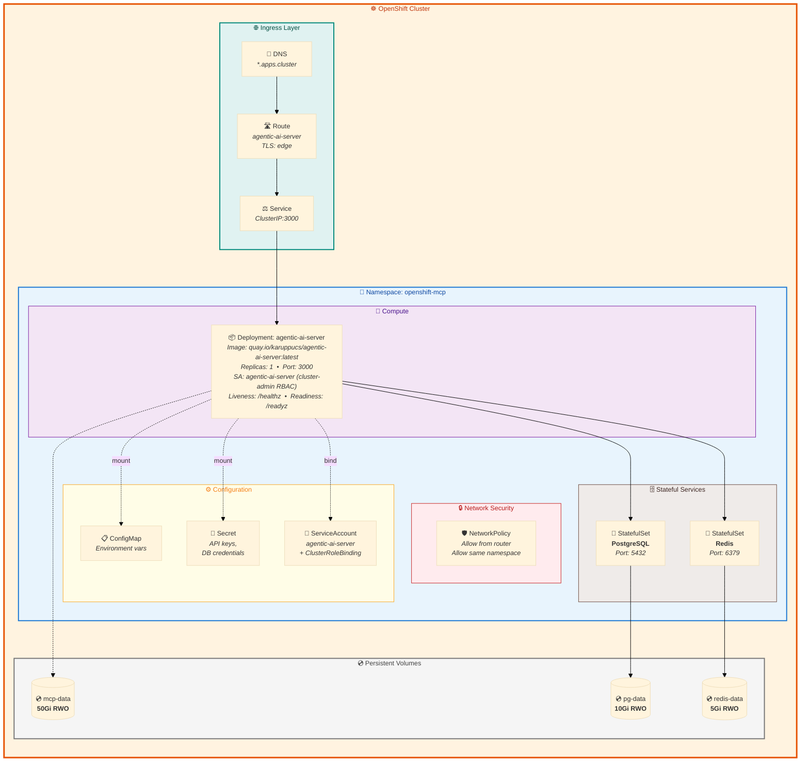
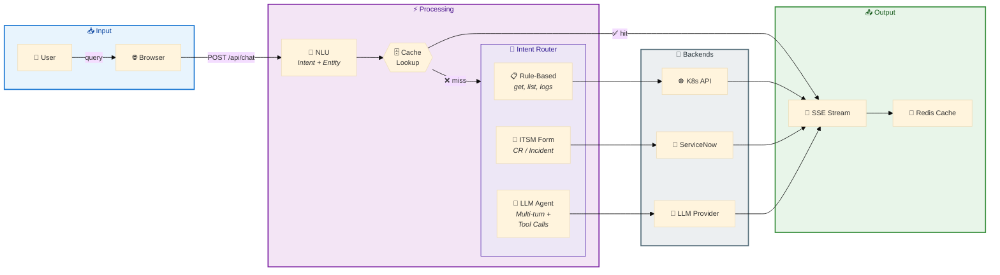

# KubeNexus AI — Reference Architecture

> **KubeNexus AI** — Kubernetes Intelligence Platform powered by MCP (Model Context Protocol)
> for OpenShift Container Platform

---

## Reference Architecture Diagram

```mermaid
%%{init: {'theme': 'base', 'themeVariables': { 'fontSize': '14px', 'fontFamily': 'Red Hat Display, Segoe UI, Arial' }}}%%

flowchart TB

    subgraph USERS["&nbsp;&nbsp;&nbsp;&nbsp;&nbsp;&nbsp;&nbsp;&nbsp;&nbsp;&nbsp;&nbsp;&nbsp;&nbsp;&nbsp;&nbsp;&nbsp;&nbsp;&nbsp;&nbsp;&nbsp;&nbsp;&nbsp;&nbsp;&nbsp;&nbsp;&nbsp;&nbsp;&nbsp;&nbsp;&nbsp;&nbsp;&nbsp;&nbsp;&nbsp;&nbsp;&nbsp;&nbsp;&nbsp;&nbsp;&nbsp;&nbsp;&nbsp;&nbsp;&nbsp;&nbsp;&nbsp;&nbsp;&nbsp;&nbsp;👤 USERS  &  CLIENTS&nbsp;&nbsp;&nbsp;&nbsp;&nbsp;&nbsp;&nbsp;&nbsp;&nbsp;&nbsp;&nbsp;&nbsp;&nbsp;&nbsp;&nbsp;&nbsp;&nbsp;&nbsp;&nbsp;&nbsp;&nbsp;&nbsp;&nbsp;&nbsp;&nbsp;&nbsp;&nbsp;&nbsp;&nbsp;&nbsp;&nbsp;&nbsp;&nbsp;&nbsp;&nbsp;&nbsp;&nbsp;&nbsp;&nbsp;&nbsp;&nbsp;&nbsp;&nbsp;&nbsp;&nbsp;&nbsp;&nbsp;&nbsp;&nbsp;"]
        direction LR
        U1("🌐 Web Browser<br/><b>Dashboard UI</b>")
        U2("🤖 Claude CLI<br/><b>claude.ai</b>")
        U3("💻 VS Code / JetBrains<br/><b>IDE Extensions</b>")
        U4("🔌 MCP Client<br/><b>SDK / stdio</b>")
    end

    subgraph NETWORK["&nbsp;&nbsp;&nbsp;&nbsp;&nbsp;&nbsp;&nbsp;&nbsp;&nbsp;&nbsp;&nbsp;&nbsp;&nbsp;&nbsp;&nbsp;&nbsp;&nbsp;&nbsp;&nbsp;&nbsp;&nbsp;&nbsp;&nbsp;&nbsp;&nbsp;&nbsp;&nbsp;&nbsp;&nbsp;&nbsp;&nbsp;&nbsp;&nbsp;&nbsp;&nbsp;&nbsp;&nbsp;&nbsp;&nbsp;&nbsp;&nbsp;&nbsp;&nbsp;&nbsp;&nbsp;&nbsp;&nbsp;&nbsp;&nbsp;🌐 NETWORK  LAYER&nbsp;&nbsp;&nbsp;&nbsp;&nbsp;&nbsp;&nbsp;&nbsp;&nbsp;&nbsp;&nbsp;&nbsp;&nbsp;&nbsp;&nbsp;&nbsp;&nbsp;&nbsp;&nbsp;&nbsp;&nbsp;&nbsp;&nbsp;&nbsp;&nbsp;&nbsp;&nbsp;&nbsp;&nbsp;&nbsp;&nbsp;&nbsp;&nbsp;&nbsp;&nbsp;&nbsp;&nbsp;&nbsp;&nbsp;&nbsp;&nbsp;&nbsp;&nbsp;&nbsp;&nbsp;&nbsp;&nbsp;&nbsp;&nbsp;"]
        direction LR
        N1["🔒 TLS Termination<br/><i>HTTPS / WSS</i>"]
        N2["🛣️ OpenShift Route<br/><i>Edge TLS</i>"]
        N3["⚖️ HAProxy<br/><i>Load Balancer</i>"]
        N4["🔧 stdio<br/><i>Direct Transport</i>"]
    end

    subgraph OCP["&nbsp;&nbsp;&nbsp;&nbsp;&nbsp;&nbsp;&nbsp;&nbsp;&nbsp;&nbsp;&nbsp;&nbsp;&nbsp;&nbsp;&nbsp;&nbsp;&nbsp;&nbsp;&nbsp;&nbsp;&nbsp;&nbsp;&nbsp;&nbsp;&nbsp;&nbsp;&nbsp;&nbsp;&nbsp;&nbsp;&nbsp;&nbsp;&nbsp;&nbsp;&nbsp;&nbsp;&nbsp;&nbsp;&nbsp;&nbsp;&nbsp;&nbsp;&nbsp;&nbsp;☸️ OPENSHIFT  CLUSTER  —  Namespace: openshift-mcp&nbsp;&nbsp;&nbsp;&nbsp;&nbsp;&nbsp;&nbsp;&nbsp;&nbsp;&nbsp;&nbsp;&nbsp;&nbsp;&nbsp;&nbsp;&nbsp;&nbsp;&nbsp;&nbsp;&nbsp;&nbsp;&nbsp;&nbsp;&nbsp;&nbsp;&nbsp;&nbsp;&nbsp;&nbsp;&nbsp;&nbsp;&nbsp;&nbsp;&nbsp;&nbsp;&nbsp;&nbsp;&nbsp;&nbsp;&nbsp;&nbsp;&nbsp;&nbsp;&nbsp;"]
        direction TB

        subgraph MCPSERVER["🚀 KubeNexus AI MCP Server &nbsp;•&nbsp; Node.js 20 &nbsp;•&nbsp; Port 3000"]
            direction LR

            subgraph CHATENG["💬 Chat Engine"]
                direction TB
                CE1["🧩 NLU Parser"]
                CE2["🧠 Context Memory"]
                CE3["📋 ITSM Handler"]
                CE4["✅ Action Workflow"]
                CE5["🔧 Fix Executor"]
            end

            subgraph TOOLENG["🛠️ MCP Tools<br/><i>33 Modules</i>"]
                direction TB
                TE1["☸️ Cluster Mgmt"]
                TE2["📊 Observability"]
                TE3["📦 App Lifecycle"]
                TE4["🔒 Security & Gov"]
                TE5["⚙️ Operations"]
            end

            subgraph DASHENG["🖥️ Dashboard"]
                direction TB
                DE1["📊 6 Views"]
                DE2["🏗️ Architecture"]
                DE3["🗺️ Heatmap"]
                DE4["🔮 AI Predictions"]
                DE5["⌨️ Command Bar"]
            end

            subgraph INTELENG["🧪 Intelligence"]
                direction TB
                IE1["👁️ Proactive Agent"]
                IE2["📚 Learning Engine"]
                IE3["🔍 Knowledge Base"]
                IE4["📈 Predictive Intel"]
            end
        end

        subgraph SECURITY["🛡️ Middleware"]
            direction LR
            S1["🔐 Auth<br/><i>Token / SA</i>"]
            S2["⏱️ Rate Limit<br/><i>Token Bucket</i>"]
            S3["🛑 Guardrails<br/><i>Safety Layer</i>"]
            S4["🙈 Redaction<br/><i>Secret Filter</i>"]
        end

        subgraph DATASTORE["💾 Data Services"]
            direction LR
            DB1[("🐘 PostgreSQL<br/><b>StatefulSet</b><br/><i>Port 5432</i>")]
            DB2[("🔴 Redis<br/><b>StatefulSet</b><br/><i>Port 6379</i>")]
        end
    end

    subgraph EXTERNAL["&nbsp;&nbsp;&nbsp;&nbsp;&nbsp;&nbsp;&nbsp;&nbsp;&nbsp;&nbsp;&nbsp;&nbsp;&nbsp;&nbsp;&nbsp;&nbsp;&nbsp;&nbsp;&nbsp;&nbsp;&nbsp;&nbsp;&nbsp;&nbsp;&nbsp;&nbsp;&nbsp;&nbsp;&nbsp;&nbsp;&nbsp;&nbsp;&nbsp;&nbsp;&nbsp;&nbsp;&nbsp;&nbsp;&nbsp;&nbsp;&nbsp;&nbsp;&nbsp;&nbsp;&nbsp;&nbsp;&nbsp;&nbsp;&nbsp;🔗 EXTERNAL  SERVICES&nbsp;&nbsp;&nbsp;&nbsp;&nbsp;&nbsp;&nbsp;&nbsp;&nbsp;&nbsp;&nbsp;&nbsp;&nbsp;&nbsp;&nbsp;&nbsp;&nbsp;&nbsp;&nbsp;&nbsp;&nbsp;&nbsp;&nbsp;&nbsp;&nbsp;&nbsp;&nbsp;&nbsp;&nbsp;&nbsp;&nbsp;&nbsp;&nbsp;&nbsp;&nbsp;&nbsp;&nbsp;&nbsp;&nbsp;&nbsp;&nbsp;&nbsp;&nbsp;&nbsp;&nbsp;&nbsp;&nbsp;&nbsp;&nbsp;"]
        direction LR
        EX1["☸️ OpenShift API<br/><i>15+ Resource Types</i><br/><i>Nodes, Pods, Operators,</i><br/><i>Routes, Deployments</i>"]
        EX2["🤖 LLM Providers<br/><i>OpenAI</i><br/><i>Azure OpenAI</i><br/><i>Anthropic Claude</i><br/><i>Ollama (Local)</i>"]
        EX3["🎫 ServiceNow<br/><i>ITSM Platform</i><br/><i>Incidents</i><br/><i>Change Requests</i><br/><i>Approval Workflow</i>"]
        EX4["🅰️ Ansible Tower<br/><i>Automation Platform</i><br/><i>Job Templates</i><br/><i>Playbook Runs</i>"]
        EX5["📊 Prometheus<br/><i>Metrics & Alerts</i><br/><i>PromQL Queries</i><br/><i>AlertManager</i>"]
    end

    subgraph STORAGE["&nbsp;&nbsp;&nbsp;&nbsp;&nbsp;&nbsp;&nbsp;&nbsp;&nbsp;&nbsp;&nbsp;&nbsp;&nbsp;&nbsp;&nbsp;&nbsp;&nbsp;&nbsp;&nbsp;&nbsp;&nbsp;&nbsp;&nbsp;&nbsp;&nbsp;&nbsp;&nbsp;&nbsp;&nbsp;&nbsp;&nbsp;&nbsp;&nbsp;&nbsp;&nbsp;&nbsp;&nbsp;&nbsp;&nbsp;&nbsp;&nbsp;&nbsp;&nbsp;&nbsp;&nbsp;&nbsp;&nbsp;&nbsp;&nbsp;💿 PERSISTENT  STORAGE  —  OpenShift PVCs&nbsp;&nbsp;&nbsp;&nbsp;&nbsp;&nbsp;&nbsp;&nbsp;&nbsp;&nbsp;&nbsp;&nbsp;&nbsp;&nbsp;&nbsp;&nbsp;&nbsp;&nbsp;&nbsp;&nbsp;&nbsp;&nbsp;&nbsp;&nbsp;&nbsp;&nbsp;&nbsp;&nbsp;&nbsp;&nbsp;&nbsp;&nbsp;&nbsp;&nbsp;&nbsp;&nbsp;&nbsp;&nbsp;&nbsp;&nbsp;&nbsp;&nbsp;&nbsp;&nbsp;&nbsp;&nbsp;&nbsp;&nbsp;&nbsp;"]
        direction LR
        PV1[("💿 mcp-data<br/><b>50 Gi RWO</b><br/><i>Server State</i>")]
        PV2[("💿 postgres-data<br/><b>10 Gi RWO</b><br/><i>Chat History, Audit,</i><br/><i>Knowledge Base</i>")]
        PV3[("💿 redis-data<br/><b>5 Gi RWO</b><br/><i>Cache, Sessions,</i><br/><i>Rate Limits</i>")]
    end

    U1 -->|"HTTPS"| N1
    U2 -->|"SSE / WS"| N1
    U3 -->|"MCP Protocol"| N2
    U4 -->|"stdio"| N4

    N1 --> N2
    N2 --> N3
    N3 -->|"Port 3000"| SECURITY
    N4 -->|"Direct"| SECURITY

    SECURITY --> MCPSERVER

    CHATENG -->|"K8s API"| EX1
    TOOLENG -->|"K8s API"| EX1
    CHATENG -->|"LLM Calls"| EX2
    CHATENG -->|"ITSM"| EX3
    TOOLENG -->|"Ansible"| EX4
    TOOLENG -->|"PromQL"| EX5

    MCPSERVER --> DATASTORE
    DB1 --> PV2
    DB2 --> PV3
    MCPSERVER -.-> PV1

    style USERS fill:#E8F4FD,stroke:#1976D2,stroke-width:3px,color:#0D47A1
    style NETWORK fill:#E0F2F1,stroke:#00897B,stroke-width:3px,color:#004D40
    style OCP fill:#FFF3E0,stroke:#F57C00,stroke-width:3px,color:#E65100
    style MCPSERVER fill:#F3E5F5,stroke:#7B1FA2,stroke-width:2px,color:#4A148C
    style CHATENG fill:#EDE7F6,stroke:#5E35B1,stroke-width:1px,color:#311B92
    style TOOLENG fill:#E8F5E9,stroke:#388E3C,stroke-width:1px,color:#1B5E20
    style DASHENG fill:#FCE4EC,stroke:#C2185B,stroke-width:1px,color:#880E4F
    style INTELENG fill:#E8EAF6,stroke:#3949AB,stroke-width:1px,color:#1A237E
    style SECURITY fill:#FFFDE7,stroke:#F9A825,stroke-width:2px,color:#F57F17
    style DATASTORE fill:#EFEBE9,stroke:#6D4C41,stroke-width:2px,color:#3E2723
    style EXTERNAL fill:#ECEFF1,stroke:#546E7A,stroke-width:3px,color:#263238
    style STORAGE fill:#F5F5F5,stroke:#757575,stroke-width:3px,color:#212121

    classDef userNode fill:#BBDEFB,stroke:#1565C0,stroke-width:2px,color:#0D47A1
    classDef netNode fill:#B2DFDB,stroke:#00796B,stroke-width:2px,color:#004D40
    classDef chatNode fill:#D1C4E9,stroke:#512DA8,stroke-width:1px,color:#311B92
    classDef toolNode fill:#C8E6C9,stroke:#2E7D32,stroke-width:1px,color:#1B5E20
    classDef dashNode fill:#F8BBD0,stroke:#AD1457,stroke-width:1px,color:#880E4F
    classDef intelNode fill:#C5CAE9,stroke:#283593,stroke-width:1px,color:#1A237E
    classDef secNode fill:#FFF9C4,stroke:#F9A825,stroke-width:1px,color:#F57F17
    classDef extNode fill:#CFD8DC,stroke:#455A64,stroke-width:2px,color:#263238
    classDef dbNode fill:#D7CCC8,stroke:#5D4037,stroke-width:2px,color:#3E2723
    classDef pvNode fill:#E0E0E0,stroke:#616161,stroke-width:2px,color:#212121

    class U1,U2,U3,U4 userNode
    class N1,N2,N3,N4 netNode
    class CE1,CE2,CE3,CE4,CE5 chatNode
    class TE1,TE2,TE3,TE4,TE5 toolNode
    class DE1,DE2,DE3,DE4,DE5 dashNode
    class IE1,IE2,IE3,IE4 intelNode
    class S1,S2,S3,S4 secNode
    class EX1,EX2,EX3,EX4,EX5 extNode
    class DB1,DB2 dbNode
    class PV1,PV2,PV3 pvNode
```

---

## Deployment Architecture

---

## Data Flow: Chat Query Pipeline

---

## Component Summary

| Layer | Component | Count | Details |
|:------|:----------|:-----:|:--------|
| 🌐 **Network** | Protocols | 4 | HTTPS, SSE, stdio, WebSocket |
| 🛡️ **Security** | Middleware | 5 | Auth, Rate Limit, Guardrails, Redaction, CORS |
| 💬 **Chat** | NLU + Engines | 5 | Parser, Memory, ITSM, Workflow, Executor |
| 🛠️ **Tools** | MCP Modules | 33 | cluster, pods, security, helm, gitops, velero... |
| 🖥️ **Dashboard** | Views + Widgets | 6 + 15 | Dashboard, Chat, Audit, Hub, Intel, Settings |
| 🧪 **Intelligence** | AI Services | 8 | Proactive Agent, Learning, KB, Predictions... |
| 📡 **Endpoints** | HTTP APIs | 48+ | /api/chat, /api/actions, /api/intelligence/* |
| 🤖 **LLM** | Providers | 5 | OpenAI, Azure, Anthropic, Ollama, Built-in |
| 🔗 **External** | Integrations | 6 | OpenShift, LLMs, ServiceNow, Ansible, Prometheus, Redis |
| 💾 **Data** | Storage | 3 | PostgreSQL (8+ tables), Redis (cache), PVC (state) |

---

## Technology Stack

| Category | Technology |
|:---------|:-----------|
| **Runtime** | Node.js 20 on Alpine Linux |
| **Platform** | Red Hat OpenShift Container Platform 4.x |
| **Database** | PostgreSQL 15 (persistent) |
| **Cache** | Redis 7 (in-memory) |
| **AI/ML** | OpenAI GPT-4, Azure OpenAI, Anthropic Claude, Ollama |
| **Protocol** | MCP (Model Context Protocol), REST, SSE, WebSocket |
| **ITSM** | ServiceNow (Change Requests, Incidents) |
| **Automation** | Ansible Automation Platform |
| **Monitoring** | Prometheus, AlertManager |
| **Container** | quay.io/karuppucs/agentic-ai-server |

---

*Reference Architecture for KubeNexus AI on Red Hat OpenShift Container Platform*
