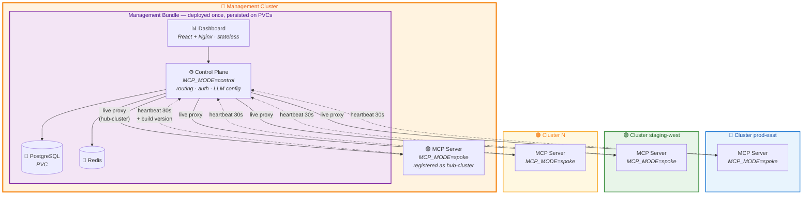
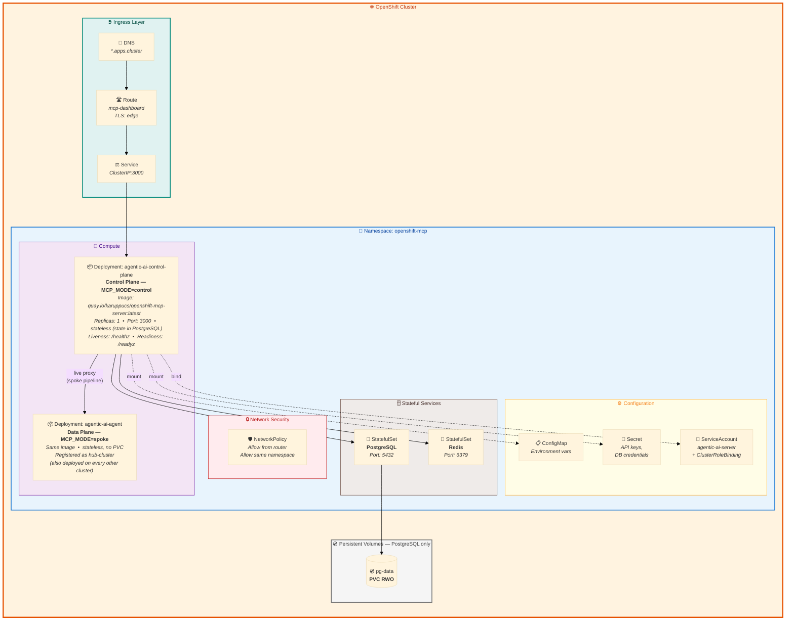
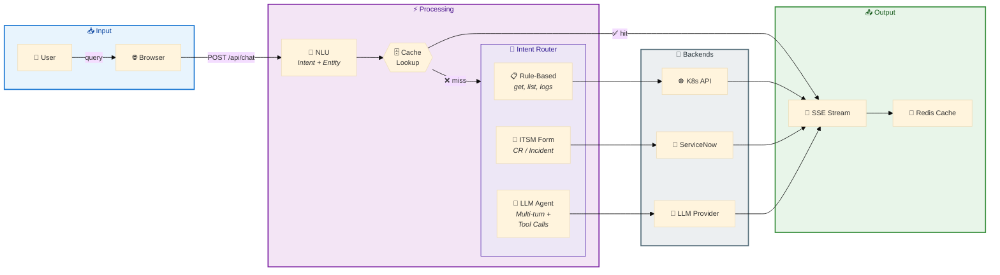
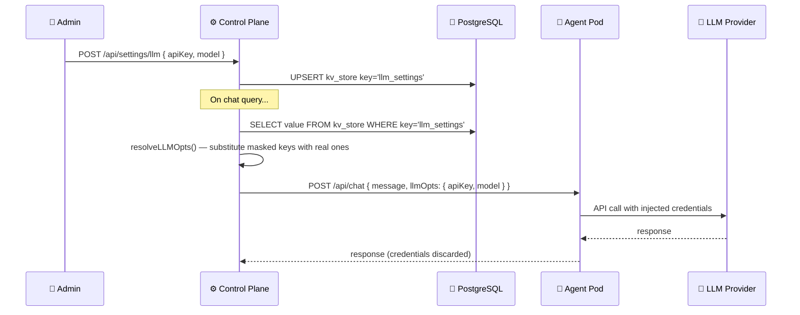

# TCS Agentic AI — Reference Architecture

> **TCS Agentic AI** — Kubernetes Intelligence Platform powered by MCP (Model Context Protocol)
> for OpenShift Container Platform

---

## Two-Plane Multi-Cluster Architecture

TCS Agentic AI separates the platform into two planes (the Red Hat ACM / Rancher pattern):

| Plane | Deployment | Components | State |
|:------|:-----------|:-----------|:------|
| **Management Plane** — *Management Bundle* | `./deploy/dashboard/deploy.sh` — deployed **once** | Dashboard (React + Nginx) • Control Plane (`MCP_MODE=control`) • PostgreSQL (StatefulSet PVC) • Redis | **Stateful** — all settings, chats, audit, incidents, knowledge base in PostgreSQL |
| **Data Plane** — *MCP Server* | `./deploy/mcp/deploy.sh` — run on **every** cluster, **including the hub** | One stateless MCP server pod (`MCP_MODE=spoke`) with 40+ tools, executing live against its own cluster | **Stateless** — no DB, no PVC; kill/redeploy anytime |

**Design guarantees:**

1. **Identical answers fleet-wide** — every query (including the hub's own, via the `hub-cluster` pod) flows through the same spoke-proxy pipeline: same image, same code path, same formatting.
2. **The bundle is never touched by MCP refreshes** — Agent pods use the `agentic-ai-agent` resource name family and carry no state; the bundle keeps its PostgreSQL PVC across any number of data-plane redeploys.
3. **Centralized LLM configuration** — credentials live only in the management plane and are injected per-request when chat is proxied to any cluster's pod.
4. **Self-healing registry** — heartbeats carry `spokeUrl` + build version; a control-plane restart re-registers every cluster within 30 seconds, and version drift surfaces as an "Update Available" badge with one-click ⋮ → Redeploy.
5. **Live data only — agent-required gate** — a cluster card appears in the picker **only** while its MCP agent pod is running and reporting (the hub follows the same rule as every spoke). Without a registered agent, data-plane endpoints return `503 { agentRequired: true }`; the control plane never serves cluster data in-process or from stale cache. Stale registrations are pruned on startup (`/healthz` probe per restored spoke), and their PostgreSQL snapshots are deleted with them.

---

## Reference Architecture Diagram

```mermaid
%%{init: {'theme': 'base', 'themeVariables': { 'fontSize': '14px', 'fontFamily': 'Red Hat Display, Segoe UI, Arial' }}}%%

flowchart TB

    subgraph USERS["&nbsp;&nbsp;&nbsp;&nbsp;&nbsp;&nbsp;&nbsp;&nbsp;&nbsp;&nbsp;&nbsp;&nbsp;&nbsp;&nbsp;&nbsp;&nbsp;&nbsp;&nbsp;&nbsp;&nbsp;&nbsp;&nbsp;&nbsp;&nbsp;&nbsp;&nbsp;&nbsp;&nbsp;&nbsp;&nbsp;&nbsp;&nbsp;&nbsp;&nbsp;&nbsp;&nbsp;&nbsp;&nbsp;&nbsp;&nbsp;&nbsp;&nbsp;&nbsp;&nbsp;&nbsp;&nbsp;&nbsp;&nbsp;&nbsp;👤 USERS  &  CLIENTS&nbsp;&nbsp;&nbsp;&nbsp;&nbsp;&nbsp;&nbsp;&nbsp;&nbsp;&nbsp;&nbsp;&nbsp;&nbsp;&nbsp;&nbsp;&nbsp;&nbsp;&nbsp;&nbsp;&nbsp;&nbsp;&nbsp;&nbsp;&nbsp;&nbsp;&nbsp;&nbsp;&nbsp;&nbsp;&nbsp;&nbsp;&nbsp;&nbsp;&nbsp;&nbsp;&nbsp;&nbsp;&nbsp;&nbsp;&nbsp;&nbsp;&nbsp;&nbsp;&nbsp;&nbsp;&nbsp;&nbsp;&nbsp;&nbsp;"]
        direction LR
        U1("🌐 Web Browser<br/><b>Dashboard UI</b>")
        U2("🤖 Claude CLI<br/><b>claude.ai</b>")
        U3("💻 VS Code / JetBrains<br/><b>IDE Extensions</b>")
        U4("🔌 MCP Client<br/><b>SDK / stdio</b>")
    end

    subgraph NETWORK["&nbsp;&nbsp;&nbsp;&nbsp;&nbsp;&nbsp;&nbsp;&nbsp;&nbsp;&nbsp;&nbsp;&nbsp;&nbsp;&nbsp;&nbsp;&nbsp;&nbsp;&nbsp;&nbsp;&nbsp;&nbsp;&nbsp;&nbsp;&nbsp;&nbsp;&nbsp;&nbsp;&nbsp;&nbsp;&nbsp;&nbsp;&nbsp;&nbsp;&nbsp;&nbsp;&nbsp;&nbsp;&nbsp;&nbsp;&nbsp;&nbsp;&nbsp;&nbsp;&nbsp;&nbsp;&nbsp;&nbsp;&nbsp;&nbsp;🌐 NETWORK  LAYER&nbsp;&nbsp;&nbsp;&nbsp;&nbsp;&nbsp;&nbsp;&nbsp;&nbsp;&nbsp;&nbsp;&nbsp;&nbsp;&nbsp;&nbsp;&nbsp;&nbsp;&nbsp;&nbsp;&nbsp;&nbsp;&nbsp;&nbsp;&nbsp;&nbsp;&nbsp;&nbsp;&nbsp;&nbsp;&nbsp;&nbsp;&nbsp;&nbsp;&nbsp;&nbsp;&nbsp;&nbsp;&nbsp;&nbsp;&nbsp;&nbsp;&nbsp;&nbsp;&nbsp;&nbsp;&nbsp;&nbsp;&nbsp;&nbsp;"]
        direction LR
        N1["🔒 TLS Termination<br/><i>HTTPS / WSS</i>"]
        N2["🛣️ OpenShift Route<br/><i>Edge TLS</i>"]
        N3["⚖️ HAProxy<br/><i>Load Balancer</i>"]
        N4["🔧 stdio<br/><i>Direct Transport</i>"]
    end

    subgraph OCP["&nbsp;&nbsp;&nbsp;&nbsp;&nbsp;&nbsp;&nbsp;&nbsp;&nbsp;&nbsp;&nbsp;&nbsp;&nbsp;&nbsp;&nbsp;&nbsp;&nbsp;&nbsp;&nbsp;&nbsp;&nbsp;&nbsp;&nbsp;&nbsp;&nbsp;&nbsp;&nbsp;&nbsp;&nbsp;&nbsp;&nbsp;&nbsp;&nbsp;&nbsp;&nbsp;&nbsp;&nbsp;&nbsp;&nbsp;&nbsp;&nbsp;&nbsp;&nbsp;&nbsp;☸️ OPENSHIFT  CLUSTER  —  Namespace: openshift-mcp&nbsp;&nbsp;&nbsp;&nbsp;&nbsp;&nbsp;&nbsp;&nbsp;&nbsp;&nbsp;&nbsp;&nbsp;&nbsp;&nbsp;&nbsp;&nbsp;&nbsp;&nbsp;&nbsp;&nbsp;&nbsp;&nbsp;&nbsp;&nbsp;&nbsp;&nbsp;&nbsp;&nbsp;&nbsp;&nbsp;&nbsp;&nbsp;&nbsp;&nbsp;&nbsp;&nbsp;&nbsp;&nbsp;&nbsp;&nbsp;&nbsp;&nbsp;&nbsp;&nbsp;"]
        direction TB

        subgraph MCPSERVER["🚀 TCS Agentic AI MCP Server &nbsp;•&nbsp; Node.js 20 &nbsp;•&nbsp; Port 3000"]
            direction LR

            subgraph CHATENG["💬 Chat Engine"]
                direction TB
                CE1["🧩 NLU Parser"]
                CE2["🧠 Context Memory"]
                CE3["📋 ITSM Handler"]
                CE4["✅ Action Workflow"]
                CE5["🔧 Fix Executor"]
            end

            subgraph TOOLENG["🛠️ MCP Tools<br/><i>33 Modules</i>"]
                direction TB
                TE1["☸️ Cluster Mgmt"]
                TE2["📊 Observability"]
                TE3["📦 App Lifecycle"]
                TE4["🔒 Security & Gov"]
                TE5["⚙️ Operations"]
            end

            subgraph DASHENG["🖥️ Dashboard"]
                direction TB
                DE1["📊 6 Views"]
                DE2["🏗️ Architecture"]
                DE3["🗺️ Heatmap"]
                DE4["🔮 AI Predictions"]
                DE5["⌨️ Command Bar"]
            end

            subgraph INTELENG["🧪 Intelligence"]
                direction TB
                IE1["👁️ Proactive Agent"]
                IE2["📚 Learning Engine"]
                IE3["🔍 Knowledge Base"]
                IE4["📈 Predictive Intel"]
            end
        end

        subgraph SECURITY["🛡️ Middleware"]
            direction LR
            S1["🔐 Auth<br/><i>Token / SA</i>"]
            S2["⏱️ Rate Limit<br/><i>Token Bucket</i>"]
            S3["🛑 Guardrails<br/><i>Safety Layer</i>"]
            S4["🙈 Redaction<br/><i>Secret Filter</i>"]
        end

        subgraph DATASTORE["💾 Data Services"]
            direction LR
            DB1[("🐘 PostgreSQL<br/><b>StatefulSet</b><br/><i>Port 5432</i>")]
            DB2[("🔴 Redis<br/><b>StatefulSet</b><br/><i>Port 6379</i>")]
        end
    end

    subgraph EXTERNAL["&nbsp;&nbsp;&nbsp;&nbsp;&nbsp;&nbsp;&nbsp;&nbsp;&nbsp;&nbsp;&nbsp;&nbsp;&nbsp;&nbsp;&nbsp;&nbsp;&nbsp;&nbsp;&nbsp;&nbsp;&nbsp;&nbsp;&nbsp;&nbsp;&nbsp;&nbsp;&nbsp;&nbsp;&nbsp;&nbsp;&nbsp;&nbsp;&nbsp;&nbsp;&nbsp;&nbsp;&nbsp;&nbsp;&nbsp;&nbsp;&nbsp;&nbsp;&nbsp;&nbsp;&nbsp;&nbsp;&nbsp;&nbsp;&nbsp;🔗 EXTERNAL  SERVICES&nbsp;&nbsp;&nbsp;&nbsp;&nbsp;&nbsp;&nbsp;&nbsp;&nbsp;&nbsp;&nbsp;&nbsp;&nbsp;&nbsp;&nbsp;&nbsp;&nbsp;&nbsp;&nbsp;&nbsp;&nbsp;&nbsp;&nbsp;&nbsp;&nbsp;&nbsp;&nbsp;&nbsp;&nbsp;&nbsp;&nbsp;&nbsp;&nbsp;&nbsp;&nbsp;&nbsp;&nbsp;&nbsp;&nbsp;&nbsp;&nbsp;&nbsp;&nbsp;&nbsp;&nbsp;&nbsp;&nbsp;&nbsp;&nbsp;"]
        direction LR
        EX1["☸️ OpenShift API<br/><i>15+ Resource Types</i><br/><i>Nodes, Pods, Operators,</i><br/><i>Routes, Deployments</i>"]
        EX2["🤖 LLM Providers<br/><i>OpenAI</i><br/><i>Azure OpenAI</i><br/><i>Anthropic Claude</i><br/><i>Ollama (Local)</i>"]
        EX3["🎫 ServiceNow<br/><i>ITSM Platform</i><br/><i>Incidents</i><br/><i>Change Requests</i><br/><i>Approval Workflow</i>"]
        EX4["🅰️ Ansible Tower<br/><i>Automation Platform</i><br/><i>Job Templates</i><br/><i>Playbook Runs</i>"]
        EX5["📊 Prometheus<br/><i>Metrics & Alerts</i><br/><i>PromQL Queries</i><br/><i>AlertManager</i>"]
    end

    subgraph STORAGE["&nbsp;&nbsp;&nbsp;&nbsp;&nbsp;&nbsp;&nbsp;&nbsp;&nbsp;&nbsp;&nbsp;&nbsp;&nbsp;&nbsp;&nbsp;&nbsp;&nbsp;&nbsp;&nbsp;&nbsp;&nbsp;&nbsp;&nbsp;&nbsp;&nbsp;&nbsp;&nbsp;&nbsp;&nbsp;&nbsp;&nbsp;&nbsp;&nbsp;&nbsp;&nbsp;&nbsp;&nbsp;&nbsp;&nbsp;&nbsp;&nbsp;&nbsp;&nbsp;&nbsp;&nbsp;&nbsp;&nbsp;&nbsp;&nbsp;💿 PERSISTENT  STORAGE  —  OpenShift PVCs&nbsp;&nbsp;&nbsp;&nbsp;&nbsp;&nbsp;&nbsp;&nbsp;&nbsp;&nbsp;&nbsp;&nbsp;&nbsp;&nbsp;&nbsp;&nbsp;&nbsp;&nbsp;&nbsp;&nbsp;&nbsp;&nbsp;&nbsp;&nbsp;&nbsp;&nbsp;&nbsp;&nbsp;&nbsp;&nbsp;&nbsp;&nbsp;&nbsp;&nbsp;&nbsp;&nbsp;&nbsp;&nbsp;&nbsp;&nbsp;&nbsp;&nbsp;&nbsp;&nbsp;&nbsp;&nbsp;&nbsp;&nbsp;&nbsp;"]
        direction LR
        PV2[("💿 postgres-data<br/><b>PVC RWO</b><br/><i>Settings, Chat History,</i><br/><i>Audit, Knowledge Base</i>")]
    end

    U1 -->|"HTTPS"| N1
    U2 -->|"SSE / WS"| N1
    U3 -->|"MCP Protocol"| N2
    U4 -->|"stdio"| N4

    N1 --> N2
    N2 --> N3
    N3 -->|"Port 3000"| SECURITY
    N4 -->|"Direct"| SECURITY

    SECURITY --> MCPSERVER

    CHATENG -->|"K8s API"| EX1
    TOOLENG -->|"K8s API"| EX1
    CHATENG -->|"LLM Calls"| EX2
    CHATENG -->|"ITSM"| EX3
    TOOLENG -->|"Ansible"| EX4
    TOOLENG -->|"PromQL"| EX5

    MCPSERVER --> DATASTORE
    DB1 --> PV2

    style USERS fill:#E8F4FD,stroke:#1976D2,stroke-width:3px,color:#0D47A1
    style NETWORK fill:#E0F2F1,stroke:#00897B,stroke-width:3px,color:#004D40
    style OCP fill:#FFF3E0,stroke:#F57C00,stroke-width:3px,color:#E65100
    style MCPSERVER fill:#F3E5F5,stroke:#7B1FA2,stroke-width:2px,color:#4A148C
    style CHATENG fill:#EDE7F6,stroke:#5E35B1,stroke-width:1px,color:#311B92
    style TOOLENG fill:#E8F5E9,stroke:#388E3C,stroke-width:1px,color:#1B5E20
    style DASHENG fill:#FCE4EC,stroke:#C2185B,stroke-width:1px,color:#880E4F
    style INTELENG fill:#E8EAF6,stroke:#3949AB,stroke-width:1px,color:#1A237E
    style SECURITY fill:#FFFDE7,stroke:#F9A825,stroke-width:2px,color:#F57F17
    style DATASTORE fill:#EFEBE9,stroke:#6D4C41,stroke-width:2px,color:#3E2723
    style EXTERNAL fill:#ECEFF1,stroke:#546E7A,stroke-width:3px,color:#263238
    style STORAGE fill:#F5F5F5,stroke:#757575,stroke-width:3px,color:#212121

    classDef userNode fill:#BBDEFB,stroke:#1565C0,stroke-width:2px,color:#0D47A1
    classDef netNode fill:#B2DFDB,stroke:#00796B,stroke-width:2px,color:#004D40
    classDef chatNode fill:#D1C4E9,stroke:#512DA8,stroke-width:1px,color:#311B92
    classDef toolNode fill:#C8E6C9,stroke:#2E7D32,stroke-width:1px,color:#1B5E20
    classDef dashNode fill:#F8BBD0,stroke:#AD1457,stroke-width:1px,color:#880E4F
    classDef intelNode fill:#C5CAE9,stroke:#283593,stroke-width:1px,color:#1A237E
    classDef secNode fill:#FFF9C4,stroke:#F9A825,stroke-width:1px,color:#F57F17
    classDef extNode fill:#CFD8DC,stroke:#455A64,stroke-width:2px,color:#263238
    classDef dbNode fill:#D7CCC8,stroke:#5D4037,stroke-width:2px,color:#3E2723
    classDef pvNode fill:#E0E0E0,stroke:#616161,stroke-width:2px,color:#212121

    class U1,U2,U3,U4 userNode
    class N1,N2,N3,N4 netNode
    class CE1,CE2,CE3,CE4,CE5 chatNode
    class TE1,TE2,TE3,TE4,TE5 toolNode
    class DE1,DE2,DE3,DE4,DE5 dashNode
    class IE1,IE2,IE3,IE4 intelNode
    class S1,S2,S3,S4 secNode
    class EX1,EX2,EX3,EX4,EX5 extNode
    class DB1,DB2 dbNode
    class PV2 pvNode
```

---

## Deployment Architecture

---

## Data Flow: Chat Query Pipeline

---

## Component Summary

| Layer | Component | Count | Details |
|:------|:----------|:-----:|:--------|
| 🌐 **Network** | Protocols | 4 | HTTPS, SSE, stdio, WebSocket |
| 🛡️ **Security** | Middleware | 5 | Auth, Rate Limit, Guardrails, Redaction, CORS |
| 💬 **Chat** | NLU + Engines | 5 | Parser, Memory, ITSM, Workflow, Executor |
| 🛠️ **Tools** | MCP Modules | 33 | cluster, pods, security, helm, gitops, velero... |
| 🖥️ **Dashboard** | Views + Widgets | 6 + 15 | Dashboard, Chat, Audit, Hub, Intel, Settings |
| 🧪 **Intelligence** | AI Services | 8 | Proactive Agent, Learning, KB, Predictions... |
| 📡 **Endpoints** | HTTP APIs | 48+ | /api/chat, /api/actions, /api/intelligence/* |
| 🤖 **LLM** | Providers | 5 | OpenAI, Azure, Anthropic, Ollama, Built-in |
| 🔗 **External** | Integrations | 6 | OpenShift, LLMs, ServiceNow, Ansible, Prometheus, Redis |
| 💾 **Data** | Storage | 3 | PostgreSQL (8+ tables), Redis (cache), PVCs (management bundle only — MCP server pods are stateless) |

---

## Technology Stack

| Category | Technology |
|:---------|:-----------|
| **Runtime** | Node.js 20 on Alpine Linux |
| **Platform** | Red Hat OpenShift Container Platform 4.x |
| **Database** | PostgreSQL 15 (persistent) |
| **Cache** | Redis 7 (in-memory) |
| **AI/ML** | OpenAI GPT-4, Azure OpenAI, Anthropic Claude, Ollama |
| **Protocol** | MCP (Model Context Protocol), REST, SSE, WebSocket |
| **ITSM** | ServiceNow (Change Requests, Incidents) |
| **Automation** | Ansible Automation Platform |
| **Monitoring** | Prometheus, AlertManager |
| **Container** | quay.io/karuppucs/openshift-mcp-server |

---

---

## Kubernetes Resource Naming

Pod names are chosen for immediate role clarity. Service names are decoupled so internal URLs (nginx `proxy_pass`, `REDIS_URL`) never break on a rename.

| Pod prefix | Role | Service DNS | Selector label |
|:-----------|:-----|:------------|:---------------|
| `agentic-ai-control-plane-*` | Management plane — API, auth, routing, LLM config injection | `agentic-ai-server` | `app.kubernetes.io/name: agentic-ai-server` |
| `agentic-ai-dashboard-*` | React SPA + Nginx reverse proxy | `mcp-dashboard` | `app.kubernetes.io/name: mcp-dashboard` |
| `agentic-ai-agent-*` | Data plane — per-cluster MCP worker (40+ tools) | `agentic-ai-agent` | `app.kubernetes.io/name: agentic-ai-agent` |
| `mcp-postgres-0` | PostgreSQL (StatefulSet) — single source of truth | `mcp-postgres` | `app: mcp-postgres` |
| `agentic-ai-redis-*` | Redis — cache and sessions | `mcp-redis` | `app.kubernetes.io/name: mcp-redis` |

Only `data-mcp-postgres-0` (5 Gi PVC) carries persistent storage. All other pods use `emptyDir` — fully stateless.

---

## Persistence Architecture

All platform state is stored in PostgreSQL, accessed exclusively by the control plane (`MCP_MODE=control`).

### Core Tables

| Table | Purpose |
|:------|:--------|
| `kv_store` | JSONB settings store — `key TEXT PK`, `value JSONB`, `updated_at TIMESTAMPTZ` |
| `users` | Authentication — `username TEXT PK`, `password_hash TEXT` (scrypt), `role`, `namespaces`, `active` |
| `chat_history` | Per-cluster conversation logs |
| `audit_log` | Compliance trail for all actions |
| `knowledge_base` | Incident patterns for RAG-based correlation |

### Settings in `kv_store`

| Key | Contents |
|:----|:---------|
| `llm_settings` | All LLM provider configs (API keys, models, endpoints, temperature) |
| `servicenow_settings` | Instance URL, credentials, default assignment group |
| `connected_clusters` | Spoke registry snapshot (restored on control-plane restart) |
| `user_roles` | RBAC role assignments |
| `user_namespaces` | Per-user namespace restrictions |

### LLM Credential Injection

LLM API keys are configured once in the dashboard and stored in `kv_store`. Agent pods **never** store credentials — the control plane injects them per-request:

**Dual persistence fallback:** LLM settings are also written to `/data/mcp-llm-settings.json`. On startup, the control plane tries PostgreSQL first; if unreachable, it reads the file.

---

*Reference Architecture for TCS Agentic AI on Red Hat OpenShift Container Platform*
