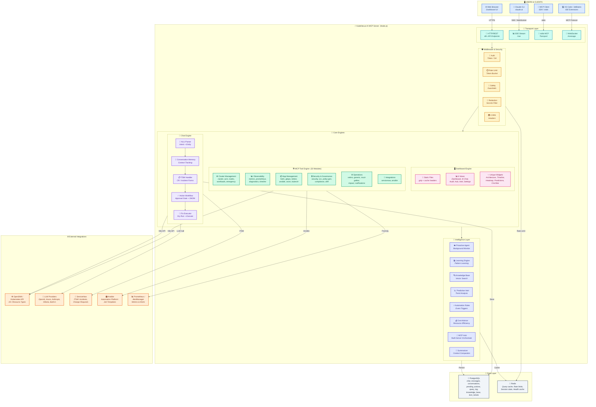
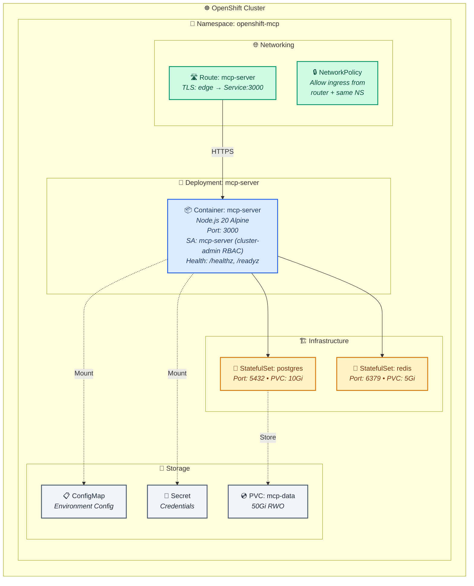
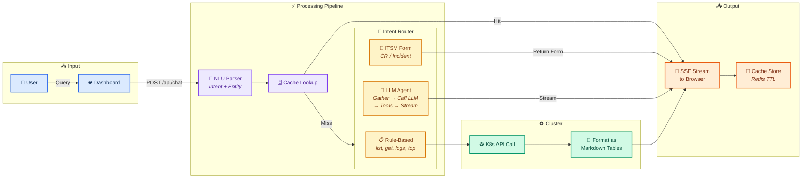
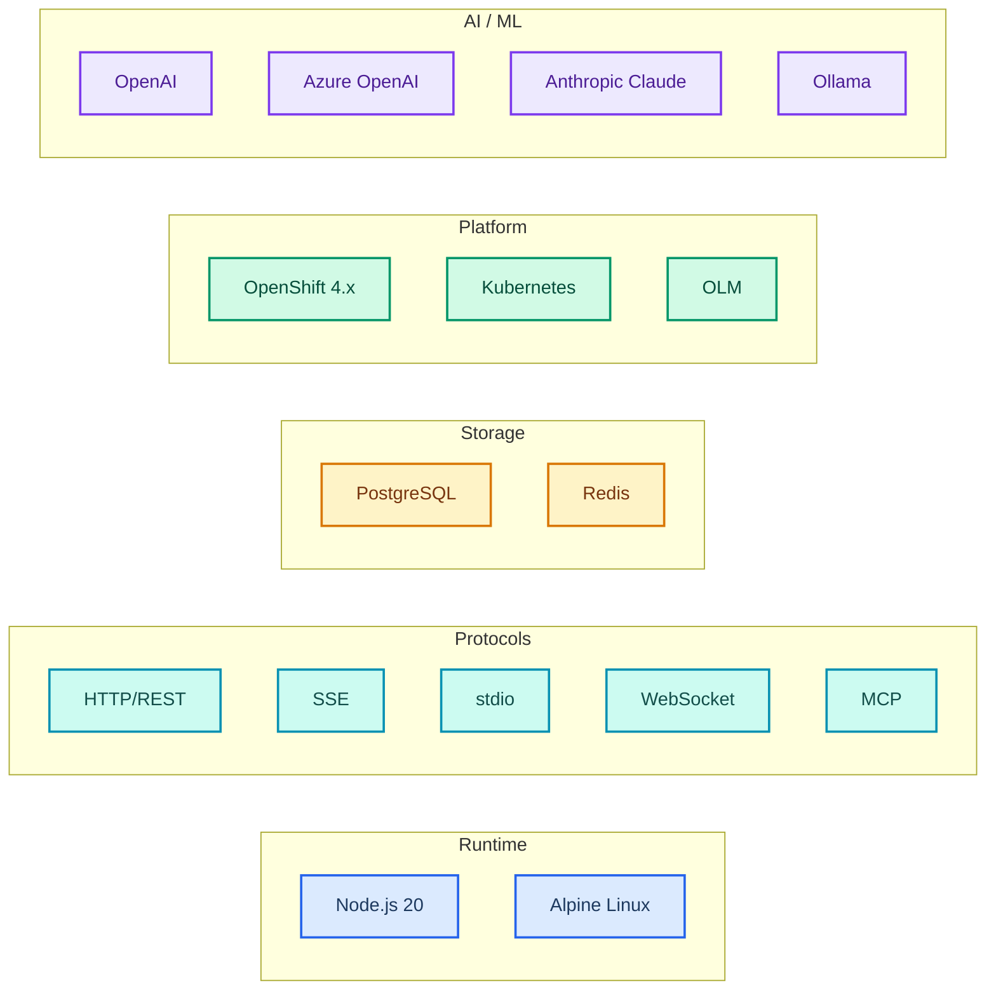

# KubeNexus AI — System Architecture

## High-Level Architecture

---

## Deployment Architecture (OpenShift)

---

## Data Flow: User Chat Query

---

## Component Statistics

| Category | Count | Details |
|:---------|:-----:|:--------|
| 📡 HTTP Endpoints | **48+** | `/api/chat`, `/api/actions`, `/api/intelligence/*`, `/api/cluster/*` |
| 🛠️ MCP Tool Modules | **33** | cluster, pods, security, gitops, velero, helm, ansible... |
| ⚙️ Service Modules | **33** | llm, nlu, chat-api, action-workflow, fix-executor... |
| 🔧 Utility Modules | **6** | openshift-client, db, cache, config, rate-limit, redact |
| 🤖 LLM Providers | **5** | OpenAI, Azure OpenAI, Anthropic (Claude), Ollama, Built-in |
| 🖥️ Dashboard Views | **6** | Dashboard, AI Chat, Audit Log, AI Hub, Intelligence, Settings |
| ✨ Dashboard Widgets | **15+** | Architecture, Timeline, Heatmap, Predictions, Cmd Bar, Security... |
| ☸️ K8s Manifests | **10** | namespace, deployment, service, route, PVC, configmap, secret... |
| 🌐 External Systems | **6** | OpenShift, LLMs, ServiceNow, Ansible, Prometheus, Redis |
| 💾 Database Tables | **8+** | conversations, messages, actions, audit, knowledge_base... |

---

## Technology Stack

