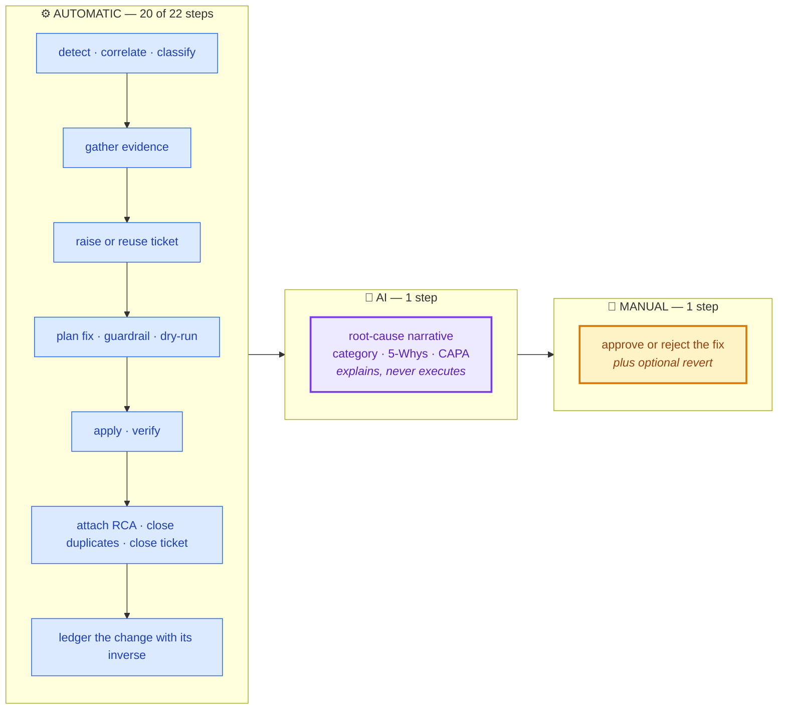
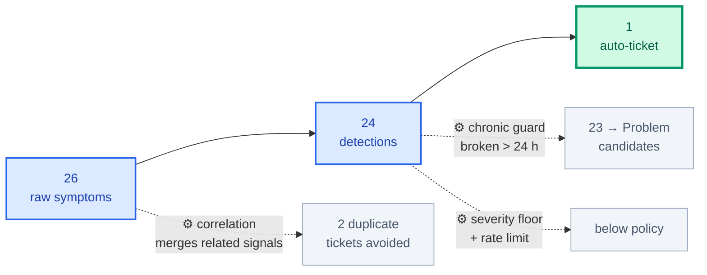
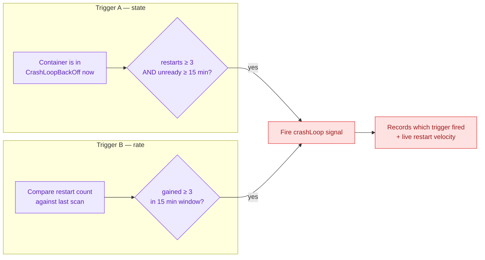
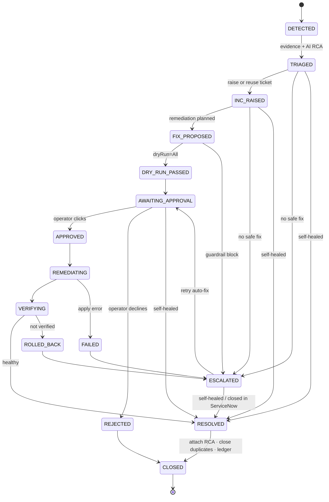
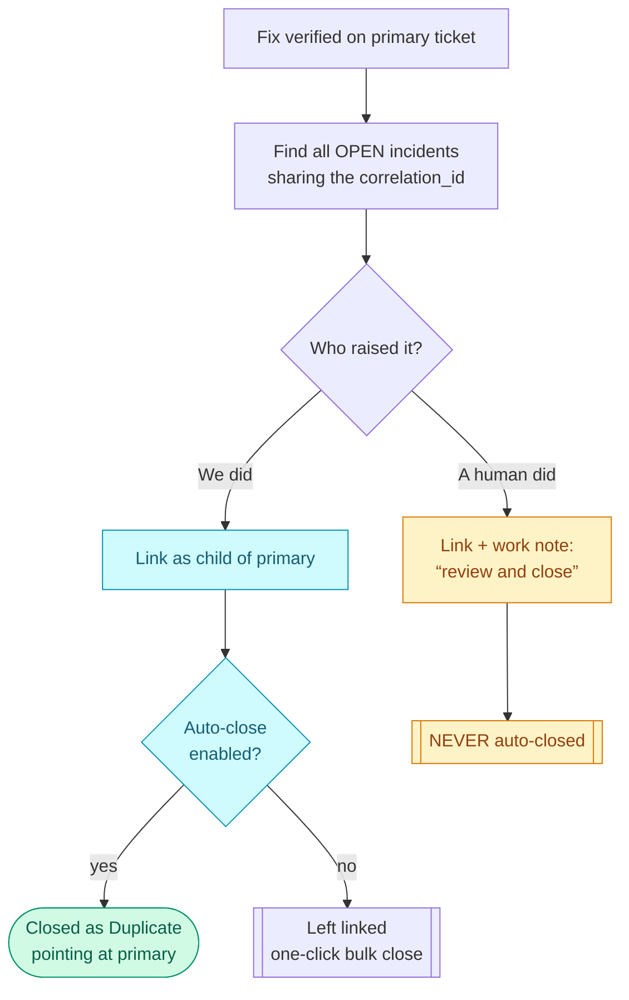
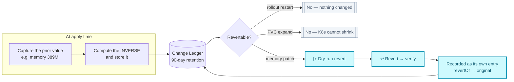
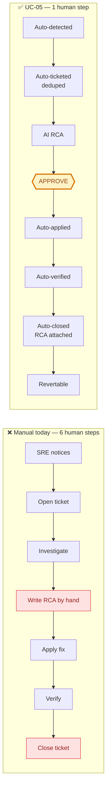

# TCS Agentic AI — Zero-Touch Incident Command

### ZTIC · Use Case 05

**Self-detecting · Self-documenting · Self-closing · Self-reverting incident lifecycle for OpenShift**

| | |
|---|---|
| **Use case ID** | UC-05 |
| **Full name** | **TCS Agentic AI — Zero-Touch Incident Command** |
| **Short name** | **ZTIC** *(use this in demos and conversation)* |
| **Product family** | TCS Agentic AI for OpenShift · Tata Consultancy Services |
| **Tagline** | *Nobody opens the ticket. Nobody writes the RCA. Nobody closes it.* |
| **Category** | Autonomous ITSM / AIOps |
| **Human touchpoints** | **Exactly one** — approving the fix |
| **Platform** | TCS Agentic AI for OpenShift |

---

## 1. Demo description (short)

> Today an SRE notices a problem, opens a ServiceNow incident, investigates, writes the
> root-cause analysis by hand, applies a fix, then goes back and closes the ticket. Most of
> that effort is **administration, not engineering** — and the ticket-closing step alone
> consumes hours of skilled time every week.
>
> **UC-05 removes every one of those steps except the decision to apply the fix.**
>
> The platform continuously evaluates industry-standard thresholds against the live cluster.
> When a breach is sustained past its dwell time, it **merges every related signal into a
> single incident**, gathers real evidence (container logs — including the *previous*
> terminated instance — events, resource limits, exit codes), asks the AI for a grounded
> root-cause analysis, checks whether a ticket already exists before raising one, plans a
> safe remediation, and dry-runs it against the live API server.
>
> Then it stops and waits for one human click.
>
> On approval it applies the fix, verifies the workload actually recovered, **attaches the RCA
> as HTML and PDF**, links and closes duplicate tickets, closes the incident with the full RCA
> in the close notes, and **records the change with a precomputed inverse so it can be
> reverted**. If the condition clears on its own first, the incident closes itself. If
> verification fails, it escalates and deliberately leaves the ticket open.

**What makes it unique:** this is not alerting, and it is not a chatbot. UC-01 answers when a
human asks. **UC-05 has no human trigger at all** — and it *closes* its own tickets with an
audit-grade RCA and keeps an undo log, which is the part every other automation leaves on the
human.

---

## 2. Who does what — actor legend

Three distinct actors run this lifecycle. The distinction matters: **the AI explains, deterministic
code acts, and a human decides.** Claiming "AI does everything" would be both inaccurate and less
reassuring to an operator being asked to trust it.

| | Actor | What it means | Where it is used |
|---|---|---|---|
| 🤖 | **AI** | LLM reasoning over gathered evidence | Root-cause narrative, category, 5-Whys, contributing factors, preventive actions |
| ⚙️ | **AUTOMATIC** | Deterministic code — **no AI, no human** | Detection, correlation, ticketing, fix planning, dry-run, apply, verify, close, ledger |
| 👤 | **MANUAL** | Requires a person | **Approving the fix**, reverting, tuning thresholds, owning an escalation |

> **The remediation command is chosen by deterministic rules, not by the AI.** That is a safety
> decision: a language model writes the explanation, while a fixed table decides what is actually
> executed against the cluster. The AI can be wrong about *why* without ever being able to run the
> wrong command.

## 3. Master workflow — colour-coded by actor

```mermaid
flowchart TD
    subgraph DET["DETECT — every 2 min · strictly read-only"]
        direction TB
        A["⚙️ Scan pods · nodes · deployments<br/>operators · PVCs · Alertmanager"] --> B{"⚙️ Threshold breached<br/>AND sustained past dwell?"}
        B -- no --> A
        B -- yes --> C["⚙️ Merge related signals<br/>→ one incident per workload"]
        C --> D["⚙️ Fingerprint + classify<br/>chronic · recurring · escalated"]
    end

    D --> E{"⚙️ Eligible for<br/>auto-ticket?"}
    E -- "chronic · below floor · rate-limited" --> SURF[["👤 Surfaced only —<br/>promote by hand if wanted"]]

    subgraph TRI["TRIAGE &amp; TICKET — no human involved"]
        direction TB
        E -- yes --> G["⚙️ Gather evidence<br/>logs · events · limits · exit codes"]
        G --> H["🤖 AI root-cause analysis<br/>narrative · category · 5-Whys"]
        H --> I{"⚙️ Ticket already open<br/>for this condition?"}
        I -- yes --> J["⚙️ Reuse it + work note<br/>no duplicate raised"]
        I -- no --> K["⚙️ Raise ServiceNow INC<br/>ITIL priority · admin queue"]
        J --> L["⚙️ Plan ONE safe remediation<br/>deterministic table, not AI"]
        K --> L
        L --> M{"⚙️ Safe automated<br/>fix exists?"}
        M -- no --> ESC[["👤 ESCALATE —<br/>RCA + ticket ready for a human"]]
        M -- yes --> O["⚙️ Guardrail check → DRY-RUN<br/>live API, nothing changed"]
    end

    O --> GATE{{"👤  APPROVE OR REJECT  👤<br/>THE ONLY HUMAN GATE"}}
    GATE -- "👤 Reject" --> REJ[["👤 Ticket left open<br/>for manual handling"]]

    subgraph FIX["FIX &amp; CLOSE — no human involved"]
        direction TB
        GATE -- "👤 Apply Fix" --> R["⚙️ Snapshot containers<br/>then apply"]
        R --> S{"⚙️ Verified<br/>healthy?"}
        S -- no --> RB[["👤 ROLL BACK → ESCALATE<br/>ticket stays OPEN"]]
        S -- yes --> U["⚙️ Attach RCA<br/>HTML + PDF"]
        U --> V["⚙️ Link + close<br/>duplicate tickets"]
        V --> W(["⚙️ Close incident<br/>full RCA in close notes"])
        W --> X["⚙️ Record in Change Ledger<br/>with inverse for revert"]
    end

    X --> RV{{"👤 Revert?<br/>optional, any time"}}
    D -. condition cleared .-> SH[["⚙️ SELF-HEAL<br/>auto-close + RCA"]]
    K -. admin closed it .-> RC[["⚙️ RECONCILE<br/>stop tracking"]]

    classDef ai fill:#ede9fe,stroke:#7c3aed,stroke-width:2.5px,color:#5b21b6
    classDef auto fill:#dbeafe,stroke:#2563eb,stroke-width:1.5px,color:#1e40af
    classDef manual fill:#fef3c7,stroke:#d97706,stroke-width:2.5px,color:#92400e
    classDef done fill:#d1fae5,stroke:#059669,stroke-width:2px,color:#065f46
    classDef bad fill:#fee2e2,stroke:#dc2626,stroke-width:2px,color:#991b1b

    class A,B,C,D,E,G,I,J,K,L,M,O,R,S,U,V auto
    class H ai
    class GATE,RV,SURF,ESC,REJ manual
    class W,X,SH,RC done
    class RB bad
```

**Reading the colours:** blue = deterministic automation · **purple = the one AI step** ·
**amber = the human** · green = terminal success · red = failure path.

## 4. Effort split

## 5. Step-by-step actor matrix

| # | Step | Actor | Notes |
|---|---|---|---|
| 1 | Scan cluster + Alertmanager | ⚙️ AUTOMATIC | Read-only API calls, every 2 min |
| 2 | Threshold + dwell evaluation | ⚙️ AUTOMATIC | kubernetes-mixin rule values |
| 3 | Correlation / causal merge | ⚙️ AUTOMATIC | Precedence table — not AI |
| 4 | Fingerprint · chronic · recurrence · escalation | ⚙️ AUTOMATIC | Deterministic classification |
| 5 | Eligibility (severity floor, rate limit) | ⚙️ AUTOMATIC | Policy check |
| 6 | Gather evidence (logs, events, limits, exit codes) | ⚙️ AUTOMATIC | Includes the *previous* terminated container |
| 7 | **Root-cause analysis** | 🤖 **AI** | Narrative, category, confidence, 5-Whys, CAPA |
| 8 | Deterministic RCA fallback | ⚙️ AUTOMATIC | Used when the LLM is slow or absent |
| 9 | Known-error knowledge-base match | ⚙️ AUTOMATIC | Regex catalogue over real logs |
| 10 | Duplicate check via `correlation_id` | ⚙️ AUTOMATIC | ServiceNow is the source of truth |
| 11 | Raise or reuse the incident | ⚙️ AUTOMATIC | ITIL Impact × Urgency matrix |
| 12 | **Plan the remediation** | ⚙️ **AUTOMATIC** | **Deterministic table — deliberately not AI** |
| 13 | Guardrail risk classification | ⚙️ AUTOMATIC | Blocked commands never reach the cluster |
| 14 | Dry-run | ⚙️ AUTOMATIC | `?dryRun=All` against the live API |
| 15 | **Approve or reject** | 👤 **MANUAL** | **The only required human step** |
| 16 | Apply the fix | ⚙️ AUTOMATIC | Snapshot taken first |
| 17 | Verify workload health | ⚙️ AUTOMATIC | Polls until healthy or budget spent |
| 18 | Attach RCA (HTML + PDF) | ⚙️ AUTOMATIC | Before closing |
| 19 | Link + close duplicate tickets | ⚙️ AUTOMATIC | Human-raised ones are never closed |
| 20 | Close the incident with the RCA | ⚙️ AUTOMATIC | Full RCA in close notes |
| 21 | Record in the Change Ledger | ⚙️ AUTOMATIC | With the precomputed inverse |
| 22 | Self-heal close (condition cleared) | ⚙️ AUTOMATIC | No human, no fix applied |
| — | Revert a change | 👤 MANUAL *(optional)* | Dry-run → apply → verify, same governance |
| — | Tune thresholds / settings | 👤 MANUAL *(optional)* | UI, applied live |
| — | Own an escalation | 👤 MANUAL | When no safe automated fix exists |

**Totals: 20 automatic · 1 AI · 1 required human decision.**

---

## 6. Noise-control funnel — measured on the live lab cluster

The single most persuasive demo visual: what the guards actually filter out. Every stage here is
⚙️ **automatic** — no AI, no human.

> Without the chronic guard this cluster would have opened **24 tickets on the first scan**.
> The one that survived was the genuinely new failure. **That restraint is the product.**

## 7. Detection has two independent triggers

A container flapping on a few-second cycle is often *Running* at the instant of a scan, so a
state-only check misses it. The industry-standard `KubePodCrashLooping` rule is rate-based for
exactly this reason.

## 8. Lifecycle state machine

## 9. Duplicate handling — deliberately asymmetric

> **Rationale:** we clean up our own output automatically, but never close a person's ticket
> without permission — they may have added context we would destroy.

## 10. Change ledger &amp; revert

**Why an inverse patch rather than `oc rollout undo` by default:** undo restores the *entire*
prior pod template and would silently discard any unrelated change made since. The inverse
patch undoes exactly what we did. Native `rollout undo` / `rollout history` are both
implemented and available for changes with no captured before-value.

## 11. Manual vs Zero-Touch

---

## 12. Threshold policy (industry standard)

Defaults come from the **kubernetes-mixin / kube-prometheus** rules that ship with OpenShift —
not invented numbers. `dwellMinutes` is the equivalent of a Prometheus rule's `for:` clause.

| Rule | Dwell | Severity | Industry standard |
|---|---|---|---|
| `crashLoop` | 15m **or** restart-rate | SEV-2 | KubePodCrashLooping |
| `oomKilled` | on event (30m window) | SEV-2 | container OOMKilled |
| `imagePull` | 10m | SEV-3 | KubeContainerWaiting |
| `podNotReady` | 15m | SEV-3 | KubePodNotReady |
| `podPending` | 15m | SEV-3 | KubePodNotScheduled |
| `zeroReady` | 5m | SEV-1 | KubeDeploymentReplicasMismatch (0 ready) |
| `replicaMismatch` | 15m | SEV-3 | KubeDeploymentReplicasMismatch |
| `nodeNotReady` | 5m | SEV-1 | KubeNodeNotReady |
| `nodePressure` | 10m | SEV-3 | KubeNodeMemory/DiskPressure |
| `operatorDegraded` | 10m | SEV-2 | ClusterOperatorDegraded |
| `pvcPending` | 15m | SEV-3 | KubePersistentVolumeClaimPending |
| `pvcFilling` | <10% free | SEV-2 | KubePersistentVolumeFillingUp |

## 13. Noise control &amp; lifecycle policy

| Guard | Purpose | Default |
|---|---|---|
| **Dwell time** | Ignore transient blips and rolling deploys | per rule |
| **Causal merge** | Every signal on a workload → **one** incident, root cause chosen by precedence | always on |
| **Node cascade** | A NotReady node taking N pods = **1** incident, not N+1 | always on |
| **Workload signature** | Stable across rollouts and across a changing signal mix | always on |
| **ServiceNow dedup** | Reuse an existing open ticket via `correlation_id` | always on |
| **Chronic guard** | Broken >24h when first seen → Problem candidate | 24h |
| **Activity override** | …**unless** it is still actively restarting — then it is live | on |
| **Severity floor** | Only this severity or worse is auto-ticketed | SEV-2 |
| **Rate limit** | Rolling ceiling per hour + circuit breaker | 10/hour |
| **Recurrence gap** | "Recurring" = cleared then returned, not "polled again" | 20m |
| **Escalation** | 3+ recurrences → severity +1 and flagged for immediate attention | 3 |
| **Protected namespaces** | `openshift-*`, `kube-*`, `default` never auto-remediated | always on |
| **Self-heal confirm** | Consecutive clear scans before auto-closing | 2 |

## 14. Remediation catalogue

| Signal | Action | Risk | Reversible |
|---|---|---|---|
| CrashLoop / NotReady / ZeroReady / ReplicaMismatch | `rollout restart` | low | n/a (no config change) |
| **OOMKilled** | `set resources --limits=memory` (**doubled**) | medium | **yes — ledgered inverse** |
| PVC filling up | `patch pvc` expand +50% | medium | **no** (K8s cannot shrink) |
| Node NotReady · Operator Degraded · PVC Pending · ImagePull | **none — escalate** | — | — |

## 15. RCA deliverables

| Format | Where it goes | Purpose |
|---|---|---|
| **Plain text** | ServiceNow `close_notes` | Guaranteed record — always present |
| **HTML** | Attached to the incident + `View RCA` | Professional report, print-ready |
| **PDF** | Attached to the incident | Archival / e-mail / auditors |

Ten sections: summary · impact · timeline with **MTTD/MTTA/MTTR** · root cause (category,
confidence, provenance) · **detailed AI analysis** · 5-Whys causal chain · contributing factors
· evidence (threshold observations, resource config, **log excerpts**, K8s events, known-error
matches) · resolution with the CLI transcript · verification · **CAPA** · blameless notes.

Attachments are uploaded **before** closing (many ServiceNow configs refuse attachments on
closed records) and are best-effort — a failure never costs the text record.

## 16. Safety model

| Control | Behaviour |
|---|---|
| **Two-flag interlock** | Detection (read-only) separate from action |
| **Shadow mode** | See what *would* happen before granting autonomy |
| **Mandatory dry-run** | Every fix **and every revert** previewed with `?dryRun=All` |
| **Guardrails** | Commands risk-classified; blocked ones never reach the cluster |
| **Verification gate** | Unverified → **ROLLED_BACK → ESCALATED**, ticket left **open** |
| **No guessing** | Signals without a known-safe fix escalate |
| **Prompt-injection defense** | Logs/events fenced with `UNTRUSTED_GUARD` — data, never instructions |
| **Bounded AI** | 35s AI / 20s evidence soft timeouts; degrades and says so |
| **Full audit** | Every state transition and every revert audit-logged |
| **Revert governance** | A revert is a change: classify → dry-run → apply → verify → work-note |

## 17. Business value

| Metric | Manual | UC-05 |
|---|---|---|
| Detection → ticket raised | minutes–hours | **seconds, no human** |
| RCA authoring | 20–60 min hand-written | **automatic, evidence-grounded** |
| Ticket closure | manual, often deferred | **automatic with RCA attached** |
| Self-resolved conditions | stale tickets closed by hand | **self-closing** |
| Duplicate tickets | one fault → many tickets | **merged + auto-linked/closed** |
| Undoing a change | manual archaeology | **one-click ledgered revert** |
| Human touchpoints | ~6 | **1 (approve)** |
| Audit evidence | inconsistent | **HTML + PDF on every incident** |

## 18. Demo script (6 minutes)

| # | Action | What to say |
|---|---|---|
| 1 | **AI Intelligence → Auto-Detect** | "Nobody asked. 24 detections from 26 correlated symptoms." |
| 2 | Point at the funnel: **CHRONIC 23 / ELIGIBLE 1** | "It refuses to page for things broken 10 days. That restraint is the product." |
| 3 | Toggle **Actionable / Chronic** filter | "One actionable item, not 24 — the queue tells the truth." |
| 4 | **⚙ Automation Settings** | Autonomous toggle, ServiceNow queue, thresholds — no redeploy. |
| 5 | Break something live | A genuinely new failure — the only kind that should page. |
| 6 | Wait one cycle | Incident appears **auto-raised** with INC number + ITIL priority. |
| 7 | Read the **AI RCA** on the card | Category, confidence, causal chain, real log lines, container name. |
| 8 | **▷ Dry-run** | Previewed against the live API server — nothing changed. |
| 9 | **✅ Apply Fix** | Terminal transcript + **before/after container table** appear. |
| 10 | Open the ticket in ServiceNow | **HTML + PDF attached**, full RCA in close notes, MTTR. |
| 11 | **History — applied changes** | before → after diff, then **↩ Revert** with its own dry-run. |
| 12 | Optional: let one self-heal | Incident closes itself, marked *self-healed*. |

**Closing line:** *"The only decision a human made in that entire lifecycle was whether to
apply the fix — and even that is reversible."*

## 19. Implementation map

| Component | File |
|---|---|
| Threshold evaluator, correlation, causal merge | `src/services/incident-detector.js` |
| State machine, RCA, remediation, self-heal, duplicates | `src/services/incident-orchestrator.js` |
| **Change ledger + revert inverse** | `src/services/change-ledger.js` |
| **RCA HTML + PDF reports** | `src/services/incident-rca-report.js` |
| Runtime policy (UI-configurable) | `src/services/incident-settings.js` |
| Dry-run / apply / **rollout undo** | `src/services/fix-executor.js` |
| Command risk classification | `src/services/guardrails.js` |
| Known-error knowledge base | `src/services/error-knowledge.js` |
| ServiceNow (create/reuse/attach/dedup/close) | `src/utils/servicenow-client.js` |
| Console UI | `console/src/views/IntelligenceView.jsx` |
| Background loop | `src/index.js` (`pollIncidentDetections`) |

## 20. Configuration

| Setting | Env | Default | UI |
|---|---|---|---|
| Detection on/off | `INCIDENT_AUTO_DETECT` | true | ✓ |
| **Autonomous action** | `INCIDENT_AUTO_ACT` | **false** | ✓ |
| **ServiceNow queue** | `SERVICENOW_ASSIGNMENT_GROUP` | *(instance default)* | ✓ |
| Chronic window | `INCIDENT_CHRONIC_HOURS` | 24 | ✓ |
| Activity override | `INCIDENT_CHRONIC_ACTIVITY_OVERRIDE` | true | ✓ |
| Severity floor | `INCIDENT_AUTO_SEVERITY_FLOOR` | SEV-2 | ✓ |
| Ticket rate limit | `INCIDENT_MAX_TICKETS_PER_HOUR` | 10 | ✓ |
| Self-heal confirm scans | `INCIDENT_SELFHEAL_SCANS` | 2 | ✓ |
| **Attach RCA (HTML+PDF)** | `INCIDENT_ATTACH_RCA` / `_PDF` | true | ✓ |
| **Auto-close duplicates** | `INCIDENT_AUTO_CLOSE_DUPLICATES` | **false** | ✓ |
| Escalate after N recurrences | `INCIDENT_ESCALATE_AFTER` | 3 | — |
| Restart-rate window | `INCIDENT_RESTART_WINDOW_MINUTES` | 15 | — |
| Ledger retention | `CHANGE_LEDGER_RETENTION_DAYS` | 90 | — |
| Scan interval | `INCIDENT_POLL_INTERVAL_MS` | 120000 | — |
| Threshold overrides | `INCIDENT_THRESHOLDS` (JSON) | mixin defaults | — |

## 21. Verification status

**Verified by automated harness:** node-cascade correlation · causal merge (3 signals → 1
ticket) · workload-signature stability across a changing signal mix · chronic guard · activity
override (static stays chronic, churning goes live) · recurrence semantics · escalation on the
3rd episode · restart-rate detection of a container Running at scan time · ReplicaSet→Deployment
name derivation (9 real names) · full happy path to closure · dry-run provably precedes apply ·
failed verification escalates without closing · protected namespaces · idempotent promotion ·
self-heal · duplicate asymmetry (ours closed, human's never) · attachment failure degrades
safely · ledger inverse for all four action classes · revert chain links both ways ·
`rollout undo` restores the prior revision and refuses aged-out ones.

**Requires live validation:** first real ServiceNow auto-raise, attachment upload and close
against the customer instance; AI RCA depth depends on the configured LLM being reachable.

**Recommended rollout:** shadow mode for one cycle → tune thresholds → set the queue → enable
autonomous action → watch the first real close end to end.
