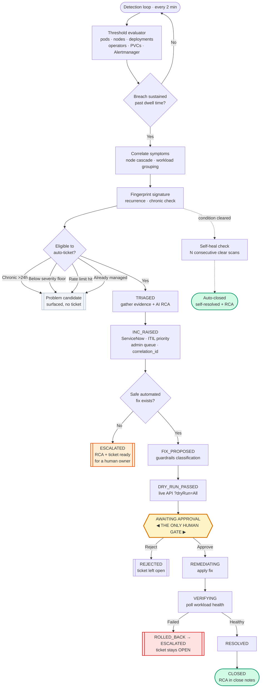
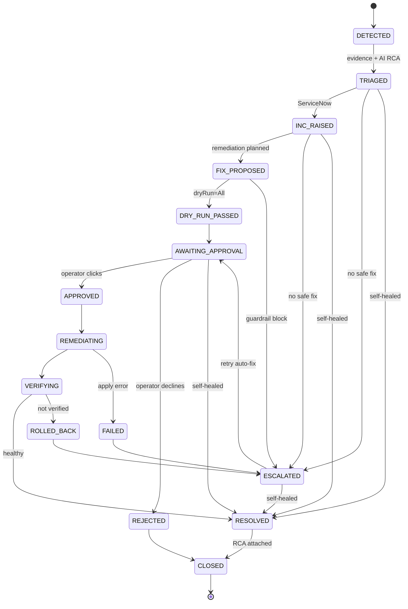
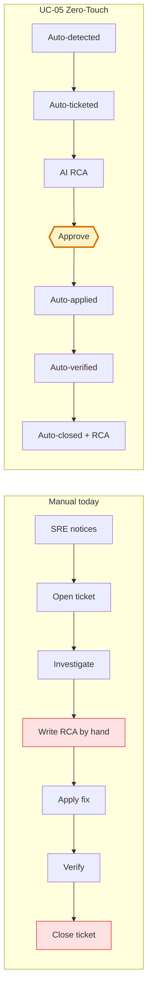

# UC-05 — Zero-Touch Incident Command

**Self-detecting · Self-documenting · Self-closing incident lifecycle for OpenShift**

| | |
|---|---|
| **Use case ID** | UC-05 |
| **Name** | Zero-Touch Incident Command |
| **Tagline** | *Nobody opens the ticket. Nobody writes the RCA. Nobody closes it.* |
| **Category** | Autonomous ITSM / AIOps |
| **Human touchpoints** | **Exactly one** — approving the fix |
| **Platform** | TCS Agentic AI for OpenShift |

---

## 1. Demo description (short)

> Today an SRE notices a problem, opens a ServiceNow incident, investigates, writes the
> root-cause analysis by hand, applies a fix, then goes back and closes the ticket. Most of
> that effort is **administration, not engineering** — and the ticket-closing step alone
> consumes hours of skilled time every week.
>
> **UC-05 removes every one of those steps except the decision to apply the fix.**
>
> The platform continuously evaluates industry-standard thresholds against the live cluster.
> When a breach is sustained past its dwell time, it correlates the symptoms into a single
> incident, gathers real evidence (container logs — including the *previous* terminated
> instance — events, resource limits, exit codes), asks the AI for a grounded root-cause
> analysis, raises a properly classified ServiceNow incident into the admin queue, plans a
> safe remediation, and dry-runs it against the live API server.
>
> Then it stops and waits for one human click.
>
> On approval it applies the fix, verifies the workload actually recovered, and closes the
> ticket with a full ITIL/SRE-standard RCA attached. If the condition clears on its own
> first, the incident closes itself and says so. If verification fails, it escalates and
> deliberately leaves the ticket open rather than reporting a false success.

**What makes it unique:** this is not alerting, and it is not a chatbot. UC-01 answers when a
human asks. **UC-05 has no human trigger at all** — and, uniquely, it *closes* its own tickets
with an audit-grade RCA, which is the part every other automation leaves on the human.

---

## 2. Workflow — master flow

## 3. State machine

## 4. Manual vs Zero-Touch

---

## 5. Threshold policy (industry standard)

Defaults come from the **kubernetes-mixin / kube-prometheus** rules that ship with OpenShift —
not invented numbers. `dwellMinutes` is the equivalent of a Prometheus rule's `for:` clause and
is what stops a transient blip or a normal rolling deploy from opening a ticket.

| Rule | Dwell | Severity | Industry standard |
|---|---|---|---|
| `crashLoop` | 15m | SEV-2 | KubePodCrashLooping |
| `oomKilled` | on event (30m window) | SEV-2 | container OOMKilled |
| `imagePull` | 10m | SEV-3 | KubeContainerWaiting |
| `podNotReady` | 15m | SEV-3 | KubePodNotReady |
| `podPending` | 15m | SEV-3 | KubePodNotScheduled |
| `zeroReady` | 5m | SEV-1 | KubeDeploymentReplicasMismatch (0 ready) |
| `replicaMismatch` | 15m | SEV-3 | KubeDeploymentReplicasMismatch |
| `nodeNotReady` | 5m | SEV-1 | KubeNodeNotReady |
| `nodePressure` | 10m | SEV-3 | KubeNodeMemory/DiskPressure |
| `operatorDegraded` | 10m | SEV-2 | ClusterOperatorDegraded |
| `pvcPending` | 15m | SEV-3 | KubePersistentVolumeClaimPending |
| `pvcFilling` | <10% free | SEV-2 | KubePersistentVolumeFillingUp |

## 6. Noise-control guards

These are what make autonomy safe. Without them, enabling auto-ticketing on a real cluster
creates an alert storm on the first scan.

| Guard | Purpose | Default |
|---|---|---|
| **Dwell time** | Ignore transient blips and rolling deploys | per rule |
| **Correlation** | A NotReady node taking N pods with it = **1** incident, not N+1 | always on |
| **Chronic guard** | Already broken >24h when first seen → **Problem** candidate, not an Incident | 24h |
| **Severity floor** | Only this severity or worse is auto-ticketed | SEV-2 |
| **Rate limit** | Rolling ceiling on tickets per hour, with circuit breaker | 10/hour |
| **Signature dedup** | One live incident per condition; stable across rollouts | always on |
| **Recurrence gap** | "Recurring" means *cleared then returned*, not "polled again" | 20m |
| **Protected namespaces** | `openshift-*`, `kube-*`, `default` are never auto-remediated | always on |

> **Measured effect on the live lab cluster:** 26 raw symptoms → 24 correlated detections →
> **23 chronic (Problem candidates)** → **1 auto-ticket**. The single ticket was the genuinely
> new failure. That is the guard set doing its job.

## 7. Remediation catalogue

One safe, deterministic action per signal class. Anything not listed **escalates with the RCA
and ticket already prepared** rather than guessing.

| Signal | Action | Risk | Reversible |
|---|---|---|---|
| CrashLoopBackOff / NotReady / ZeroReady / ReplicaMismatch | `rollout restart` | low | yes |
| **OOMKilled** | `set resources --limits=memory` (**doubled**, never a bare restart) | medium | yes |
| PVC filling up | `patch pvc` expand +50% (validated for `allowVolumeExpansion`) | medium | **no** |
| Node NotReady · Operator Degraded · PVC Pending · ImagePull | **none — escalate to human** | — | — |

## 8. RCA document structure (ITIL 4 · Google SRE · NIST SP 800-61)

1. Summary — title, severity, cluster, scope, detecting threshold
2. Impact — symptoms, correlation, recurrence
3. Timeline — with computed **MTTD / MTTA / MTTR**
4. Root cause — category, confidence, provenance
   - 4.1 **Detailed AI analysis** (3–5 sentences explaining *why*)
   - 4.2 Impact assessment · 4.3 **5-Whys causal chain** · 4.4 Contributing factors · 4.5 Recommendation
5. Evidence — 5.1 threshold observations · 5.2 resource config · 5.3 **log excerpts** · 5.4 K8s events · 5.5 known-error KB matches · 5.6 further investigation
6. Resolution — action, command, rationale, approver, dry-run + apply output
7. Verification — evidence the workload actually recovered
8. **CAPA** — AI-proposed preventive actions first
9. Blameless notes

Delivered into the ServiceNow **close notes**, and downloadable from the console.

## 9. Safety model

| Control | Behaviour |
|---|---|
| **Two-flag interlock** | `INCIDENT_AUTO_DETECT` (read-only) and `INCIDENT_AUTO_ACT` (acts) |
| **Shadow mode** | Detect and show *what would happen* — raise nothing — until thresholds are trusted |
| **Mandatory dry-run** | Every fix previewed with `?dryRun=All` before apply |
| **Guardrails** | Command classified; blocked commands never reach the cluster |
| **Verification gate** | Fix unverified → **ROLLED_BACK → ESCALATED**, ticket left **open** (never a false success) |
| **Prompt-injection defense** | Logs/events fenced with `UNTRUSTED_GUARD` — treated as data, never instructions |
| **Bounded AI** | 35s AI / 20s evidence soft timeouts; degrades to deterministic RCA and says so |
| **Full audit** | Every state transition written to the audit log |

## 10. Business value

| Metric | Manual | UC-05 |
|---|---|---|
| Detection → ticket raised | minutes–hours (human notices) | **seconds, no human** |
| RCA authoring | 20–60 min hand-written | **automatic, evidence-grounded** |
| Ticket closure | manual, often deferred | **automatic with RCA** |
| Self-resolved conditions | stale tickets closed by hand | **self-closing** |
| Duplicate tickets | common | **deduped by signature** |
| Human touchpoints | ~6 | **1 (approve)** |
| Audit evidence | inconsistent | **standard RCA on every incident** |

## 11. Demo script (5 minutes)

| # | Action | What to point out |
|---|---|---|
| 1 | Open **AI Intelligence → Auto-Detect** | "Nobody asked. 24 detections, 26 symptoms correlated." |
| 2 | Point at **CHRONIC 23 / AUTO-TICKET ELIGIBLE 1** | "It refuses to page for things broken 10 days. That's the credibility guard." |
| 3 | Show **Automation Settings** | Autonomous toggle + ServiceNow queue — configurable, no redeploy. |
| 4 | Break something live (scale a deployment to a bad image / tight memory) | Fresh failure — the only thing that will ticket. |
| 5 | Wait one detection cycle | Incident appears **auto-raised** with ServiceNow number + ITIL priority. |
| 6 | Read the **AI RCA** on the card | Category, confidence, causal chain, real log lines. |
| 7 | Click **▷ Dry-run** | Preview against the live API server — nothing changed. |
| 8 | Click **✅ Apply Fix** | Applies → verifies → resolves → **closes the ticket with the RCA**. |
| 9 | Open the ticket in ServiceNow | Full RCA in close notes, MTTD/MTTA/MTTR, CAPA. |
| 10 | Optional: let something self-heal | Incident closes itself, marked *self-healed*. |

## 12. Implementation map

| Component | File |
|---|---|
| Threshold evaluator + correlation | `src/services/incident-detector.js` |
| State machine, RCA, remediation, self-heal | `src/services/incident-orchestrator.js` |
| Runtime policy (UI-configurable) | `src/services/incident-settings.js` |
| Dry-run / apply executor | `src/services/fix-executor.js` |
| Command risk classification | `src/services/guardrails.js` |
| Known-error knowledge base | `src/services/error-knowledge.js` |
| ServiceNow client | `src/utils/servicenow-client.js` |
| Console UI | `console/src/views/IntelligenceView.jsx` |
| Background loop | `src/index.js` (`pollIncidentDetections`) |

## 13. Configuration

| Setting | Env | Default | UI |
|---|---|---|---|
| Detection on/off | `INCIDENT_AUTO_DETECT` | true | ✓ |
| **Autonomous action** | `INCIDENT_AUTO_ACT` | **false** | ✓ |
| **ServiceNow queue** | `SERVICENOW_ASSIGNMENT_GROUP` | *(instance default)* | ✓ |
| Chronic window | `INCIDENT_CHRONIC_HOURS` | 24 | ✓ |
| Severity floor | `INCIDENT_AUTO_SEVERITY_FLOOR` | SEV-2 | ✓ |
| Ticket rate limit | `INCIDENT_MAX_TICKETS_PER_HOUR` | 10 | ✓ |
| Self-heal confirm scans | `INCIDENT_SELFHEAL_SCANS` | 2 | ✓ |
| Scan interval | `INCIDENT_POLL_INTERVAL_MS` | 120000 | — |
| Threshold overrides | `INCIDENT_THRESHOLDS` (JSON) | mixin defaults | — |

## 14. Verification status

**Verified by automated harness:** correlation (node cascade → 1 incident), chronic guard
(10-day failures excluded, fresh failure ticketed), recurrence semantics (4 scans → still 1
occurrence), name derivation across 9 real-world workload names, full happy path to closure,
dry-run provably precedes apply, failed verification escalates without closing the ticket,
protected namespaces refused, idempotent promotion, self-heal requiring 2 confirming scans,
settings applying live without restart.

**Requires live validation:** first real ServiceNow auto-raise and close against the customer
instance; AI RCA depth depends on the configured LLM being reachable from the pod.

**Recommended rollout:** run in **shadow mode** for one cycle, confirm the chronic/eligible
split matches expectations, then enable autonomous action.
