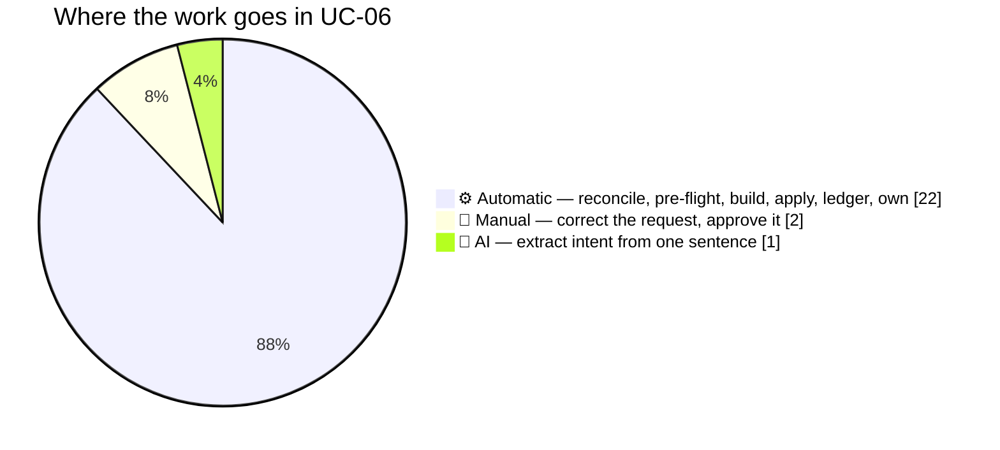
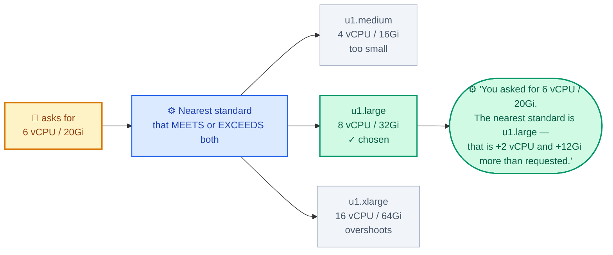
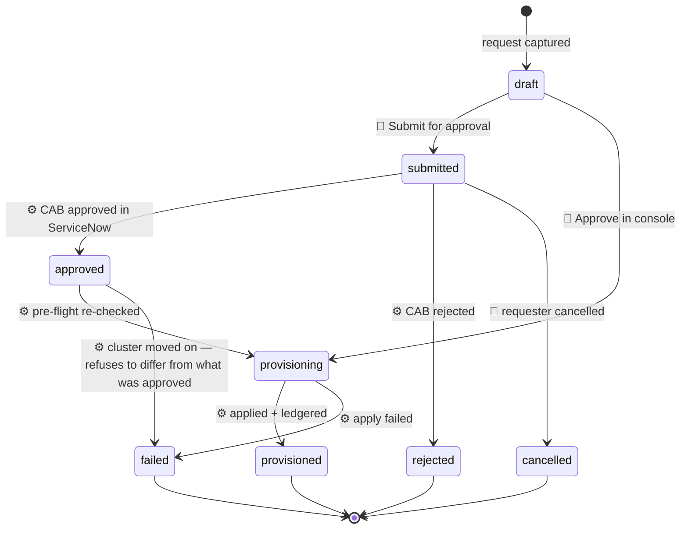
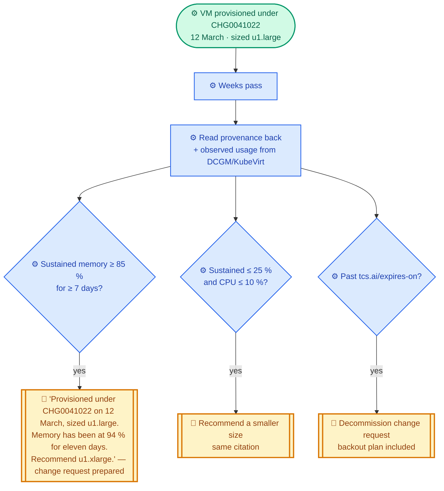

# TCS Agentic AI — Governed VM Provisioning & Lifecycle

**UC-06** · *One sentence in. A governed, owned, accountable virtual machine out — and an agent that
remembers why it built it.*

> **The console creates a VM. It does not remember why.**
> UC-06 records the reason, enforces the expiry, and comes back weeks later to right-size what it
> built — citing the original change request.

---

## 1. Demo description (short)

> OpenShift Virtualization already provisions a VM in about ninety seconds. We did not try to
> replace that. We asked a different question: **what does nobody do either side of that moment?**
>
> Nobody checks quota headroom before committing. Nobody records *why* it was sized 8 vCPU. Nobody
> acts on the "expires on" field. Nobody revisits the machine that has run at 12 % memory since the
> day it was built.
>
> A request is captured in plain language, reconciled against the golden templates this cluster
> actually offers, and checked against live quota — **before** anyone is asked to approve it. The
> change record is raised automatically. On approval the VM is provisioned with its full provenance
> written onto the object itself. Weeks later the agent reads that provenance back and recommends a
> resize, or reclaims capacity that has expired.
>
> **Provisioning is a transaction. Ownership is a lifecycle.**

### 1.1 The one-line claim

> **UC-06 provisions a VM that survives a restart, that somebody owns, that expires — and that the
> agent recognises as its own work months later.**

### 1.2 Deliberate contrast with UC-05

UC-05 is **agent-initiated**: nothing triggers it, which is its entire point.

**UC-06 is never autonomous.** Provisioning consumes quota, IP addresses, licences and money, so it
is human-initiated and human-approved *by construction* — there is no auto-promote path anywhere in
the design. Keeping that boundary explicit is what lets UC-05's autonomy stay credible.

---

## 2. Who does what — actor legend

| | Actor | What it means | Where it is used |
|---|---|---|---|
| 🤖 | **AI** | LLM reasoning over free text | **Intent extraction only** — turning a sentence into a typed request |
| ⚙️ | **AUTOMATIC** | Deterministic code — no AI, no human | Template reconciliation, pre-flight, manifest build, dry-run, apply, ledger, expiry sweep, right-sizing |
| 👤 | **MANUAL** | Requires a person | Correcting the request, **approving it** — in the console or in ServiceNow |

> **The AI never chooses the manifest, the image, or the command.** Everything it produces is a
> value in a typed struct that the operator sees and can correct before anything is created. It also
> never synthesises an SSH key: the deterministic extractor wins on that field unconditionally,
> because a language model inventing a credential is a failure mode with no acceptable version.

---

## 3. Master workflow — colour-coded by actor

```mermaid
flowchart TD
    subgraph CAPTURE["CAPTURE — chat is the front door, not the mechanism"]
        direction TB
        A["👤 'Provision a RHEL 9 VM called sap-app-01<br/>in namespace sap, 8 vCPU, 32GB, 200GB, prod'"] --> B["🤖 Extract intent → typed VMRequest<br/>LLM + deterministic fallback"]
        B --> C["⚙️ Discover what THIS cluster offers<br/>DataSources · instance types · storage classes"]
        C --> D["⚙️ Reconcile size against golden templates<br/>and state the delta plainly"]
    end

    D --> E["⚙️ PRE-FLIGHT against the live cluster"]

    subgraph PRE["PRE-FLIGHT — before anyone is asked to approve"]
        direction TB
        E --> E1["⚙️ Namespace exists · not a platform namespace"]
        E1 --> E2["⚙️ Name free — for every VM in the batch"]
        E2 --> E3["⚙️ Golden image present AND Ready"]
        E3 --> E4["⚙️ Storage class · NetworkAttachmentDefinition"]
        E4 --> E5["⚙️ Quota headroom, per ResourceQuota"]
        E5 --> E6["⚙️ SSH key present — or nobody can log in"]
    end

    E6 --> F{"⚙️ Blocking issues?"}
    F -- yes --> FIX[["👤 Card shows what blocks it<br/>operator corrects and re-checks"]]
    FIX --> E
    F -- no --> G["⚙️ DRY-RUN — server-side, nothing created"]

    G --> GATE{{"👤  APPROVE  👤<br/>THE ONLY HUMAN GATE"}}

    GATE -- "👤 console" --> APPLY
    GATE -- "👤 via ServiceNow CAB" --> CR["⚙️ Raise change request<br/>park the request, wait"]
    CR --> POLL{"⚙️ CAB decision?"}
    POLL -- rejected --> REJ[["👤 Nothing created<br/>request closed"]]
    POLL -- approved --> RECHECK{"⚙️ Pre-flight STILL passes?<br/>the cluster moved on"}
    RECHECK -- no --> FAILED[["👤 Fails with the reason<br/>never provisions something<br/>different from what was approved"]]
    RECHECK -- yes --> APPLY

    subgraph BUILD["PROVISION — no human involved"]
        direction TB
        APPLY["⚙️ Apply manifest<br/>persistent DataVolume + cloud-init"] --> LEDGER["⚙️ Ledger the change<br/>inverse = decommission"]
        LEDGER --> ACCESS["⚙️ Hand back access commands<br/>virtctl ssh · console · IP"]
    end

    ACCESS --> OWN(["⚙️ Provenance written ONTO the VM<br/>owner · cost centre · request id · expiry · rationale"])

    subgraph LIFE["OWNERSHIP — the part nobody else does"]
        direction TB
        OWN --> S1["⚙️ Detect: VM not Ready · guest disk filling"]
        OWN --> S2["⚙️ Right-size: usage vs the size we chose"]
        OWN --> S3["⚙️ Expiry sweep: past its decommission date"]
        S2 --> CR2[["👤 Change request, citing the ORIGINAL request"]]
        S3 --> CR3[["👤 Decommission change request"]]
        S1 --> INC[["⚙️ Flows into UC-05's incident pipeline"]]
    end

    classDef ai fill:#ede9fe,stroke:#7c3aed,stroke-width:2.5px,color:#5b21b6
    classDef auto fill:#dbeafe,stroke:#2563eb,stroke-width:1.5px,color:#1e40af
    classDef manual fill:#fef3c7,stroke:#d97706,stroke-width:2.5px,color:#92400e
    classDef done fill:#d1fae5,stroke:#059669,stroke-width:2px,color:#065f46
    classDef bad fill:#fee2e2,stroke:#dc2626,stroke-width:2px,color:#991b1b

    class C,D,E,E1,E2,E3,E4,E5,E6,F,G,CR,POLL,RECHECK,APPLY,LEDGER,ACCESS,S1,S2,S3 auto
    class B ai
    class A,GATE,FIX,CR2,CR3 manual
    class OWN,INC done
    class REJ,FAILED bad
```

**Reading the colours:** blue = deterministic automation · **purple = the one AI step** ·
**amber = the human** · green = a durable outcome · red = a stop.

---

## 4. Effort split

**Twenty-two deterministic steps. One AI step. Two human touches** — and the second of those is a
single approval that can live in ServiceNow rather than the console.

---

## 5. Step-by-step actor matrix

| # | Step | Actor | Notes |
|---|---|---|---|
| 1 | Request stated in plain language | 👤 | Chat, or the card directly |
| 2 | Intent extracted into a typed struct | 🤖 | LLM + deterministic fallback; heuristics win on conflict |
| 3 | SSH key extraction | ⚙️ | **Never the AI** — a model must not synthesise a credential |
| 4 | Discover cluster catalogue | ⚙️ | DataSources, instance types, preferences, storage classes |
| 5 | Reconcile size to a golden template | ⚙️ | States the delta: "+2 vCPU and +12Gi more than requested" |
| 6 | Namespace exists, not platform-owned | ⚙️ | `kube-*`, `openshift-*`, `default` refused |
| 7 | Name collision check — every VM in a batch | ⚙️ | |
| 8 | Golden image present **and Ready** | ⚙️ | Not-Ready is a warning: the VM would sit importing |
| 9 | Storage class and NAD exist | ⚙️ | A missing NAD means a VM with no network |
| 10 | Quota headroom, per ResourceQuota | ⚙️ | Exceeding blocks; ≥85 % warns |
| 11 | SSH key present | ⚙️ | **Blocking** — a VM nobody can log into is not provisioned |
| 12 | Missing owner / expiry | ⚙️ | Warns, does not block. Sprawl starts here |
| 13 | Operator corrects the card | 👤 | Pre-filled, editable, shows quota impact |
| 14 | Server-side dry-run | ⚙️ | `?dryRun=All` — the API server validates, nothing created |
| 15 | **Approval** | 👤 | **The only gate.** Console, or a ServiceNow CAB |
| 16 | Change request raised | ⚙️ | With implementation and backout plans filled in |
| 17 | Poll CAB decision | ⚙️ | Off unless `VM_APPROVAL_RECONCILE=true` |
| 18 | **Re-run pre-flight after approval** | ⚙️ | An approval can sit for days; the cluster moves on |
| 19 | Apply manifest | ⚙️ | Persistent DataVolume, cloud-init, instance type |
| 20 | Ledger the change | ⚙️ | Inverse = decommission, so removal is a first-class revert |
| 21 | Return access commands | ⚙️ | `virtctl ssh`, console, IP once the VMI reports one |
| 22 | Expiry sweep | ⚙️ | Past its date → decommission change request |
| 23 | Right-sizing | ⚙️ | Cites the original request id |
| 24 | Health detection | ⚙️ | `vmNotReady`, `vmGuestDiskFull` → UC-05's pipeline |

---

## 6. What makes a VM "real" — the Phase 1 bar

The capability that existed before UC-06 produced a VM nobody could use. This is the difference,
and it is the unglamorous half that has to be right first.

| | Before | UC-06 |
|---|---|---|
| Root disk | `containerDisk` / `emptyDisk` — **wiped on every restart** | `dataVolumeTemplate` → a real PVC that survives |
| Access | none — no cloud-init at all | user, SSH key, hostname injected; password login disabled |
| Sizing | raw cpu/memory | `VirtualMachineClusterInstancetype` + `Preference` |
| Network | pod network, masquerade only | NetworkAttachmentDefinition for bridge/VLAN |
| Lifecycle | bare `running: false` | `runStrategy` |
| Safety | direct POST | server-side dry-run, then approval |
| Memory of it | none | owner · cost centre · environment · request id · expiry · sizing rationale |

> A VM whose disk is wiped on restart and that nobody can SSH into is not provisioning. It is a
> demo. Phase 1 was making the word honest.

---

## 7. Sizing reconciliation — the differentiator

A web form takes what you type. It cannot tell you what the compromise is.

Four verdicts, each stated rather than silently applied:

| Verdict | Meaning |
|---|---|
| **exact** | The request matches a standard size precisely |
| **rounded-up** | Nearest standard, **with the delta named** |
| **exceeds-catalogue** | Nothing on this cluster is big enough — needs an explicit size and an exception |
| **none-available** | No instance types exist; sized explicitly instead |

Platform teams argue about exactly this. Making the compromise visible is the thing a form cannot do.

---

## 8. Provenance — why the agent can own what it built

Six values written onto the VM at creation. Cheap to write, and the enabling mechanism for
everything in section 10.

| Label / annotation | Purpose |
|---|---|
| `app.kubernetes.io/managed-by: tcs-agentic-ai` | **The agent claims only what it built.** Hand-made VMs are never touched |
| `tcs.ai/owner` | Who to contact |
| `tcs.ai/cost-centre` | Chargeback |
| `tcs.ai/environment` | dev / test / prod — drives change risk |
| `tcs.ai/request-id` | The change request this came from |
| `tcs.ai/expires-on` | The decommission date, made enforceable |
| `tcs.ai/sizing-rationale` | *Why* this size — read back when right-sizing |

> Without provenance, a platform can provision. With it, a platform can be **accountable**.

---

## 9. Approval — two paths, one gate

A submitted request outlives the browser session and the pod, so it is durable state — a
`vm_requests` table with an in-memory mirror.

**Two details that matter:**

- **Pre-flight runs BEFORE submission.** There is no point asking a change board to approve
  something that cannot succeed.
- **Pre-flight runs AGAIN after approval.** An approval can sit for days and the cluster moves on —
  the name may now be taken, the quota consumed. If it no longer passes, the request **fails with
  the reason** rather than provisioning something different from what was approved.

The reconciler is off unless `VM_APPROVAL_RECONCILE=true`, and never runs in spoke mode: a hub that
is not the system of record for provisioning should not act on approvals.

---

## 10. Ownership — the loop closing

**Guards against becoming noise:** only running VMs are judged, only after a sustain window, and
**absent metrics mean "cannot judge", never "idle"**. A recommendation that fires on a spike trains
people to ignore recommendations.

> *"This VM was provisioned under CHG0041022 on 12 March, sized u1.large. Since then, memory has
> been at 94 % of 32Gi over eleven days. Recommend increasing it to u1.xlarge."*

That sentence is only writable by an agent that provisioned the VM **and** operates the estate. It
is the claim a competitor cannot copy without first building UC-05.

---

## 11. Manual vs UC-06

| Step | Manual today | UC-06 |
|---|---|---|
| Capture the request | Ticket, email, spreadsheet | One sentence |
| Check quota | Rarely, and after the fact | Before approval, per ResourceQuota |
| Choose a size | Guesswork, or copy the last one | Reconciled to a standard, delta shown |
| Validate | Find out when it fails | Server-side dry-run |
| Change record | Written by hand | Raised automatically with backout plan |
| Record who owns it | A wiki page that rots | On the object itself |
| Expiry | A form field nobody reads | Enforced, with a decommission CR |
| Right-size later | Never happens | Unprompted, citing the original request |
| Decommission | Whenever someone notices | Change request on the expiry date |

---

## 12. Safety model

| Control | Behaviour |
|---|---|
| **Never autonomous** | No auto-promote path exists in the design |
| Protected namespaces | `kube-*`, `openshift-*`, `default` refused outright |
| Batch cap | 10 VMs per request |
| Blocking pre-flight | Missing image, taken name, exceeded quota, absent NAD, no SSH key |
| Server-side dry-run | Every path, before any apply |
| Re-check after approval | Refuses to provision something different from what was approved |
| Change ledger | Every creation reversible; inverse = decommission |
| AI boundary | Extracts intent only; never picks image, manifest or command |
| Credential boundary | The AI may not produce an SSH key under any circumstance |

---

## 13. Business value

| | Manual | UC-06 |
|---|---|---|
| Time from request to running VM | hours to days (ticket queue) | one approval |
| Requests provisioned with wrong sizing | common — no reconciliation step | delta shown before approval |
| VMs with a recorded owner | patchy | every one |
| VMs with an enforced expiry | effectively none | every one that sets a date |
| Right-sizing reviews performed | ad hoc, usually never | continuous |
| Reclaimed capacity | whenever someone audits | on the expiry date |

**VM sprawl is a real budget line.** Every request form has an "expires on" field and almost nobody
acts on it. UC-06 is the first part of the platform that does.

---

## 14. Implementation map

| Concern | Where |
|---|---|
| Request struct, extraction, reconciliation, pre-flight, manifest, apply | `src/services/vm-provisioning.js` |
| Fleet, expiry sweep, right-sizing, access guidance | `src/services/vm-lifecycle.js` |
| Approval state machine + ServiceNow reconciler | `src/services/vm-request-store.js` |
| MCP tools | `src/tools/kubevirt.js` |
| VM Request card | `console/src/views/ChatTokens.jsx` (`VM_REQUEST` token) |
| Detection rules | `src/services/incident-detector.js` (`vmNotReady`, `vmGuestDiskFull`) |
| Change ledger | `src/services/change-ledger.js` |
| API | `/api/vm/*` in `src/index.js` |

### MCP tools

`kubevirt_list_templates` · `kubevirt_create_vm` · `kubevirt_vm_access` ·
`kubevirt_lifecycle_report` · `kubevirt_list_vms` · `kubevirt_get_vm` · `kubevirt_start_vm` ·
`kubevirt_stop_vm` · `kubevirt_restart_vm` · `kubevirt_list_vmis`

Filed under the **VM Lifecycle Agent** in the agent registry.

---

## 15. Configuration

| Variable | Default | Purpose |
|---|---|---|
| `VM_IMAGE_NAMESPACE` | `openshift-virtualization-os-images` | Where golden image DataSources live |
| `VM_APPROVAL_RECONCILE` | `false` | Poll ServiceNow for CAB approval |
| `VM_APPROVAL_INTERVAL_SEC` | `300` | Poll interval |
| `VM_MEM_HIGH_PCT` | `85` | Right-size up above this |
| `VM_MEM_LOW_PCT` | `25` | Right-size down below this |
| `VM_CPU_HIGH_PCT` / `VM_CPU_LOW_PCT` | `80` / `10` | CPU equivalents |
| `VM_SUSTAIN_DAYS` | `7` | Minimum age and sustain window before judging |
| `VM_EXPIRY_WARN_DAYS` | `14` | Warn before expiry |

---

## 16. Demo script (4 minutes)

| Time | Show | Say |
|---|---|---|
| 0:00 | Chat | "Provision a RHEL 9 VM called sap-app-01 in namespace sap, 8 vCPU, 32GB RAM, 200GB disk, production, expires 2026-12-31, and here's my SSH key." |
| 0:30 | The card appears | "Nothing has been created. This is what it understood — and here is what a form cannot tell you." |
| 1:00 | Reconciliation line | "You asked for 8 and 32. The nearest standard size is an exact match. Had it not been, it would say by how much." |
| 1:20 | Quota bar | "This takes the namespace to 78 % of quota. That is a decision, not a number." |
| 1:50 | Dry-run | "Validated against the live API server. Still nothing created." |
| 2:10 | Submit for approval | "The change request is raised. In a change-controlled estate the CAB is the authority, not a button in my console." |
| 2:40 | ServiceNow → approve | "One human decision." |
| 3:00 | VM appears, access panel | "Provisioned — and here is how to get into it, rather than making you hunt for the IP." |
| 3:20 | Show the labels on the VM | "Owner, cost centre, change request, expiry, and why it was sized this way. Written onto the object." |
| 3:40 | Lifecycle report | "Which is what lets it come back weeks later and tell you the VM it built is undersized — citing the request it was built under." |

---

## 17. Verification status

| Area | Status |
|---|---|
| Intent extraction, reconciliation, manifest shape | ✅ 15 automated tests (`test/unit/vm-provisioning.test.js`) |
| Root disk is always a DataVolume, never a containerDisk | ✅ asserted |
| Pre-flight, dry-run, provision, lifecycle routes | ✅ exercised against a running server |
| Chat card end to end | ✅ verified for the bare and partial ask |
| ServiceNow CAB approval loop | ⚠️ **built and unit-verified; not yet run against a live ServiceNow instance** |
| Right-sizing against real DCGM/KubeVirt usage | ⚠️ **logic verified; awaiting a workload with sustained history** |

> Stated plainly because a demo that claims more than it has verified is one question away from
> falling apart.
