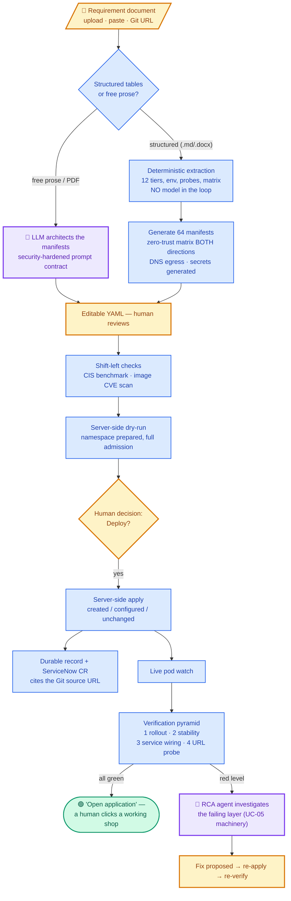
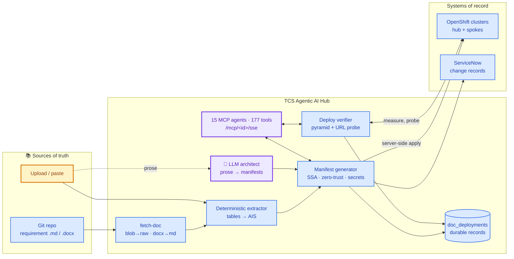

# UC-07 — Document-Driven Application Deployment (App Deployment Agent)

**TCS Agentic AI for Hybrid Infrastructure · Container & Kubernetes Operations**

> *The requirement document IS the deployment. Versioned in Git, deterministic on
> the wire, verified until a human can click the URL.*

A requirement document — Markdown or Word, uploaded, pasted, or pulled straight
from GitHub — becomes a complete, security-hardened, zero-trust application on
OpenShift: generated, dry-run, deployed, and then **verified level by level
until the proof is a working URL**. Every deploy leaves a durable record, a
ServiceNow change, and a citation of the exact versioned document that
produced it.

Reference application: **Online Boutique** — a real e-commerce shop with 11
gRPC microservices, a Redis cart, and synthetic shoppers — deployed from one
document into 64 manifests.

## 1. Demo description (short)

| Field | Value |
|---|---|
| Use case ID | UC-07 |
| Name | Document-Driven Application Deployment |
| Trigger | Human-initiated: upload / paste / Git URL of a requirement document |
| Input | Structured requirement doc (.md / .docx / .pdf / plain text), or free prose |
| Output | Running, verified, governed application + durable deploy record + change record |
| Demo time | 5–7 minutes (boutique first pull) · ~90 seconds (hello-web) |
| Sample inputs | docs/sample-requirements/ 01–04, each in .md and .docx |

## 2. Who does what — actor legend

| Colour | Actor | Meaning |
|---|---|---|
| 🟣 Purple | Agentic AI | An LLM reasons, extracts, architects, or investigates |
| 🔵 Blue | Deterministic automation | Same input → same output, no model in the loop |
| 🟡 Amber | Human | Reviews, decides, or clicks the final URL |
| 🟢 Green | Verified outcome | Proven against the live cluster, not assumed |

## 3. Master workflow — colour-coded by actor

## 4. Where the agentic AI actually is — an honest map

This use case deliberately splits the work between a reasoning model and
deterministic code, and the split is the product's argument. **The AI is the
operator; determinism is the contract.**

| # | Stage | Actor | Why this actor |
|---|---|---|---|
| 1 | Free-prose requirement → manifests | 🟣 Agentic AI | "Deploy a web app with Postgres and monitoring" has no tables to parse. The LLM acts as the platform architect, under a prompt contract enforcing CIS/PSS-restricted, non-root images, least privilege |
| 2 | Structured document → manifests | 🔵 Deterministic | The tables are already a contract. Re-running an audit-grade document must produce byte-identical YAML — a model would paraphrase. The AI's job here was DESIGNING the grammar, not executing it |
| 3 | Conversational operations (AI Chat) | 🟣 Agentic AI | "Deploy the boutique doc to the lab cluster" in chat routes through the same agent tools — 15 MCP agents, 177 tools, callable by any framework |
| 4 | Shift-left security verdicts | 🔵 + 🟣 | CIS/image scans are deterministic; the AI explains findings and proposes remediations on request |
| 5 | Change governance | 🔵 Automatic | The platform authors the ServiceNow CR — implementation, backout and test plans written from the deploy itself |
| 6 | Verification pyramid | 🔵 Deterministic | Truth about the cluster must not be generated. Rollout, stability, wiring and the URL probe are measured, never inferred |
| 7 | Failure investigation | 🟣 Agentic AI | When a level goes red, the RCA agent (UC-05) reasons over evidence — logs, events, probes — and proposes the fix a human approves |
| 8 | The one irreversible click | 🟡 Human | Deploy and fix-approval stay human. The AI narrows the decision; it does not take it |

The pattern to say out loud in a demo: **generation may be creative,
verification never is.** The LLM is free to architect (lane 1); everything
that claims "this is true of your cluster" (lanes 2, 5, 6) is deterministic
and testable — 93 unit tests pin it.

## 5. Architecture

| Component | Implementation | Notes |
|---|---|---|
| Document ingestion | /api/automation/extract-doc, fetch-doc | .md/.docx/.pdf/.txt; docx tables preserved as markdown; GitHub blob→raw rewrite; one-shot token for private repos |
| Deterministic extractor | ais-extractor.js | Headings + key/value tables → Application Intent Schema; exact-match column resolution |
| LLM architect (fallback) | chat-api.js generate-manifest | Only when no structured tables found; CIS/PSS-restricted prompt contract |
| Manifest generator | manifest-generator.js | Zero-trust matrix both directions, DNS egress, generated Secrets, native gRPC probes, HPA, Route |
| Apply engine | deploy-verifier.js applyResource | Server-side apply, created/configured/unchanged, dry-run with namespace preparation |
| Verification pyramid | deploy-verifier.js verifyNamespace | Rollout → stability → Service/endpoint wiring → HTTP probe of every Route |
| Durable records | doc-deploy-store.js | Postgres write-through; survives pod restarts; rollback deletes only what the deploy created |
| Governance | servicenow-client.js | CR with implementation/backout/test plans, 6s budget, never blocks the deploy |

## 6. Docs-as-code — the Git story

| Step | What happens |
|---|---|
| 1 | The requirement document lives in a Git repo — reviewed by PR, versioned, diffable |
| 2 | Paste the GitHub link into "Load from Git" — blob URLs are rewritten to raw automatically |
| 3 | Generate is deterministic: the same commit produces the same 64 manifests, every time |
| 4 | The deploy record and change record **cite the source URL** — audit can walk from a running pod back to the document version that created it |
| 5 | Re-deploy after a doc change = fetch → generate → deploy; server-side apply updates only what changed and reports created/configured/unchanged |

Roadmap from here (in order of value): a webhook so a merged PR on the
document auto-deploys to the dev cluster; environment promotion (same
document, dev → staging → prod cluster targets); and a GitOps hand-off mode
that commits the generated YAML for Argo CD to sync instead of applying
directly.

## 7. The verification pyramid — "done" means a human can use it

| Level | Question | Catches |
|---|---|---|
| 1 Rollout | Is THIS generation fully rolled out? (kubectl rollout status semantics) | Old-pods-still-Ready false positives |
| 2 Stability | Anything crash-looping or accumulating restarts? | Probe misconfiguration, OOM, bad env |
| 3 Wiring | Does every Service select ready pods? | The label mismatch behind "Route says 503" |
| 4 Access | Does every Route answer over HTTP from outside? | Everything else between the user and the app |

The flow ends at an **"Open application"** button with a live status dot —
the user's acceptance test, executed. The negative sample document
(03-negative-broken-image) exists so audiences see the pyramid fail honestly:
a green result means something because red is possible.

## 8. Security model

| Control | Where |
|---|---|
| Zero-trust NetworkPolicies | default-deny both directions; every allowed path from the document's matrix generates ingress on the target AND egress on the caller; DNS egress scoped to openshift-dns |
| Secrets | Generated at manifest time with random credentials — never present in the document, the chat, or Git |
| Images | Restricted-SCC compatible (arbitrary UID, non-root); shift-left CIS + CVE scan before deploy |
| Blast radius | Rollback deletes ONLY resources the deployment created; pre-existing namespaces and updated resources are never touched |
| Change trail | Every deploy: durable record + change-timeline event + ServiceNow CR with backout plan |

## 9. Business value

| Metric | Manual baseline | UC-07 |
|---|---|---|
| Requirement → running app | Days (ticket, YAML authoring, review cycles) | Minutes, from a reviewed document |
| YAML authored by hand | ~2,000 lines for the boutique | 0 — 64 manifests generated |
| Security posture | Varies by engineer | Identical, generated, testable — every namespace |
| Audit answer to "who deployed what, from what?" | Archaeology | Record cites the Git URL, the CR number, and the verification result |
| Verification | "Pods are green" | A probed URL and a four-level proof |

## 10. Demo script (6 minutes)

| Min | Beat | Say |
|---|---|---|
| 0–1 | Show the document in GitHub (or the .docx in Word) | "This is the deployment. Not YAML — a reviewed, versioned requirement." |
| 1–2 | Load from Git → Generate | "Deterministic: 12 tiers, 64 manifests, no AI paraphrase — same commit, same YAML. Watch the AI lane too: paste plain prose instead and the LLM architects it." |
| 2–3 | CIS + image scan → Dry-run | "Shift-left: the server validated all 64 objects before anything ran." |
| 3–5 | Deploy → pod watch → pyramid turns green | "Server-side apply, a change record in ServiceNow, and now: rollout, stability, wiring, and the platform itself browsing to the shop." |
| 5–6 | Click "Open application", place an order | "One click crosses nine services and Redis, each hop crossing a network policy the document declared. And if any level had gone red — the RCA agent takes it from there." |

## 11. Verification status

| Claim | Status |
|---|---|
| Deterministic extraction (.md and .docx identical) | ✅ Pinned by round-trip unit tests |
| 64-manifest generation, matrix both directions | ✅ Unit-tested; deployed live on caaslab |
| Server-side apply + created/configured/unchanged | ✅ Live |
| Dry-run with namespace preparation | ✅ Live (fixed after first field run) |
| Verification pyramid + URL probe | ✅ Live |
| Git fetch (blob→raw) → deterministic generate | ✅ Verified against the GitHub branch |
| ServiceNow CR on deploy | ✅ Live (CHG0030065 in the lab) |
| RCA-agent-on-red-level loop | 🔶 Machinery exists (UC-05); auto-wiring is roadmap |
| Webhook auto-deploy · promotion · Argo CD hand-off | 🔶 Roadmap |
