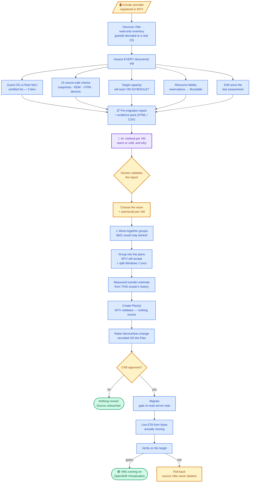
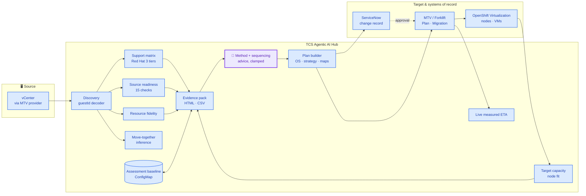

# UC-10 — VMware to OpenShift Virtualization Migration (VM Migration Agent)

**TCS Agentic AI for Hybrid Infrastructure · Virtualization Operations**

> *Assess before you move. The agent runs inside the destination, so it can
> answer the one question no external assessment tool can: will this VM
> actually run when it lands?*

A vCenter estate is discovered, assessed against Red Hat's certified guest list
**and the target cluster's real capacity**, grouped into waves, governed through
a ServiceNow change record, and migrated with the Migration Toolkit for
Virtualization — with a measured ETA while bytes move and a rollback that never
touches the source.

## 1. Demo description (short)

| Field | Value |
|---|---|
| Use case ID | UC-10 |
| Name | VMware → OpenShift Virtualization migration |
| Trigger | Human-initiated: choose a source provider, discover |
| Input | A vCenter (or oVirt/OpenStack/OVA) provider registered in MTV |
| Output | Assessed estate, evidence pack, approved change record, migrated and verified VMs |
| Demo time | 6–8 minutes (assessment) · plus transfer time for a live migration |
| Prerequisite | MTV/Forklift installed, provider connected, storage + network maps defined |

## 2. Who does what — actor legend

| Colour | Actor | Meaning |
|---|---|---|
| 🟣 Purple | Agentic AI | An LLM reasons about strategy, sequencing and risk |
| 🔵 Blue | Deterministic automation | Same input → same output, no model in the loop |
| 🟡 Amber | Human | Reviews, decides, approves |
| 🟢 Green | Verified outcome | Measured against the live cluster, not assumed |

## 3. Master workflow — colour-coded by actor



## 4. Where the agentic AI actually is — an honest map

| # | Stage | Actor | Why this actor |
|---|---|---|---|
| 1 | Guest OS classification & support verdict | 🔵 Deterministic | A support statement is a fact about Red Hat's list, not an opinion. A model would paraphrase it |
| 2 | Source-side readiness (15 checks) | 🔵 Deterministic | "Does this VM have an RDM" has one right answer, and it decides whether a migration fails |
| 3 | Target capacity & node fit | 🔵 Deterministic | Arithmetic against live node allocatable. Generated capacity figures would be worthless |
| 4 | **Warm vs cold, per VM** | 🟣 **Agentic AI** | The judgement call: downtime traded against transfer complexity, weighed against what the machine does and when the window is. This is reasoning, not a rule |
| 5 | Wave sequencing & risk advice | 🟣 Agentic AI | Which group to move first, what to pilot, what to hold back — on top of deterministic findings it may not contradict |
| 6 | Move-together grouping | 🔵 Deterministic | Inference from addresses, names, folders and datastores — labelled as inference, evidence always shown |
| 7 | Transfer estimate | 🔵 Measured | From migrations this cluster has already completed, then replaced by live bytes-moved once the transfer starts |
| 8 | Change governance | 🔵 Automatic | The platform authors the CR — implementation, backout, test plan, and the outage the CAB is approving |
| 9 | The irreversible click | 🟡 Human | Approval and Migrate stay human. The AI narrows the decision; it does not take it |

**The contract everywhere: the model advises, code decides.** A warm
recommendation for a VM without changed block tracking is downgraded by
`clampAdvice()` before it can reach a plan. A model claiming a cold migration
stays online is overruled by `powerPlan()`. Neither ever sees a manifest.

## 5. What makes this different from MTV alone

MTV is the transfer engine and it is excellent at that. Everything below is
absent from it, and most of it is absent from the external assessment tools
too — because they read the source and this agent runs inside the destination.

| Capability | MTV | External assessment tools | UC-10 |
|---|---|---|---|
| Guest OS vs Red Hat's certified list, with tier | — | Partial | ✅ Certified / vendor supported / known to run |
| Will the VM SCHEDULE on the target? | — | Cannot see the target | ✅ Blocks a VM bigger than every node |
| Reservations lost on migration | — | — | ✅ 52 vCPU → 5.2 cores requested, named per VM |
| What to change, per machine | Concerns, no fixes | Generic | ✅ "Upgrade to Windows Server 2022", "enable CBT" |
| Measured transfer time | — | Vendor figures | ✅ From this cluster's own history, then live |
| Evidence pack for the CAB | — | ✅ | ✅ Report ID, matrix version, HTML + CSV |
| Drift since the last assessment | — | Rare | ✅ Improved / regressed / added / gone |
| Move-together groups | — | Dependency mapping (agents) | ✅ Agentless inference, evidence shown |
| Approval gate before data moves | — | — | ✅ Held on the Plan, re-read server-side |

### The check nobody else makes

**A KubeVirt VM is a pod, so it must fit on ONE node.** A 64 GiB guest does not
run on 32 GiB workers, however much RAM the cluster has in total. MTV validates
the plan, copies every byte correctly, creates the VirtualMachine — and it sits
`Pending` forever, after the outage has already been spent.

The agent blocks that at assessment time, and separates "can never schedule"
(needs hardware) from "no room today" (needs a window). It counts only nodes
that are Ready, uncordoned and labelled `kubevirt.io/schedulable=true`, because
a node without virt-handler has RAM the cluster can use and a VM cannot.

## 6. Architecture



| Component | Implementation | Notes |
|---|---|---|
| Discovery | vm-migration.js `discoverVMs`, `normaliseInventoryVM` | Decodes vSphere guestIds — `windows2019srvNext_64Guest` is Server **2022**, not 2019 |
| Support matrix | `SUPPORT_MATRIX`, `classifyGuestOS` | Red Hat article 4234591; three tiers; stamped with the date it was read |
| Source readiness | source-readiness.js | 15 checks; a check with no data is reported unchecked, never as a pass |
| Target capacity | target-capacity.js | Node allocatable minus pod requests; virt-schedulable nodes only |
| Resource fidelity | resource-fidelity.js | vCPU → CPU request at the cluster's overcommit ratio; reservations lost |
| Move-together groups | affinity.js | Folder alone is enough; anything else needs two signals agreeing |
| Drift | assessment-store.js | Baseline per provider in one ConfigMap; pure diff |
| Evidence pack | assessment-report.js | Pure string generation — no runtime library dependency |
| Plan builder | `planGroups`, `buildPlanManifest` | Groups by the five dimensions MTV forces, plus OS |
| Approval gate | `approvalGate`, `raiseMigrationCR`, `checkMigrationApproval` | Annotations on the Plan; survives a restart and a different operator |
| Live ETA | `liveEta`, `recordProgressSample` | Measured from bytes moving; says "stalled" rather than growing a number |
| Rollback | `rollbackPlan`, `rollbackMigration` | Deletes target VMs; **the source is never deleted** |

## 7. The four steps

| Step | What the operator does | What the agent does |
|---|---|---|
| 1 Discover | Choose the source provider | Read-only inventory: OS, IPs, vCPU, RAM, per-disk detail |
| 2 Analyse | Read the report | Assess every VM: matrix, 15 source checks, capacity, fidelity, drift; recommend a method |
| 3 Select & strategy | Tick the wave, set warm/cold | Pre-tick what can go; warn on split groups; offer only workable options |
| 4 Plan & migrate | Approve, then migrate | Estimate, group, raise the CR, gate on approval, transfer, verify, roll back |

Discovery is deliberately read-only and strategy is chosen at the end: picking
warm or cold before you know whether a VM is even supported is a decision made
in the dark.

## 8. Governance

| Control | Where |
|---|---|
| Change record | Raised per Plan, quoting **that plan's** footprint, transfer time and downtime — not the wave's |
| Approval gate | Annotations on the Forklift Plan. `startMigration` re-reads them every call: an enabled button is not authorisation |
| Durability | Approval survives a pod restart, a browser refresh and a different operator tomorrow, and is visible in `oc get plan -o yaml` |
| Override | `MIGRATION_REQUIRE_APPROVAL=false` — deliberate, named, and off by default |
| Rollback | Deletes only what the migration created. Source VMs are never deleted and can be powered back on |
| Evidence | Every assessment has a quotable report ID, a timestamp, the matrix version and the operator |

## 9. Business value

| Metric | Manual baseline | UC-10 |
|---|---|---|
| Assess 100 VMs | Days of spreadsheet work | Minutes, repeatable, with an exported register |
| "Will it run when it lands?" | Discovered after the outage | Answered before the wave |
| Post-migration performance surprises | A ticket three weeks later | Named per VM at assessment |
| Answer to "why was this moved unsupported?" | Archaeology | Report ID, matrix version, tier, and the operator |
| Estimate quality | A vendor number | This cluster's own throughput, then live bytes |
| Assessment freshness | Stale in weeks, silently | Drift report on every run |

## 10. Demo script (7 minutes)

| Min | Beat | Say |
|---|---|---|
| 0–1 | Step 1, Discover | "Read-only. Fourteen VMs, and note the Guest OS column — vCenter reports `windows2019srvNext_64Guest`; that is VMware's id for Server **2022**. Read it literally and your whole Windows estate lands in 'needs review'." |
| 1–3 | Step 2, the report | "Every VM assessed, not the ones I already chose. Rings by OS family. Red Hat's three tiers — certified, vendor supported, known to run. And 'Will it fit?' — this machine needs 64 GiB and the biggest node has 48. MTV would have copied 200 GiB and left it Pending." |
| 3–4 | Expand a row | "Fifteen source checks per machine, each with its own fix. And '15 of 15 ran' — where the inventory tells us nothing we say so, rather than calling it a pass." |
| 4–5 | Resource guarantees + export | "52 vCPU becomes 5.2 cores requested. The guests still see 52; the scheduler does not. Three VMs lose a reservation they have today. Then: evidence pack for the change board." |
| 5–6 | Step 3, choose the wave | "Pick two of the three ShopApp machines and it says db01 would stay on VMware — MTV has no idea these are one system." |
| 6–7 | Step 4, plan → CR → migrate | "Windows and Linux never share a plan. The estimate comes from this cluster's own history. Change request raised, held on the Plan itself — Migrate stays disabled until the CAB says yes. And if it goes wrong: roll back. The source VMs were never deleted." |

## 11. Verification status

| Claim | Status |
|---|---|
| vSphere guestId decoding (incl. the srvNext trap) | ✅ Unit-tested against 13 real guest ids |
| Support matrix vs Red Hat article 4234591 | ✅ Read 2026-09-02; three tiers; tested |
| 15 source-side checks, unchecked ≠ pass | ✅ Unit-tested, both directions |
| Target capacity and single-node fit | ✅ Unit-tested; "never" separated from "not today" |
| Resource fidelity (reservations → Burstable) | ✅ Unit-tested |
| Move-together groups | ✅ Unit-tested; over-populated signals dropped |
| Drift against a stored baseline | ✅ Unit-tested; ConfigMap-backed |
| Evidence pack (HTML + CSV, injection-safe) | ✅ Unit-tested |
| Plan grouping incl. OS split | ✅ Unit-tested |
| Change-request gate on the Plan | ✅ Unit-tested verdict mapping; live in the lab |
| Live measured ETA + stall detection | ✅ Unit-tested |
| Rollback (source never deleted) | ✅ Unit-tested decision logic |
| MTV readiness detection + RBAC guidance | ✅ Live (fixed after two field runs) |
| Wave scheduling against blackout windows | 🔶 Roadmap |
| RCA agent on a stalled transfer | 🔶 Machinery exists (UC-05); auto-wiring is roadmap |

---

## Regenerating this pack

```bash
node usecases/uc-10-vm-migration/generate-ppt.cjs     # deck
node usecases/uc-10-vm-migration/generate-excel.cjs   # workbook
node usecases/uc-10-vm-migration/generate-docx.cjs    # this document as .docx
node usecases/portfolio/generate-usecase-summary.cjs  # the one-slide-each portfolio
```

`generate-ppt` and `generate-excel` need `pptxgenjs` and `exceljs`, which are
devDependencies — they are authoring tools, deliberately absent from the
runtime image.
